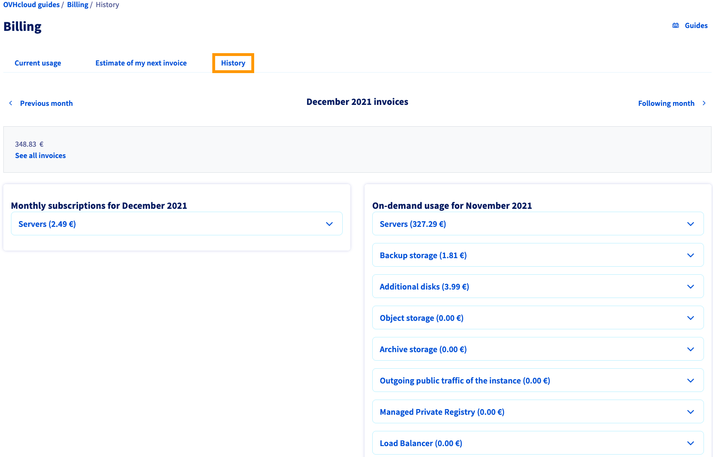
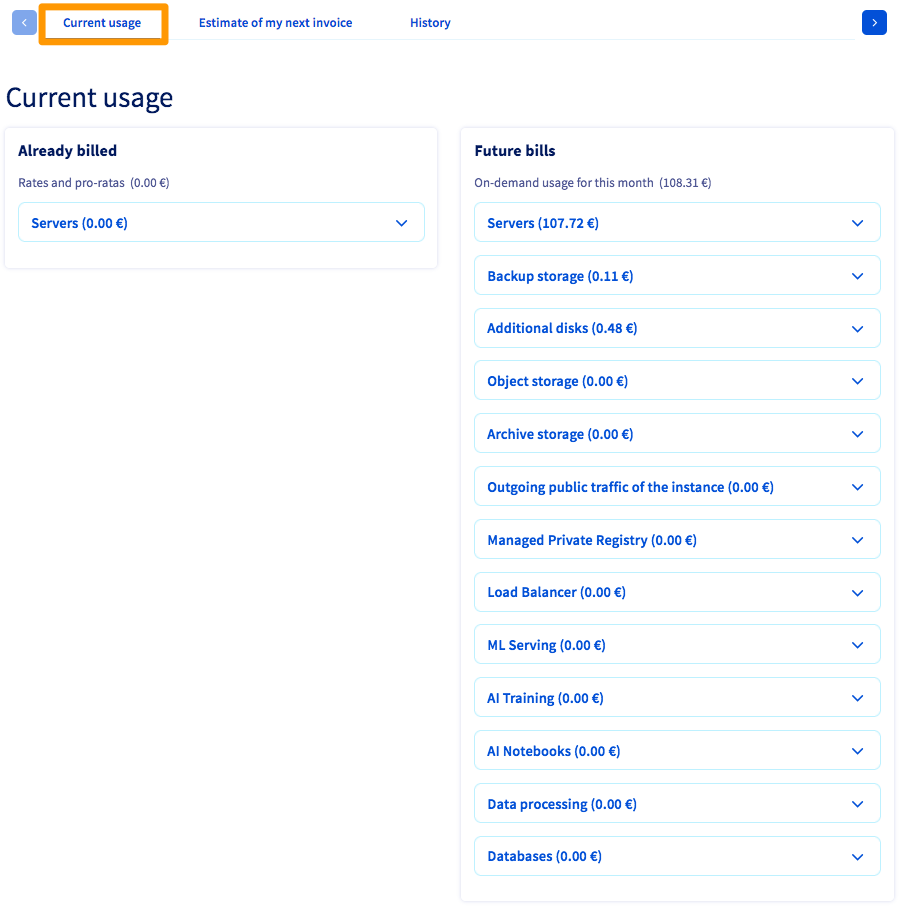

## Objective

One of the main principles of cloud computing is based on **pay-as-you-go** billing, where customers pay for what they use.

The standard billing option for renting computing resources is generally based on a contract with a pre-determined length (usually 12 months) and a commitment between two parties during this period. However, cloud computing offers a more flexible billing system — **one where you pay at the end of the month for the time during which you have used the resources**.

This system is similar to the one used by certain telephone operators, where they bill at the end of the month for the number of minutes used. Here, OVHcloud bills the hours for which the server, storage space or another element of the service is used.

**This guide details the billing design of OVHcloud Public Cloud solutions.**

## Requirements

- A [Public Cloud project](https://www.ovhcloud.com/en-au/public-cloud/){.external} in your OVHcloud account
- A [Public Cloud instance](/pages/public_cloud/compute/public-cloud-first-steps){.external}
- Access to the [OVHcloud Control Panel](https://ca.ovh.com/auth/?action=gotomanager&from=https://www.ovh.com.au/&ovhSubsidiary=au){.external}

## General design

Our goal is to provide a billing system that matches the way our customers use this service as closely as possible. To achieve this, we needed to make the billing granular. This is why the unit system is usually the amount of time, counted in hours in this case.

For each resource to be billed, an hour counter starts when the resource is created, and stops when the resource is removed. This works in accordance with the principle of each hour of use being billed.

At the end of the month, each counter is multiplied by the hourly rate for the resource. To get the overall bill total, simply add up all of the counters charged for.

Each cloud project has its own bill, which totals up all of the resources billed during the month. This bill is generated on the first day of the following month.

### Example

> [!warning]
> Please note that an hourly instance is billed per hour, regardless of when the instance is created. If you would like to have 60 minutes of usage for one hour of billing, you will need to launch your instance at the hour mark, for example at 1:00 or 2:00 pm.
>

This example might provide a clear explanation of how this works.

- A user launches a B2-15 instance on the 04th day of the month, at 09:40.
- On the 08th day of the month at 10:00, they add 250GB additional volume (Classic Volume).
- They delete all of it on the 12th day of the same month at 16:30, once they have finished what they needed to do with these resources.

For the instance, from the 04th day of the month at 09:40 until the 12th of the month at 16:30, there are 200 hours of resource usage. They are billed at 0.111 euros per hour.

For the storage, from the 08th day of the month at 10:00 until the 12th of the month at 16:30, there are 103 hours of resource usage. One GB of Classic Volume costs 0.04 euros/month (0.0000555556 euros/hour).

At the end of the month, the bill will total up to:

- 200 x 0.111
- 103 x 250 x 0.0000555556

i.e. €23.63.

> [!primary]
>
> The prices listed here are not contractual, and are only used to provide an example.
>

## Instructions

### View your bills

To view the bills for a project, open your `Public Cloud`{.action} project in the OVHcloud Control Panel, then click on `Billing Control`{.action} and open the tab `History`{.action}.

{.thumbnail}

In this screen, you can:

- View details on the resources by expanding each section.
- Browse logs by going to the previous or next month.

### View your current resource usage

You can also view your current resource usage (for the ongoing month) by clicking `Current usage`{.action}.

{.thumbnail}

The first part, **"Already billed"**, includes resources billed by the month (see instances billed at the lower monthly rate). These resources are the exception to the “pay-as-you-go” method. Commitments are billed on a monthly basis and payable in advance. The commitment option offers the user a cost advantage.

The second part, **"Future bills"**, includes pay-as-you-go resources. It lists your resource usage from the first of the month up to that day.

You can also have an `Estimation of my next invoice`{.action} (for the 01st of the next month) based on a forecast of resource usage taking into account the current situation, and predicted usage for the remainder of the month.

> [!primary]
>
> This information is for information purposes only, as the situation may
> change at any time following your actions (adding or removing
> resources).
>

{.thumbnail}

If you would like to receive alerts when the forecast of your resource usage exceeds a set threshold, you can configure this via this screen. When your forecasted usage exceeds the set threshold, you will receive an email to alert you of this.

### Instances

The prices of cloud instances (or cloud servers) are listed in the OVHcloud Control Panel before you get started with an instance. You can also view prices on the [pricing page](https://www.ovhcloud.com/en-au/public-cloud/prices/){.external}.

> [!primary]
>
> The bandwidth for instances is not billed.
>

Each instance model has two different billing methods: hourly and monthly.

> [!warning]
>
> The billing for an instance stops when the instance is deleted
> permanently. If the instance has a status such as “stopped” or “paused”, the billing counter will continue
> to work because the instance has not been deleted.
> With both billing methods, the service is billed by the amount of time during which it is used.
>

#### Hourly price

This pricing follows the pay-as-you-go model explained earlier.

These instances are paid for on the first day of the following month, for the hours of resource usage over the course of the previous month.

##### **Shelve (suspend) an instance**

For hourly instances, it is possible to shelve (suspend) an instance in order to release the resources dedicated to it while keeping the same IP. In this case, the data on your local disk will be stored in a snapshot that is created when an instance is shelved/suspended. Only the snapshot will be billed.

> [!warning]
>
>This process is only functional for hourly billed instances, it will not stop the billing of your instance but it will reduce your cost.
>

For more information on how to proceed, consult this [guide](/pages/public_cloud/compute/suspend_or_pause_an_instance).

#### Monthly price

This pricing offers a price reduction of around 50% compared to hourly billing. This is typical cloud billing.

Each commenced month is billed, even if the instance is deleted before the end of the month.

### Storage

Storage solutions are generally charged on the basis of a GB per month price. To see the price per GB per hour, simply divide the per-month price by 720, the average number of hours in a month. The result of this calculation will be the cost of an element stored per hour.

The calculation is: ( Price per GB per month / 720 ) x number of hours x number of GB

The number of GB per hour corresponds to the maximum number of GB stored over the course of the hour. For example, if a user has 15GB at 16:20, 17GB at 16:40, and 14GB at 16:50, OVHcloud will charge 17GB for the 16:00 - 17:00 period.

The storage prices are available directly on the [OVHcloud website](https://www.ovhcloud.com/en-au/public-cloud/storage/){.external}.

#### Additional volumes

The additional volumes are simply billed per GB provisioned, with a different price depending on the range.

#### Backups of additional volumes

Backups of additional volumes are billed the same way as the volumes themselves.

#### Snapshots of additional volumes

Snapshots of additional volumes are billed the same way as the volumes themselves.

#### Instance snapshots and images

Both snapshots and images of instances (excluding the catalogue of images supplied by OVHcloud) are billed at a flat rate per GB per month, regardless of the original instance and image type. Go to the [pricing page](https://www.ovhcloud.com/en-au/public-cloud/prices/){.external} to view prices.

#### Object storage

Two elements are billed for object storage:

- The storage of the objects themselves, i.e. the volume actually used in GB.
- Outgoing traffic, i.e. the volume of data sent from the service, contained in HTTP body.

> [!primary]
>
> Outgoing traffic between the object storage service and the instances is
> billed the same way as outgoing traffic sent via the internet.
>

> [!warning]
>
> Viewing objects via the OVHcloud Control Panel is also considered
> to be outgoing traffic.
>

#### Archives

Three elements are billed for archive storage:

- The storage of the archives themselves, i.e. the volume actually used in GB.
- Incoming traffic, i.e. the volume of data sent to the service, contained in HTTP body.
- Outgoing traffic, i.e. the volume of data sent from the service, contained in HTTP body.

> [!primary]
>
> Outgoing traffic between the archive service and the instances is
> billed the same way as outgoing traffic sent via the internet.
>

## Go further

Join our community of users on <https://community.ovh.com/en/>.
