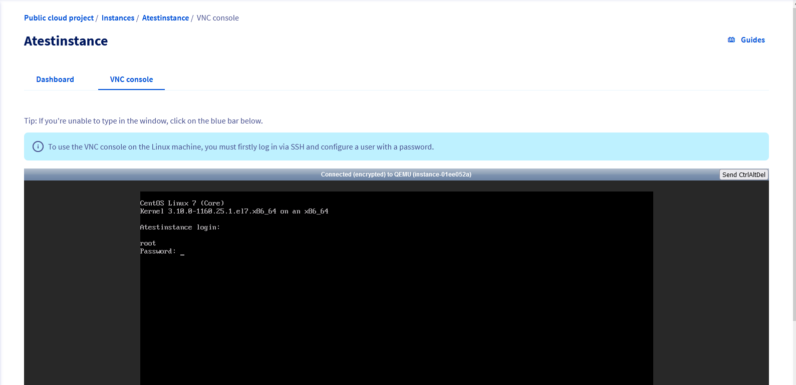

> [!primary]
> Esta traducción ha sido generada de forma automática por nuestro partner SYSTRAN. En algunos casos puede contener términos imprecisos, como en las etiquetas de los botones o los detalles técnicos. En caso de duda, le recomendamos que consulte la versión inglesa o francesa de la guía. Si quiere ayudarnos a mejorar esta traducción, por favor, utilice el botón «Contribuir» de esta página.
>


## Objetivo

Para realizar determinadas tareas en un servidor (como la instalación de paquetes), es necesario disponer de un nivel de acceso elevado. En los servidores Linux, este nivel se denomina "root".

**Esta guía explica cómo configurar el usuario root y establecer la contraseña.**

## Requisitos

- Una [instancia de Public Cloud](/pages/public_cloud/compute/public-cloud-first-steps#3-crear-una-instancia) en su cuenta de OVHcloud
- Tienes acceso a tu [Panel de configuración de OVHcloud](https://ca.ovh.com/auth/?action=gotomanager&from=https://www.ovh.com/world/&ovhSubsidiary=ws)

## Procedimiento

### Establecer la contraseña root <a name="settingtherootpassword"></a>

En primer lugar, conéctese al servidor por [SSH](/pages/public_cloud/compute/public-cloud-first-steps#4-conectarse-a-una-instancia) con el usuario por defecto.

Para ello, utilice el comando que se indica a continuación y establezca una contraseña para el usuario *root* (por motivos de seguridad, la contraseña no se mostrará mientras la escriba):

```bash
~$ sudo passwd root
Enter new UNIX password:
Retype new UNIX password:
passwd: password updated successfully 
```

### Actualizar el sistema (Debian y Ubuntu)

Para actualizar los paquetes de software instalados en el servidor, introduzca el siguiente comando:

```bash
~$ sudo apt update && sudo apt upgrade -y
```

### Actualizar el sistema (CentOS y Fedora)

Para actualizar el sistema operativo del servidor, introduzca el siguiente comando:

```bash
~$ sudo yum update
```

### Conectarse como root

Para conectarse como usuario root, introduzca el siguiente comando:

```bash
~$ sudo su -
~#
```

A continuación escriba la contraseña root.


### Permitir la autenticación del usuario root con contraseña

#### Para las conexiones desde la consola VNC del área de cliente de OVHcloud

En primer lugar, [establezca la contraseña root](#settingtherootpassword).

A continuación, acceda a la consola VNC:

Haga clic en los `...`{.action} a la derecha de la instancia correspondiente y seleccione `Detalles de la instancia`{.action}. 

{.thumbnail} 

Vaya a la pestaña `Consola VNC`{.action}. Escribe tu nombre de usuario como **root**, luego introduce tu contraseña.

{.thumbnail} 

#### Para conexiones con terminales Linux

En primer lugar, [establezca la contraseña root](#settingtherootpassword).

Permite la autenticación del usuario root con contraseña en su archivo **sshd_config**:

```bash
~$ sudo sed -i 's/#PermitRootLogin prohibit-password/PermitRootLogin yes/g' /etc/ssh/sshd_config

~$ sudo sed -i 's/PasswordAuthentication no/PasswordAuthentication yes/g' /etc/ssh/sshd_config
```

Reinicie el servicio SSH:

```
~$ service sshd restart
```

Una vez hecho esto, debería poder acceder al servidor con el usuario root y la contraseña establecida.

#### Para las conexiones que utilizan Putty

En primer lugar, [establezca la contraseña root](#settingtherootpassword).

Permite la autenticación del usuario root con contraseña en su archivo **sshd_config**:

```bash
~$ sudo sed -i 's/#PermitRootLogin prohibit-password/PermitRootLogin yes/g' /etc/ssh/sshd_config

~$ sudo sed -i 's/PasswordAuthentication no/PasswordAuthentication yes/g' /etc/ssh/sshd_config
```

Reinicie el servicio SSH:

```bash
~$ service sshd restart
```

En la lista Putty authentication agent (*pageant key list*), elimine su llave SSH privada.

{.thumbnail}

Una vez hecho esto, debería poder acceder al servidor con el usuario root y la contraseña establecida.

## Más información

Si necesita formación o asistencia técnica para implantar nuestras soluciones, póngase en contacto con su representante de ventas o haga clic en [este enlace](https://www.ovhcloud.com/es/professional-services/) para obtener un presupuesto y solicitar un análisis personalizado de su proyecto a nuestros expertos del equipo de Servicios Profesionales.

Interactúe con nuestra comunidad de usuarios en <https://community.ovh.com/en/>.