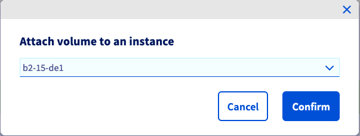
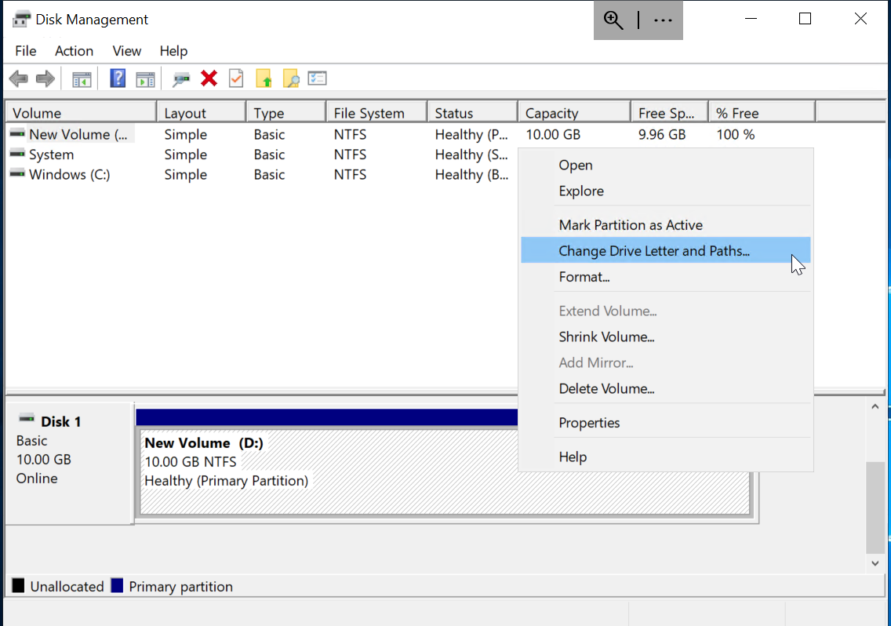

> [!primary]
> Diese Übersetzung wurde durch unseren Partner SYSTRAN automatisch erstellt. In manchen Fällen können ungenaue Formulierungen verwendet worden sein, z.B. bei der Beschriftung von Schaltflächen oder technischen Details. Bitte ziehen Sie im Zweifelsfall die englische oder französische Fassung der Anleitung zu Rate. Möchten Sie mithelfen, diese Übersetzung zu verbessern? Dann nutzen Sie dazu bitte den Button "Beitragen" auf dieser Seite.
>

**Letzte Aktualisierung am 03.03.2023**

## Ziel

Es ist möglich, zusätzliche Volumes für Ihre OVHcloud Public Cloud Instanzen zu erstellen. Das kann in folgenden Fällen hilfreich sein:

- Sie möchten Ihre Speicherkapazität erhöhen, ohne das Instanzmodell zu verändern.
- Sie benötigen hochverfügbaren und leistungsfähigen Speicherplatz.
- Sie möchten sowohl Ihren Storage als auch Ihre Daten zu einer anderen Instanz verschieben.

**Diese Anleitung erklärt, wie Sie eine zusätzliche Disk erstellen und auf Ihrer Instanz konfigurieren.**

## Voraussetzungen

- Sie haben Zugriff auf Ihr [OVHcloud Kundencenter](https://www.ovh.com/auth/?action=gotomanager&from=https://www.ovh.de/&ovhSubsidiary=de).
- Sie verfügen über eine [Public Cloud Instanz](https://www.ovhcloud.com/de/public-cloud).
- Sie haben administrativen Zugriff (Root) auf Ihre Instanz über SSH (Linux) oder RDP (Windows).

> [!warning]
> Diese Funktion ist derzeit für Metal Instanzen nicht verfügbar.
>

## In der praktischen Anwendung

### Ein neues Volume hinzufügen

Loggen Sie sich in Ihrem [OVHcloud Kundencenter](https://www.ovh.com/auth/?action=gotomanager&from=https://www.ovh.de/&ovhSubsidiary=de) ein, gehen Sie in den Bereich `Public Cloud`{.action} und wählen Sie das betreffende Public Cloud Projekt aus. Öffnen Sie `Block Storage`{.action} im linken Menü.

Klicken Sie in diesem Bereich auf den Button `Volume erstellen`{.action}.

{.thumbnail}

Folgen Sie den Konfigurationsschritten, um die Optionen für Standort, Volumetyp und Volumekapazität auszuwählen. Geben Sie einen Namen für das Volume ein und bestätigen Sie, indem Sie auf `Volume erstellen klicken`{.action}.

{.thumbnail}

Die neue Disk wird anschließend im Kundencenter angezeigt.

{.thumbnail}

Klicken Sie rechts neben dem Volume auf den Button `...`{.action} und wählen Sie `Mit Instanz verbinden`{.action}.

{.thumbnail}

Wählen Sie im angezeigten Fenster eine Instanz aus der Liste aus und klicken Sie auf `Bestätigen`{.action}, um das Volume anzuhängen.

{.thumbnail}

Der Vorgang zum Verbinden mit der Instanz startet nun. Dieser Task kann einige Minuten in Anspruch nehmen.

> [!warning]
> Achten Sie darauf, nicht vom aktuellen Bereich weg zu navigieren, während das Volume angehängt wird. Der Vorgang könnte unterbrochen werden.
>

### Konfiguration des neuen Volumes

Die folgenden Beispiele setzen voraus, dass Sie als Benutzer mit erhöhten Rechten eingeloggt sind.

#### Unter Linux

Stellen Sie eine [SSH-Verbindung](/pages/public_cloud/compute/public-cloud-first-steps#connect-to-instance) zur Instanz her und verwenden Sie den folgenden Befehl, um die eingehängten Disks aufzulisten.

```bash
~$ admin@server-1:~$ lsblk

NAME MAJ:MIN RM SIZE RO TYPE MOUNTPOINT
vda 254:0 0 10G 0 disk
└─vda1 254:1 0 10G 0 part /
vdb 254:16 0 10G 0 disk
```

> [!primary]
>
> In diesem Beispiel bezieht sich `vda` auf die originäre Disk der Instanz. Die zusätzliche Disk ist demzufolge als `vdb` benannt.
>

Erstellen Sie eine Partition auf der zusätzlichen Disk indem Sie die nachfolgenden Befehle ausführen.

```bash
~$ admin@server-1:~$ sudo fdisk /dev/vdb

Welcome to fdisk (util-linux 2.25.2).
Changes will remain in memory only, until you decide to write them.
Be careful before using the write command.

Device does not contain a recognized partition table.
Created a new DOS disklabel with disk identifier 0x95c4adcc.
```

```bash
Command (m for help): n

Partition type
p primary (0 primary, 0 extended, 4 free)
e extended (container for logical partitions)
Select (default p):
Using default response p.
Partition number (1-4, default 1):
First sector (2048-20971519, default 2048):
Last sector, +sectors or +size{K,M,G,T,P} (2048-20971519, default 20971519):

Created a new partition 1 of type 'Linux' and of size 10 GiB.
```

```bash
Command (m for help): w

The partition table has been altered.
Calling ioctl() to re-read partition table.
Syncing disks.
```

Formatieren Sie anschließend die neue Partition `vdb1` mit folgendem Befehl:

```bash
~$ admin@server-1:~$ sudo mkfs.ext4 /dev/vdb1
mke2fs 1.42.12 (29-Aug-2014)
Creating filesystem with 2621184 4k blocks and 655360 inodes
Filesystem UUID: 781be788-c4be-462b-b946-88429a43c0cf
Superblock backups stored on blocks:
32768, 98304, 163840, 229376, 294912, 819200, 884736, 1605632

Allocating group tables: done
Writing inode tables: done
Creating journal (32768 blocks): done
Writing superblocks and filesystem accounting information: done
```

Mounten Sie die Partition mit folgenden Befehlen:

```bash
admin@server-1:~$ sudo mkdir /mnt/disk
admin@server-1:~$ sudo mount /dev/vdb1 /mnt/disk/
```

Überprüfen Sie den Mountpunkt mit folgendem Befehl:

```bash
~$ admin@server-1:~$ df -h

Filesystem Size Used Avail Use% Mounted on
/dev/vda1 9.8G 840M 8.6G 9% /
udev 10M 0 10M 0% /dev
tmpfs 393M 5.2M 388M 2% /run
tmpfs 982M 0 982M 0% /dev/shm
tmpfs 5.0M 0 5.0M 0% /run/lock
tmpfs 982M 0 982M 0% /sys/fs/cgroup
/dev/vdb1 9.8G 23M 9.2G 1% /mnt/disk
```

> [!primary]
>
Die vorherige Anpassung ist nicht persistent, da die Disk wieder getrennt wird, wenn die Instanz neu gestartet wird. Zur Automatisierung des Mountvorgangs muss die Datei `fstab` angepasst werden.
>

Ermitteln Sie zunächst die UUID (Block-ID) des neuen Volumes:

```bash
~$ admin@server-1:~$ sudo blkid

/dev/vda1: UUID="51ba13e7-398b-45f3-b5f3-fdfbe556f62c" TYPE="ext4" PARTUUID="000132ff-01"
/dev/vdb1: UUID="2e4a9012-bf0e-41ef-bf9a-fbf350803ac5" TYPE="ext4" PARTUUID="95c4adcc-01"
```

Öffnen Sie `/etc/fstab` mit einem Texteditor:

```
~$ sudo nano /etc/fstab
```

Fügen Sie die folgende Zeile zur Datei hinzu und ersetzen Sie die UUID mit Ihrer zuvor ausgelesenen:

```console
UUID=2e4a9012-bf0e-41ef-bf9a-fbf350803ac5 /mnt/disk ext4 nofail 0 0
```

Speichern Sie und verlassen Sie den Editor. Nun sollte die Festplatte nach jedem Neustart automatisch gemountet werden.

#### Unter Windows

Stellen Sie eine Remotedesktop-Verbindung (RDP) mit Ihrer Windows-Instanz her.

Wenn Sie eingeloggt sind, klicken Sie mit der rechten Maustaste auf das `Startmenü`{.action} und öffnen Sie die `Datenträgerverwaltung`{.action}.

{.thumbnail}

Die neue Disk wird als unbekanntes Volume mit nicht zugewiesenem Speicherplatz angezeigt.

{.thumbnail}

Wird die Festplatte als Offline angezeigt, muss sie zuerst initialisiert werden. Sie können hierzu das [Windows GUI](#initDiskManagement) oder das [DISKPART Tool](#initDiskpart) verwenden. Falls nicht, [formatieren Sie nun die Festplatte in der Datenträgerverwaltung](#formatDiskManagement).

##### **Initialisierung der Disk in der Datenträgerverwaltung** <a name="initDiskManagement"></a>

Klicken Sie mit der rechten Maustaste auf die Disk und wählen Sie `Online`{.action}. 

Wenn die Festplatte hier als offline angezeigt wird, ist dies wahrscheinlich auf eine auf der Instanz vorhandene Policy zurückzuführen. Um dieses Problem zu lösen, klicken Sie mit der rechten Maustaste auf die Festplatte und wählen Sie `Online`{.action}.

{.thumbnail}

Klicken Sie mit der rechten Maustaste auf die Festplatte und wählen Sie dieses Mal `Festplatte initialisieren`{.action}.

{.thumbnail}

Wählen Sie `MBR`{.action} im neuen Fenster aus und klicken Sie auf `OK`{.action}.

{.thumbnail}

##### **Initialisierung der Disk mit DISKPART** <a name="initDiskpart"></a>

Klicken Sie mit der rechten Maustaste auf das `Startmenü`{.action} und öffnen Sie `Ausführen`{.action}.

{.thumbnail}

Geben Sie `cmd` ein und klicken Sie auf `OK`{.action}, um die Kommandozeilenanwendung zu öffnen.

{.thumbnail}

In der Eingabeaufforderung starten Sie DISKPART:

```
C:\> diskpart
```

Verwenden Sie folgende Befehle in DISKPART, um die Festplatte als "Online" zu konfigurieren:

```
DISKPART> san

SAN Policy : Offline Shared
```

```
DISKPART> san policy = OnlineAll

DiskPart successfully changed the SAN policy for the current operating system .

- Implementation of the strategy on the extra disk:
[Code] DISKPART> list disk

Disk ### Status Size Free Dyn Gpt
-------- ------------- ------- ------- --- ---
Disk 0 Online 200 GB 0 B
* Disk 1 Offline 10 GB 1024 KB
```

``` 
DISKPART> select disk 1

Disk 1 is now the selected disk.
```

```
DISKPART> attributes disk clear readonly

Disk attributes cleared successfully.
```

```
DISKPART> attributes disk

Current Read-only State : No
Read-only : No
Boot Disk : No
Pagefile Disk : No
Hibernation File Disk : No
Crashdump Disk : No
Clustered Disk : No
```

```
DISKPART> online disk

DiskPart successfully onlined the selected disk.
```

##### **Formatierung der Disk** <a name="formatDiskManagement"></a>

Klicken Sie in der `Datenträgerverwaltung`{.action} mit der rechten Maustaste auf die neue Disk und wählen Sie `Neues einfaches Volume...`{.action}.

{.thumbnail}

Klicken Sie im Assistenten auf `Weiter`{.action}, um die Größe des Volumes festzulegen. Sie sollte standardmäßig auf das Maximum festgelegt sein. Klicken Sie auf `Weiter`{.action}, um fortzufahren.

{.thumbnail}

Akzeptieren Sie den neuen Laufwerksbuchstaben oder wählen Sie einen anderen aus und klicken Sie dann auf `Weiter`{.action}.

{.thumbnail}

Benennen Sie das Volume (optional) und bestätigen Sie die Formatierungsoptionen, indem Sie auf `Weiter`{.action} klicken.

{.thumbnail}

Klicken Sie im letzten Fenster auf `Beenden`{.action}, um die Disk zu formatieren.

{.thumbnail}

Das Volume ist dann als Laufwerk im Dateiexplorer verfügbar.


### Volume abtrennen

Wenn Sie ein Volume von Ihrer Instanz trennen möchten, ist die beste Vorgehensweise, es vorher im Betriebssystem auszuhängen.

> [!warning]
>
> Es kann eine Fehlermeldung angezeigt werden, wenn auf der zusätzlichen Disk Software oder Prozesse ausgeführt werden. In diesem Fall wird empfohlen, zunächst alle Prozesse zu beenden.
>

#### Unter Linux <a name="linux"></a>

Stellen Sie eine [SSH-Verbindung](/pages/public_cloud/compute/public-cloud-first-steps#connect-to-instance) zur Instanz her und verwenden Sie den folgenden Befehl, um die eingehängten Disks aufzulisten.

```bash
~$ admin@server-1.~$ lsblk

NAME MAJ:MIN RM SIZE RO TYPE MOUNTPOINT
vda 254:0 0 10G 0 disk
└─ ─ vda1 254:1 0 10G 0 part /
vdb 8:0 0 10G 0 disk
└─ ─ vdb1 8:1 0 10G 0 part /mnt/disk
```

Hängen Sie die Partition mit folgendem Befehl aus:

```bash
~$ admin@server-1:~$ sudo umount /dev/vdb1
```

Löschen Sie die zugehörige UUID aus der Datei `fstab`, um den Prozess abzuschließen. Wird dies nicht durchgeführt, wird die Partition nach einem Neustart automatisch wieder gemountet.

```bash
~$ admin@server-1:~$ sudo nano /etc/fstab
```

Speichern Sie die Änderungen und verlassen Sie den Editor.

Gehen Sie in den Bereich `Public Cloud`{.action} in Ihrem OVHcloud Kundencenter und klicken Sie auf `Block Storage`{.action} im linken Menü unter **Storage**.

Klicken Sie auf den Button `...`{.action} neben dem entsprechenden Volume und wählen Sie `Instanz trennen`{.action}.

{.thumbnail}

Klicken Sie in neuen Fenster auf `Bestätigen`{.action}, um den Vorgang zu starten.

{.thumbnail}

#### Unter Windows <a name="windows"></a>

Stellen Sie eine Remotedesktop-Verbindung (RDP) mit Ihrer Windows-Instanz her.

Wenn Sie eingeloggt sind, klicken Sie mit der rechten Maustaste auf das `Startmenü`{.action} und öffnen Sie die `Datenträgerverwaltung`{.action}.

{.thumbnail}

Klicken Sie mit der rechten Maustaste auf das Volume, das Sie aushängen möchten, und wählen Sie `Laufwerkbuchstaben und -pfade ändern...`{.action}.

{.thumbnail}

Klicken Sie auf `Entfernen`{.action}, um die Disk zu entfernen.

{.thumbnail}

Klicken Sie anschließend auf `Ja`{.action}, um den Löschvorgang zu bestätigen.

{.thumbnail}

Wenn Sie fertig sind, können Sie das Datenträgerverwaltungsfenster schließen.

Gehen Sie in den Bereich `Public Cloud`{.action} in Ihrem OVHcloud Kundencenter und klicken Sie auf `Block Storage`{.action} im linken Menü unter **Storage**.

Klicken Sie auf den Button `...`{.action} neben dem entsprechenden Volume und wählen Sie `Instanz trennen`{.action}.

{.thumbnail}

Klicken Sie im neuen Fenster auf `Bestätigen`{.action}, um den Vorgang zu starten.

{.thumbnail}

## Weiterführende Informationen

Für den Austausch mit unserer User Community gehen Sie auf <https://community.ovh.com/en/>.
