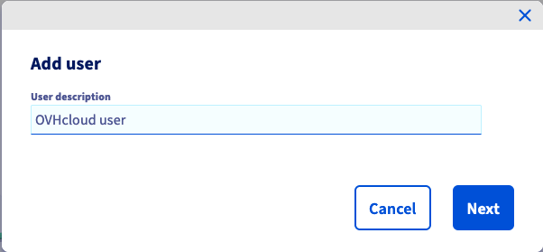

> [!primary]
> Tłumaczenie zostało wygenerowane automatycznie przez system naszego partnera SYSTRAN. W niektórych przypadkach mogą wystąpić nieprecyzyjne sformułowania, na przykład w tłumaczeniu nazw przycisków lub szczegółów technicznych. W przypadku jakichkolwiek wątpliwości zalecamy zapoznanie się z angielską/francuską wersją przewodnika. Jeśli chcesz przyczynić się do ulepszenia tłumaczenia, kliknij przycisk "Zgłóś propozycję modyfikacji" na tej stronie.
> 

## Wprowadzenie

Dostęp do interfejsu Horizon oraz API OpenStack odbywa się za pomocą kombinacji identyfikatorów i hasła zwanych "*OpenStack users*". Możesz utworzyć jak największą liczbę użytkowników OpenStack i przypisać im różne prawa dostępu.

**Niniejszy przewodnik wyjaśnia, jak zarządzać użytkownikami OpenStack w Panelu klienta OVHcloud.**

<iframe width="560" height="315" src="https://www.youtube.com/embed/NC69nrb6QlA" title="YouTube video player" frameborder="0" allow="accelerometer; autoplay; clipboard-write; encrypted-media; gyroscope; picture-in-picture" allowfullscreen></iframe>

## Wymagania początkowe

- Projekt [Public Cloud](https://www.ovhcloud.com/pl/public-cloud/) na Twoim koncie OVHcloud
- Dostęp do [Panelu client OVHcloud](https://www.ovh.com/auth/?action=gotomanager&from=https://www.ovh.pl/&ovhSubsidiary=pl)

> [!primary]
>
> Jeśli dany projekt Public Cloud jest **pierwszym projektem** utworzonym w Panelu klienta, tworzenie użytkowników OpenStack będzie możliwe dopiero po 7 dniach od daty utworzenia projektu.
>
> Aby usunąć ten środek bezpieczeństwa, należy utworzyć zgłoszenie serwisowe w Panelu klienta.
>

## W praktyce

### Tworzenie użytkownika OpenStack

Zaloguj się do Panelu klienta OVHcloud i otwórz swój projekt `Public Cloud`{.action}. W menu po lewej stronie kliknij `Users & Roles`{.action} w rubryce "Project management". 

Kliknij przycisk `Utwórz użytkownika`{.action}.

{.thumbnail}

Opis użytkownika to nie nazwa użytkownika OpenStack, ale opis, który należy wpisać, aby pomóc Ci w organizacji użytkowników i ich praw. Wprowadź opis i kliknij `Dalej`{.action}.

{.thumbnail}

Możesz teraz wybrać role, które reprezentują uprawnienia, które uzyska użytkownik. W przypadku każdego zaznaczonego kratka użytkownik uzyska uprawnienia dostępu zgodnie z poniższą tabelą.

{.thumbnail}

Kliknij na `Zatwierdź`{.action}, aby utworzyć użytkownika OpenStack. Identyfikator klienta i hasło są automatycznie generowane i wyświetlane w Panelu klienta.

{.thumbnail}

Upewnij się, czy hasło jest zapisywane tylko w tym momencie w zielonej ramce w menedżerze haseł. Hasło nie może zostać później pobrane. Możesz jednak utworzyć nowe hasło, klikając `...`{.action} i wybierając `Odnów hasło`{.action}.

{.thumbnail}

Po utworzeniu użytkownika OpenStack będziesz mógł użyć jego danych identyfikacyjnych, aby zalogować się [do interfejsu Horizon](/pages/public_cloud/compute/introducing_horizon) klikając link `Horizon`{.action} w menu po lewej stronie.

### Usuwanie użytkownika OpenStack

Użytkownik OpenStack zostaje usunięty [Panelu client OVHcloud](https://www.ovh.com/auth/?action=gotomanager&from=https://www.ovh.pl/&ovhSubsidiary=pl). W menu po lewej stronie kliknij `Users & Roles`{.action} w rubryce "Project management". 

{.thumbnail}

Kliknij `...`{.action} i wybierz `Usuń`{.action}.

> [!warning]
>
> Usunięcie użytkownika jest definitywne i spowoduje unieważnienie wszystkich przypisanych tokenów, w tym tych, których data wygaśnięcia nie została jeszcze przekroczona.
> 

## Sprawdź również

[Prezentacja Horizon](/pages/public_cloud/compute/introducing_horizon)

Dołącz do społeczności naszych użytkowników na stronie<https://community.ovh.com/en/>.