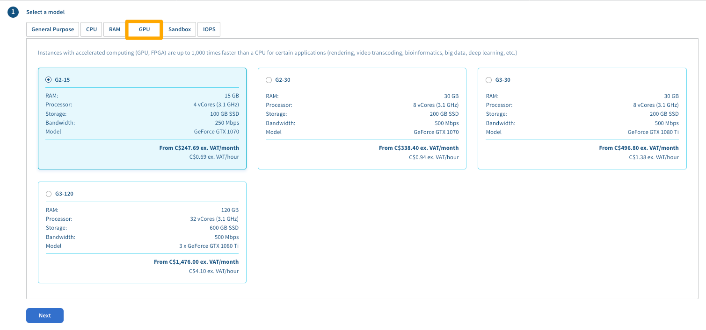

## Objectif

Les instances GPU sont techniquement similaires aux instances de la gamme 2017 mais disposent en plus d'une carte graphique (Graphic Processing Unit ou GPU). La technologie utilisée (*pci_passthrough*) permet au système d'exploitation de l'instance de contrôler le GPU exactement comme sur une machine physique.

Les GPU proposés sont des NVIDIA GeForce GTX 1060, GTX 1070 ou GTX 1080Ti. 

> [!warning]
>
> Les instances GPU sont, pour l'instant, disponibles uniquement sur le datacenter de GRA3, GRA5 et BHS3. Vous aurez peut-être besoin de créer un nouveau projet et de sélectionner la nouvelle gamme 2017.
> 

**Ce guide vous explique comment déployer une instance GPU sous Linux ou sous Windows**


## Prérequis

- Avoir créé un projet Public Cloud qui a accès aux régions où le GPU est disponible (GRA3, GRA5 et BHS3).

## En pratique

Vous trouverez ci-dessous les informations pour déployer une instance GPU via Linux ou via Windows.


### Sous Linux

Toutes les images que nous proposons peuvent être utilisées sur une instance GPU.

> [!primary]
>
> Si vous n'êtes pas à l'aise avec la compilation manuelle de module noyau, nous vous recommandons d'utiliser une distribution officiellement supportée par Nvidia, pour laquelle ils fournissent des drivers *clés-en-main* : <https://developer.nvidia.com/cuda-downloads>.
> 

Une fois connecté dans votre [espace client OVHcloud](https://ca.ovh.com/auth/?action=gotomanager&from=https://www.ovh.com/ca/fr/&ovhSubsidiary=qc){.external} dans votre project Public Cloud, cliquez sur `Ajouter un serveur`{.action} et choisissez une instance GPU :

{.thumbnail}

Quelques secondes plus tard, l'instance est démarrée. Vous pourrez ensuite vous y connecter et vérifier la présence de la carte graphique : 

```bash
lspci | grep -i nvidia
00:05.0 VGA compatible controller: NVIDIA Corporation Device 1c03 (rev a1)
00:06.0 Audio device: NVIDIA Corporation Device 10f1 (rev a1)
```

La carte graphique est présente mais n'est pas encore utilisable, il faut maintenant installer les drivers NVIDIA. Vous trouverez la liste des paquets à l'adresse suivante : [Liste des paquets Linux disponibles](http://developer.download.nvidia.com/compute/cuda/repos/){.external}.

Il suffira ensuite de taper les commandes suivantes :

```sh
wget URL_du_paquet_à_télécharger
sudo dpkg -i cuda-repo-XXXX-XXXXXX
sudo apt-get update
sudo apt-get upgrade
sudo apt-get install cuda
sudo reboot
```

> [!primary]
>
> La commande Linux peut varier en fonction de votre distribution, vérifiez auprès de la documentation officielle de votre version Linux en cas de doute.
> 


Une fois l'instance redémarrée, la carte graphique apparaît dans l'utilitaire NVIDIA :

```sh
nvidia-smi
Wed Apr 26 13:05:25 2017
+-----------------------------------------------------------------------------+
| NVIDIA-SMI 375.51                 Driver Version: 375.51                    |
|-------------------------------+----------------------+----------------------+
| GPU  Name        Persistence-M| Bus-Id        Disp.A | Volatile Uncorr. ECC |
| Fan  Temp  Perf  Pwr:Usage/Cap|         Memory-Usage | GPU-Util  Compute M. |
|===============================+======================+======================|
|   0  GeForce GTX 106...  Off  | 0000:00:05.0     Off |                  N/A |
|  0%   22C    P0    26W / 120W |      0MiB /  6072MiB |      0%      Default |
+-------------------------------+----------------------+----------------------+

+-----------------------------------------------------------------------------+
| Processes:                                                       GPU Memory |
|  GPU       PID  Type  Process name                               Usage      |
|=============================================================================|
|  No running processes found                                                 |
+-----------------------------------------------------------------------------+
```

L'instance GPU est désormais pleinement fonctionelle et utilisable.


### Sous Windows

Il y a des incompatibilités entre le driver Nvidia et la solution de virtualisation *KVM/pci_passthrough*. **Les images Windows standard ne fonctionnent pas.**

Nous fournissons des images spéciales, reposant sur un BIOS virtuel UEFI, qui permettent au driver de fonctionner correctement :

{.thumbnail}


> [!warning]
>
> Il ne nous est pas possible de garantir que la  solution fonctionnera avec toutes les versions futures du driver NVIDIA.
>
> Avant toute mise à jour du driver NVIDIA il est fortement recommandé de prendre un snapshot qui vous permettra de revenir en arrière le cas échéant.
>

Une fois votre instance GPU démarrée il faudra installer le driver NVIDIA depuis le [site officiel](http://www.nvidia.fr/Download/index.aspx){.external}.

Démarrez une instance en utilisant une des flavors GPU (win-g1-15, win-g1-30...).

Quelques minutes plus tard, l'instance est démarrée. Il rester à installer le pilote nécessaire, qui apparaîtra ensuite ici :


{.thumbnail}

{.thumbnail}


## Aller plus loin

Échangez avec notre communauté d'utilisateurs sur <https://community.ovh.com>.
