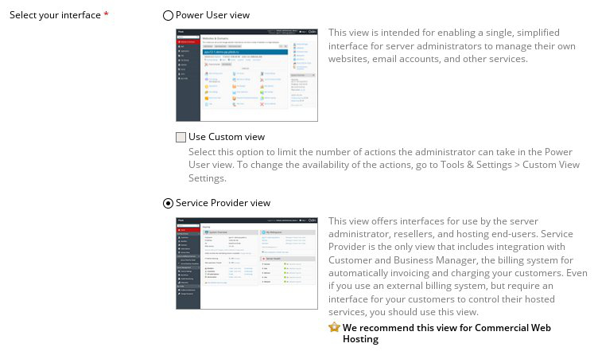

> [!primary]
> Esta traducción ha sido generada de forma automática por nuestro partner SYSTRAN. En algunos casos puede contener términos imprecisos, como en las etiquetas de los botones o los detalles técnicos. En caso de duda, le recomendamos que consulte la versión inglesa o francesa de la guía. Si quiere ayudarnos a mejorar esta traducción, por favor, utilice el botón «Contribuir» de esta página.
> 

## Objetivo

Plesk es un panel de control de servidores fácil de usar que puede instalarse en las instancias del Public Cloud de OVHcloud.

**Esta guía explica cómo instalar Plesk en una instancia de Public Cloud.** 

> [!warning]
> 
> La responsabilidad sobre los servicios que OVHcloud pone a su disposición recae íntegramente en usted. Nuestros técnicos no son los administradores de las máquinas, ya que no tienen acceso a ellas. Por lo tanto, la gestión del software y la seguridad le corresponde a usted.
>
> Esta guía le ayudará a realizar las operaciones más habituales. No obstante, si tiene problemas o dudas sobre la administración, la utilización o la seguridad de su servidor, le recomendamos que contacte con un proveedor de servicios especializado. No dude en participar en nuestro [foro comunitario](https://community.ovh.com/en/){.external} para solicitar ayuda a otros usuarios.
>

## Requisitos

- [Crear una instancia desde el área de cliente de OVHcloud](/pages/platform/public-cloud/public-cloud-first-steps#3-crear-una-instancia/).
- [Conectarse como usuario root y establecer una contraseña](/pages/public_cloud/compute/become_root_and_change_password).

## Procedimiento

### 1. Instalar Plesk

Instalar Plesk desde una conexión SSH es bastante sencillo. Para ello, descargue y ejecute el script de instalación de Plesk utilizando uno de los siguientes comandos:

- **Instalación por defecto**

```bash
# sh <(curl https://autoinstall.plesk.com/one-click-installer || wget -O - https://autoinstall.plesk.com/one-click-installer)
```

- **Instalación personalizada**

```bash
# sh <(curl https://autoinstall.plesk.com/plesk-installer || wget -O - https://autoinstall.plesk.com/plesk-installer)
```

Espere mientras se instala Plesk. 

### 2. Configurar Plesk

Conéctese a Plesk para configurarlo. Para ello, utilice la dirección **https://IP.de.la.instancia:8443** en su navegador de internet.

Introduzca su usuario y contraseña root en la pantalla de conexión.

{.thumbnail}

Una vez conectado, aparecerá un asistente que le permitirá configurar la apariencia del panel Plesk en función de su actividad.

{.thumbnail}

Seleccione el tipo de vista de la interfaz de Plesk que desee.

{.thumbnail}

A continuación, introduzca los datos de conexión a su instancia:

- hostname
- dirección IP
- contraseña root

{.thumbnail}

Por último, introduzca la información de la cuenta de administrador.

{.thumbnail}

### 3. Añadir una licencia

Para añadir su licencia de Plesk, necesitará la clave que le haya comunicado su proveedor.

> [!primary]
>
> OVHcloud no comercializa licencias de Plesk para la solución Public Cloud. No obstante, puede adquirir una desde la web de [Plesk](https://www.plesk.com/){.external}.
> 

La primera vez que se conecte a la interfaz, se abrirá automáticamente una página que le permitirá instalar su licencia de Plesk.

{.thumbnail}

Si quiere cambiar su licencia para, por ejemplo, sustituir la de prueba o cambiar de tipo, puede hacerlo desde el panel de Plesk. En **Administración del servidor**, haga clic en `Herramientas y configuración`{.action}. En el apartado **Plesk**, haga clic en `Administración de licencias`{.action}.

Una vez que haya añadido la nueva clave, puede ver el tipo de licencia instalado en la barra superior, junto al logo de Plesk.

{.thumbnail}

## Más información

[Documentación oficial de Plesk](https://docs.plesk.com/es-ES/onyx/){.external}

Interactúe con nuestra comunidad de usuarios en <https://community.ovh.com/en/>.
