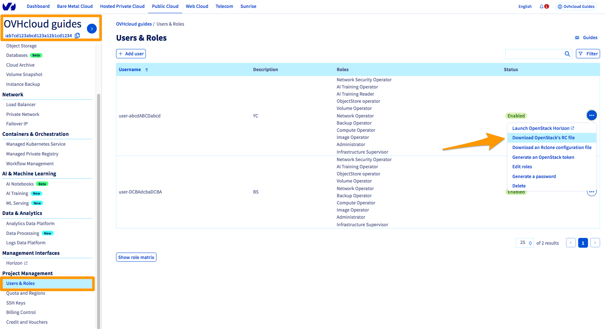

> [!primary]
> Esta traducción ha sido generada de forma automática por nuestro partner SYSTRAN. En algunos casos puede contener términos imprecisos, como en las etiquetas de los botones o los detalles técnicos. En caso de duda, le recomendamos que consulte la versión inglesa o francesa de la guía. Si quiere ayudarnos a mejorar esta traducción, por favor, utilice el botón «Contribuir» de esta página.
> 

## Objetivo

Cambiar las variables de entorno necesarias para OpenStack en su equipo le permitirá utilizar la API de OpenStack y, así, gestionar su infraestructura desde esta.

## Requisitos

- Haber iniciado sesión en el [área de cliente de OVHcloud](https://www.ovh.com/auth/?action=gotomanager&from=https://www.ovh.es/&ovhSubsidiary=es).
- Haber creado un usuario de OpenStack. Consulte [la guía dedicada a este tema](/pages/public_cloud/compute/create_and_delete_a_user).
- Haber preparado el entorno para utilizar OpenStack. Para ello, consulte la siguiente guía: [«Preparar el entorno para utilizar la API de OpenStack»](/pages/public_cloud/compute/prepare_the_environment_for_using_the_openstack_api).

## Procedimiento

### Paso 1: obtener las variables

Para obtener sus variables de entorno, puede descargar el archivo OpenRC de su usuario OpenStack previamente creado.

Conéctese a su [área de cliente de OVHcloud](https://www.ovh.com/auth/?action=gotomanager&from=https://www.ovh.es/&ovhSubsidiary=es), acceda a la sección `Public Cloud`{.action} y seleccione su proyecto de Public Cloud.

En el apartado `Project Management`, haga clic en `Users & roles`{.action}, haga clic en `«...»`{.action} a la derecha de su usuario y seleccione `«Descargar el archivo RC de OpenStack»`{.action}.

{.thumbnail}

Un archivo OpenRC corresponde tanto a un usuario como a una zona. No puede gestionar varias zonas en un mismo archivo.

### Paso 2: cargar las variables

#### **En Linux**

* Abra una terminal o conéctese con el usuario que hará las llamadas a la API de OpenStack.
* Cargue el contenido del archivo en el entorno actual. El sistema le pedirá la contraseña del usuario de Horizon correspondiente.

```bash
admin@vpsxxxxxx:~$ source openrc.sh
Please enter your OpenStack Password:
```

Como indicamos en [esta guía](/pages/public_cloud/compute/create_and_delete_a_user), la contraseña solo se ve una vez, en el momento de su creación.

Si la ha olvidado, deberá crearla nuevamente.

Si las interfaces de línea de comandos (CLI) ya están instaladas, solo compruebe que funcionen correctamente.

```bash
(env)$ openstack server list
+--------------------------------------+------------+--------+-----------------------------------------------+-----------+--------+
| ID                                   | Name       | Status | Networks                                      | Image     | Flavor |
+--------------------------------------+------------+--------+-----------------------------------------------+-----------+--------+
| 8d7c67c0-38e1-4091-88d5-c14844c1f455 | b2-7-gra11 | ACTIVE | Ext-Net=2001:xxxx:xxx:xxx::xxxx, xx.xxx.xx.xx | Debian 12 | b2-7   |
+--------------------------------------+------------+--------+-----------------------------------------------+-----------+--------+
```

Tenga en cuenta que puede guardar la contraseña predefinida del usuario de Horizon. Para ello, sustituya:

```bash
echo "Please enter your OpenStack Password: "
read -sr OS_PASSWORD_INPUT
export OS_PASSWORD=$OS_PASSWORD_INPUT
```

Por:

```bash
#echo "Please enter your OpenStack Password: "
#read -sr OS_PASSWORD_INPUT
export OS_PASSWORD="Contraseña del usuario Horizon"
```

Por defecto, deberá cargar este entorno cada vez que abra una sesión en el entorno actual. Si desea que sea permanente, añada la fuente openrc.sh al archivo bashrc. Para ello, debe predefinir la contraseña en el archivo.

#### **En Windows**

El archivo OpenRC no está diseñado para utilizarlo en Windows.

Por lo tanto, tiene dos soluciones para cargar las variables de entorno:

- Deberá adaptar el archivo modificando algunos comandos. En efecto, **export** puede sustituirse por **set**:

```bash
set OS_PASSWORD="Contraseña del usuario de Horizon"
```

- Es posible cargar las variables directamente desde los parámetros del sistema: Panel de configuración > Sistema > Configuración avanzada del sistema > Variables de entorno:

{.thumbnail}

## Más información

Para aprender a utilizar OpenStack: [Documentación de OpenStack](https://docs.openstack.org/){.external}

Interactúe con nuestra comunidad de usuarios en <https://community.ovh.com/en/>.