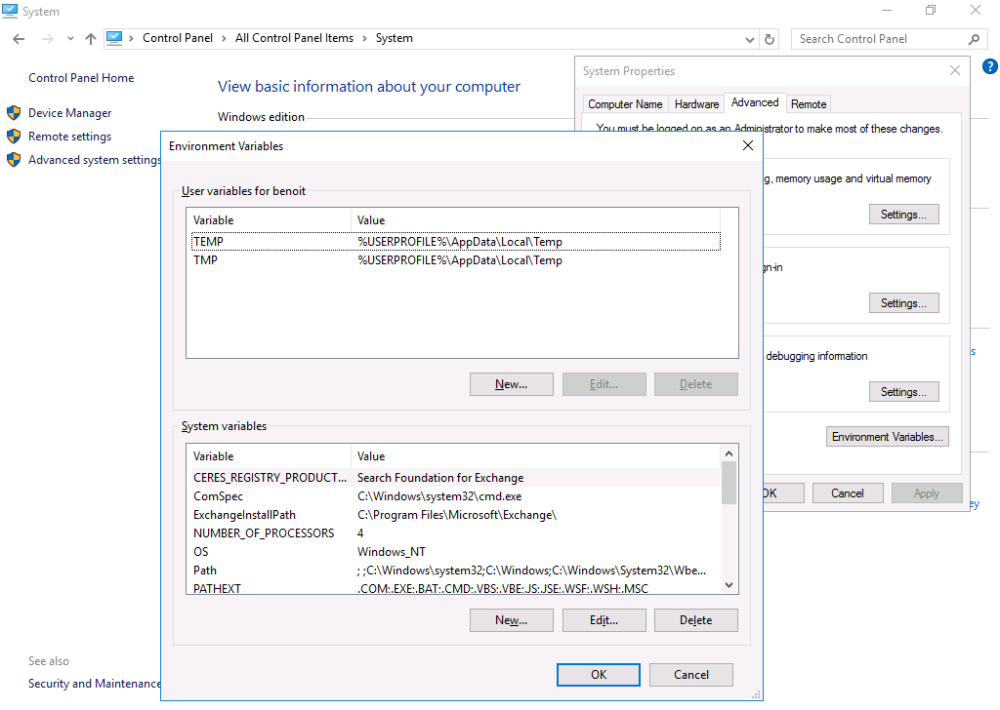

**Ultimo aggiornamento: 18/08/2021**

## Obiettivo

L’impostazione delle variabili d’ambiente OpenStack ti consente di utilizzare l’API OpenStack e gestire la tua infrastruttura.

## Prerequisiti

- Avere accesso allo [Spazio Cliente OVHcloud](https://www.ovh.com/auth/?action=gotomanager&from=https://www.ovh.it/&ovhSubsidiary=it)
- Aver creato un utente OpenStack. A questo proposito, consulta [l’apposita guida](/pages/public_cloud/compute/create_and_delete_a_user)
- Aver preparato l’ambiente di sviluppo per utilizzare l’API OpenStack. A questo proposito, consulta questa guida: [Preparare l’ambiente per utilizzare l’API OpenStack](/pages/public_cloud/compute/prepare_the_environment_for_using_the_openstack_api)

## Procedura

### Step 1: recupera le variabili

Per recuperare le variabili d’ambiente scarica il file OpenRC dall’utente OpenStack creato in precedenza.

Accedi al tuo [Spazio Cliente OVHcloud](https://www.ovh.com/auth/?action=gotomanager&from=https://www.ovh.it/&ovhSubsidiary=it){.external}, accedi alla sezione `Public Cloud`{.action} e seleziona il tuo progetto Public Cloud in alto a sinistra.
<br> Nella sezione `Project Management`, clicca su `Users & Roles`{.action}, clicca sui `...`{.action} a destra del tuo utente e seleziona `Scarica il file RC di Openstack`{.action}.

{.thumbnail}

Un file OpenRC corrisponde sia un utente che a una zona. Non è possibile gestire più zone in uno stesso file.

### Step 2: impostare le variabili

#### **Con Linux**

* Apri un terminale o connettiti con l’utente che effettuerà le chiamate all’API OpenStack
* Carica il contenuto del file nell’ambiente corrente A questo punto ti verrà chiesto di inserire la password dell’utente Horizon

```bash
admin@vpsxxxxxx:~$ source openrc.sh
Please enter your OpenStack Password:
```

Come indicato in [questa guida](/pages/public_cloud/compute/create_and_delete_a_user), la password è visibile una sola volta, cioè al momento della sua creazione.

Se l’hai dimenticata, dovrai reimpostarla.

Se le CLI sono già state installate, verifica che funzionino correttamente.

```bash
admin@vpsxxxxxx:~$ nova list
+--------------------------------------+------+--------+------------+-------------+------------------------+
| ID                                   | Name | Status | Task State | Power State | Networks               |
+--------------------------------------+------+--------+------------+-------------+------------------------+
| 2278e269-a529-40cc-9a08-794fda9302d3 | deb8 | ACTIVE | -          | Running     | Ext-Net=xx.xxx.xx.xxx |
+--------------------------------------+------+--------+------------+-------------+------------------------+
```

È possibile salvare la password utente Horizon sul disco rigido. Per farlo, sostituisci:

```bash
echo "Please enter your OpenStack Password: "
read -sr OS_PASSWORD_INPUT
export OS_PASSWORD=$OS_PASSWORD_INPUT
```

Con:

```bash
#echo "Please enter your OpenStack Password: "
#read -sr OS_PASSWORD_INPUT
export OS_PASSWORD="Password dell’utente Horizon"
```

Sarà necessario impostare questo ambiente, di default, all’avvio di ogni sessione nell’ambiente corrente. È possibile renderlo permanente aggiungendo la sorgente openrc.sh al file bashrc. Per effettuare questa operazione, è necessario salvare la password nel file.


#### **Con Windows**

Il file OpenRC non è concepito per essere avviato con Windows.

Per impostare le variabili d’ambiente hai quindi due possibilità:

- Sarà necessario adattare il file modificando alcuni comandi. Infatti **export** può essere sostituito da **set**:

```bash
export OS_PASSWORD="Password dell’utente Horizon"
```

- È possibile impostare le variabili direttamente dalle impostazioni di sistema:  Impostazioni > Sistema > Impostazioni di sistema avanzate> Variabili d’ambiente:


{.thumbnail}

## Per saperne di più

OpenStack, istruzioni per l'uso: [Documentation OpenStack](https://docs.openstack.org/train/){.external}

Contatta la nostra Community di utenti all’indirizzo <https://community.ovh.com/en/>.