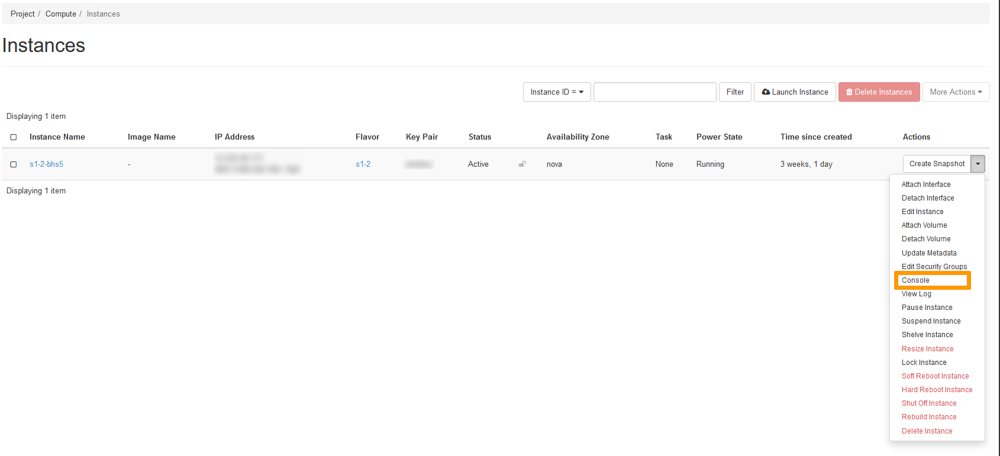
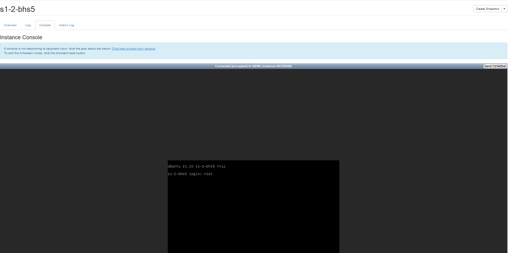

> [!primary]
> Esta traducción ha sido generada de forma automática por nuestro partner SYSTRAN. En algunos casos puede contener términos imprecisos, como en las etiquetas de los botones o los detalles técnicos. En caso de duda, le recomendamos que consulte la versión inglesa o francesa de la guía. Si quiere ayudarnos a mejorar esta traducción, por favor, utilice el botón «Contribuir» de esta página.
>

**Última actualización: 03/02/2022**

## Objetivo

Además del área de cliente de OVHcloud, también puede gestionar sus proyectos de Public Cloud a través de la [interfaz de Horizon](https://horizon.cloud.ovh.net/auth/login/). Allí encontrará toda su infraestructura (instancias, copias de seguridad, discos, claves SSH, etc.) y proyectos de almacenamiento (incluida la lista de sus contenedores).

**Esta guía explica cómo gestionar las instancias de Public Cloud en Horizon.**

## Requisitos

- Haber creado una instancia de Public Cloud desde el [área de cliente de OVHcloud](/pages/public_cloud/compute/public-cloud-first-steps) o a través de la [interfaz de Horizon](/pages/public_cloud/compute/create_instance_in_horizon).
- [Haber creado una llave SSH](/pages/public_cloud/compute/public-cloud-first-steps#1-crear-claves-ssh/).

## Procedimiento

### Acceda a la interfaz de administración de la instancia.

En primer lugar, conéctese en la [interfaz Horizon](https://horizon.cloud.ovh.net/auth/login/).

A diferencia del área de cliente de OVHcloud, Horizon separa sus servicios en función de su región de origen. Puede elegir la región desde el menú situado en la parte superior izquierda:

{.thumbnail}

Haga clic en el menú `Compute`{.action} a la izquierda y seleccione `Instances`{.action}. En esa página, verá un resumen de todas sus instancias. En ella se presentan varios datos:

  * el modelo de su instancia (*Flavor*)
  * su nombre, su estado de alimentación (Power State) y el tiempo transcurrido desde su creación (*Time since created*)
  * la dirección IPv4 e IPV6 de su instancia
  * su red privada asociada y su dirección IPv4 privada
  * su estado (*Status*)
  * la imagen utilizada para la instalación de la instancia (si es aplicable)

{.thumbnail}

**Launch Instance** 

Esta opción le permite crear una instancia. Para más información, consulte [esta guía](/pages/public_cloud/compute/create_instance_in_horizon).

**Delete Instances**

Esta opción le permite eliminar varias instancias al mismo tiempo. Solo tiene que marcar la casilla situada a la izquierda del nombre de la instancia.

**More Actions**

Este menú le permite realizar las siguientes acciones en una o más instancias. En primer lugar, marque la casilla situada a la izquierda del nombre de la instancia:

- Start Instances: esta opción permite reiniciar una o más instancias en estado *shutoff* u *off*.
- Shut Off Instances : esta opción permite suspender una o varias instancias.
- Soft Reboot Instances: esta opción le permite recargar software en una o más instancias.

**Create Snapshot** : Esta opción permite crear un snapshot (instantáneo) de la instancia. Para más información, consulte [esta guía](/pages/public_cloud/compute/managing_snapshots_in_horizon).

### Editar una instancia

Seleccione la opción que desee en el panel de control de la instancia.

{.thumbnail}

- Attach Interface: esta opción permite añadir una o más interfaces privadas a su instancia a través de la VLAN. Para más información, consulte [esta parte](/pages/public_cloud/public_cloud_network_services/getting-started-07-creating-vrack#anadir-una-interfaz-privada) de la guía correspondiente.
- Detach Interface: esta opción permite eliminar una interfaz vinculada a una instancia. Para más información, consulte [esta parte](/pages/public_cloud/public_cloud_network_services/getting-started-07-creating-vrack#eliminacion-de-una-interfaz-privada) de la guía correspondiente.
- Edit Instance : esta opción permite cambiar el nombre de la instancia y los [grupos de seguridad](/pages/public_cloud/compute/setup_security_group).

> [!warning]
> Las opciones en rojo indican la posibilidad de pérdida de datos durante el proceso. Asegúrese de disponer siempre de una copia de seguridad de sus datos antes de realizar cambios en su instancia.
>

### Redimensionar una instancia

Gracias al Public Cloud, podrá aumentar los recursos de su instancia fácilmente en pocos clics.

> [!warning]
>
> Sólo es posible redimensionar a un modelo superior para los modelos clásicos.
> Además, esta operación interrumpe la instancia durante la operación.
> 

> [!success]
>
> Las instancias de tipo *flex* permiten redimensionar hacia modelos superiores o inferiores gracias a un único tamaño de disco.
> 

Seleccione `Resize Instance`{.action} en el menú desplegable situado a la derecha de la instancia correspondiente.

{.thumbnail}

* Elección de la plantilla (*Flavor Choice*): esta sección indica la plantilla actual (*old flavor*) y le permite seleccionar una nueva plantilla (*new flavor*) para el recurso de la instancia.

{.thumbnail}

* Detalles de la plantilla (*Flavor Details*). En esta sección se muestran los recursos asociados a la plantilla seleccionada. 
* Límites de Proyecto (*Project Limits*). Consulte aquí los recursos ocupados en relación con los recursos totales asignados al proyecto.

> [!warning]
> Tenga en cuenta que solo puede redimensionar una instancia de un modelo Linux a otro modelo Linux y de un modelo Windows a otro modelo Windows.
>

* Opciones avanzadas (*Advanced Options*). Esta sección permite gestionar la partición del disco (*Disk Partition*) y el grupo de servidores (*Server Group*).

{.thumbnail}

Una vez completada la configuración, haga clic en `Resize`{.action}.

**Redimensionar el disco en Windows**

Atención: Al redimensionar una instancia Windows, el tamaño de la partición no se actualiza automáticamente, por lo que deberá ampliarse utilizando el **disk manager**:

Haga clic derecho en el menú `Inicio`{.action} e inicie el gestor del disco haciendo clic en `Administración de discos`{.action}:

{.thumbnail}

Haga clic derecho en la partición principal y seleccione `Extender volumen`{.action}.

{.thumbnail}

Haga clic en `Siguiente`{.action} para acceder al `Asistente para extender volúmenes`. Seleccione los recursos del disco que quiera ampliar y haga clic en `Siguiente`{.action}. 

{.thumbnail}

Haga clic en `Finalizar`{.action} para aceptar la opción que prefiera.

{.thumbnail}

El nuevo tamaño del disco se mostrará en el gestor de disco.

{.thumbnail}

### Reconstruir una instancia

Esta opción le permite reconfigurar su instancia sobre una nueva base o simplemente cambiar de sistema operativo.

> [!alert]
> Esta operación eliminará los datos de la instancia.
> 

Seleccione `Rebuild Instance`{.action} en la lista desplegable correspondiente a la instancia.

{.thumbnail}

Seleccione la imagen para la reconstrucción. 
Seleccione el tipo de partición ("Automática" o "Manual"). Esto es opcional. 
Por último, haga clic en `Rebuild Instance`{.action}. Esta operación puede tardar unos minutos.

### Suspender o poner en pausa una instancia (Shelve or pause an instance)

Para saber cómo suspender o poner en pausa una instancia, haga clic [aquí](/pages/public_cloud/compute/suspend_or_pause_an_instance) para consultar la guía específica sobre este método.

### Acceder a la consola de la instancia 

Si pierde el acceso a su instancia, ya sea debido a una mala configuración o a un corte del servicio SSH, podrá reconfigurar su instancia utilizando la consola VNC.

> [!primary]
>
> Puede acceder directamente a su instancia a través de la consola VNC. En cambio, es necesario configurar previamente una contraseña para el usuario root.
> Para más información, consulte [esta guía](/pages/public_cloud/compute/become_root_and_change_password).
> La consola VNC también puede servir de primer enfoque en caso de fallo de funcionamiento para establecer un diagnóstico gracias al análisis de la fase de inicio de su instancia.
> 

En el desplegable correspondiente a la instancia, seleccione `Console`{.action}.

{.thumbnail}

Se mostrará la consola de la instancia.

> [!success]
>
> Si la consola no responde a las entradas de teclado, haga clic en la barra de estado.
> Para salir del modo de pantalla completa, haga clic en el botón de retorno del navegador.
> 

**Consola de la instancia**

{.thumbnail}

### Reiniciar una instancia

Existen dos métodos para reiniciar una instancia:

- Reinicio en caliente (software) (Soft Reboot Instance)
- Reinicio en frío (hardware) (Hard Reboot Instance)

En la lista desplegable correspondiente a la instancia, seleccione `Soft Reboot Instance`{.action} o `Hard Reboot Instance`{.action}.

{.thumbnail}

A continuación, confirme la consulta en la nueva ventana.

### Eliminar una instancia

Si ya no necesita una de sus instancias, puede eliminarla en cualquier momento.

> [!alert]
>
> Se van a eliminar los datos presentes en la instancia.
> También puede crear una copia de seguridad de esta instancia si quiere conservar los datos y volver a iniciar una instancia idéntica más adelante.
> 

En el desplegable correspondiente a la instancia, seleccione `Delete Instance`{.action}. 

{.thumbnail}

Haga clic en `Confirm`{.action} para iniciar el proceso.

> [!success]
>
> Una vez eliminada, la instancia dejará de facturarse y no podrá recuperarla.
> 

## Más información

Interactúe con nuestra comunidad de usuarios en <https://community.ovh.com/en/>.