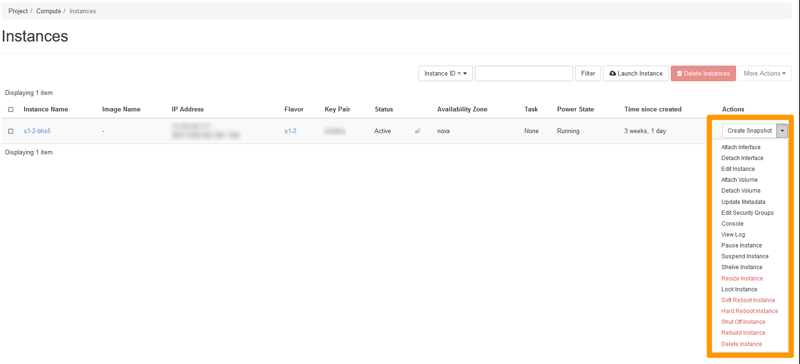
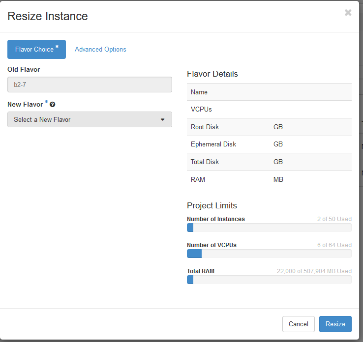
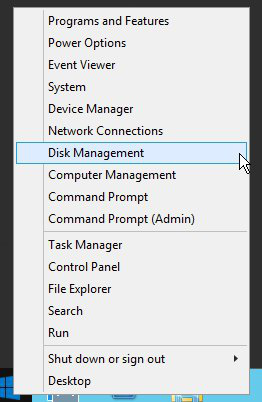
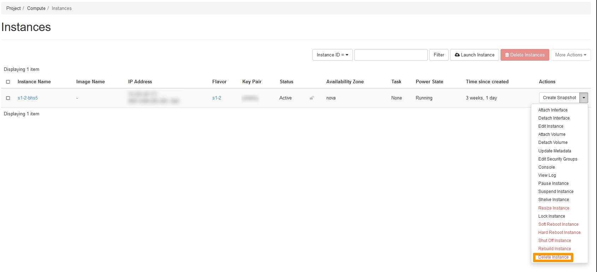

> [!primary]
> Tłumaczenie zostało wygenerowane automatycznie przez system naszego partnera SYSTRAN. W niektórych przypadkach mogą wystąpić nieprecyzyjne sformułowania, na przykład w tłumaczeniu nazw przycisków lub szczegółów technicznych. W przypadku jakichkolwiek wątpliwości zalecamy zapoznanie się z angielską/francuską wersją przewodnika. Jeśli chcesz przyczynić się do ulepszenia tłumaczenia, kliknij przycisk "Zgłóś propozycję modyfikacji" na tej stronie.
>

## Wprowadzenie

Oprócz Panelu klienta OVHcloud możesz również zarządzać projektami Public Cloud w [interfejsie Horizon](https://horizon.cloud.ovh.net/auth/login/). Znajdziesz tam wszystkie Twoje projekty związane z infrastrukturą (instancje, kopie zapasowe, dyski, klucze SSH, etc.) oraz przestrzenią dyskową (w tym listę Twoich kontenerów).

**Niniejszy przewodnik wyjaśnia, jak zarządzać instancjami Public Cloud za pośrednictwem interfejsu Horizon.**

## Wymagania początkowe

- Utworzenie instancji Public Cloud w [Panelu klienta OVHcloud](/pages/public_cloud/compute/public-cloud-first-steps) lub w [interfejsie Horizon](/pages/public_cloud/compute/create_instance_in_horizon).
- [Utworzenie klucza SSH](/pages/public_cloud/compute/public-cloud-first-steps#krok-1-utworzenie-kluczy-ssh).

## W praktyce

### Dostęp do interfejsu zarządzania instancją

Zaloguj się najpierw do [interfejsu Horizon](https://horizon.cloud.ovh.net/auth/login/).

W przeciwieństwie do Panelu klienta OVHcloud, Horizon rozdziela Twoje usługi w zależności od regionu. Region można wybrać z menu w lewym górnym rogu:

{.thumbnail}

Kliknij menu `Compute`{.action} po lewej stronie, a następnie wybierz `Instances`{.action}. Na stronie, która się wyświetla zobaczysz podsumowanie wszystkich Twoich instancji. Pojawi się tu kilka informacji:

  * Model instancji (*Flavor*)
  * Nazwa, stan zasilania (Power State) i czas, jaki upłynął od jej utworzenia (*Time since created*)
  * Adres IPv4 i IPV6 instancji
  * Przypisaną prywatną sieć i prywatny adres IPv4
  * Status instancji
  * Obraz używany do instalacji instancji (jeśli dotyczy)

{.thumbnail}

**Launch Instance** 

Ta opcja pozwala na utworzenie instancji. Więcej informacji znajdziesz [w tym przewodniku](/pages/public_cloud/compute/create_instance_in_horizon).

**Delete Instances**

Ta opcja pozwala na usunięcie kilku instancji jednocześnie. Wystarczy zaznaczyć pole po lewej stronie nazwy instancji.

**More Actions**

To menu pozwala na wykonywanie następujących operacji na jednej lub kilku instancjach. Najpierw upewnij się, czy zaznaczyłeś kratkę po lewej stronie nazwy instancji:

- Start Instances: ta opcja pozwala na ponowne uruchomienie jednej lub kilku instancji o statusie *shutoff* lub *off*.
- Shut Off Instances opcja ta pozwala na zawieszenie jednej lub kilku instancji.
- Soft Reboot Instances: opcja ta pozwala na uruchomienie oprogramowania na jednej lub kilku instancjach.

**Tworzenie kopii zapasowej**: Ta opcja pozwala na utworzenie snapshota instancji. Więcej informacji znajdziesz [w tym przewodniku](/pages/public_cloud/compute/managing_snapshots_in_horizon).

### Zmień instancję

W interfejsie zarządzania instancją wybierz odpowiednią opcję z rozwijanej listy.

{.thumbnail}

- Attach Interface: ta opcja pozwala na dodanie jednego lub kilku prywatnych interfejsów do Twojej instancji za pośrednictwem sieci VLAN. Więcej informacji znajdziesz w [tej części](/pages/public_cloud/public_cloud_network_services/getting-started-07-creating-vrack#dodawanie-prywatnego-interfejsu) odpowiedniego przewodnika.
- Detach Interface: ta opcja pozwala na usunięcie interfejsu związanego z instancją. Więcej informacji znajdziesz w [tej części](/pages/public_cloud/public_cloud_network_services/getting-started-07-creating-vrack#usuwanie-prywatnego-interfejsu) odpowiedniego przewodnika.
- Edit Instance: ta opcja pozwala na zmianę nazwy instancji i [grup zabezpieczeń](/pages/public_cloud/compute/setup_security_group).

> [!warning]
> Opcje w kolorze czerwonym wskazują na możliwość utraty danych podczas procesu. Zanim wprowadzisz zmiany na Twojej instancji, upewnij się, że zawsze posiadasz kopię zapasową swoich danych.
>

### Zmiana rozmiaru instancji

Dzięki usłudze Public Cloud możesz zwiększyć zasoby Twojej instancji - wystarczy kilka kliknięć.

> [!warning]
>
> W przypadku modeli klasycznych możliwe jest tylko zmiana rozmiaru na wyższy.
> Operacja ta spowoduje również wycięcie instancji w czasie jej wykonywania.
> 

> [!success]
>
> Instancje typu *flex* umożliwiają zmianę rozmiaru na wyższe lub niższe modele dzięki unikalnemu rozmiarowi dysku.
> 

Wybierz `Resize Instance`{.action} z rozwijanego menu po prawej stronie odpowiedniej instancji.

{.thumbnail}

* Wybór szablonu (*Flavor Choice*): ta sekcja wskazuje aktualny szablon (*old flavor*) i pozwala wybrać nowy szablon (*new flavor*) dla zasobu instancji.

{.thumbnail}

* Szczegóły skrajni (*Flavor Details*). W tej sekcji wyświetlają się zasoby przypisane do wybranego szablonu. 
* Limity Projektu (*Project Limits*). Tutaj możecie zobaczyć wykorzystane zasoby w porównaniu z całkowitymi zasobami przeznaczonymi na dany projekt.

> [!warning]
> Pamiętaj, że możesz tylko zmienić rozmiar instancji z jednego modelu Linux na inny model Linux i z jednego modelu Windows na inny model Windows.
>

* Opcje zaawansowane (*Advanced Options*). Sekcja ta pozwala na zarządzanie partycjonowaniem dysku (*Disk Partion*) i grupy serwerów (*Server Group*).

{.thumbnail}

Po zakończeniu konfiguracji kliknij `Resize`{.action}.

**Zmiana rozmiaru dysku w systemie Windows**

Uwaga: podczas zmiany rozmiaru instancji Windows rozmiar partycji nie jest automatycznie aktualizowany. Należy więc rozszerzyć ją, używając **menedżera dysku**:

Kliknij prawym przyciskiem myszy w menu `Start`{.action} i uruchom menedżer dysku klikając `Zarządzanie dyskami`{.action}.

{.thumbnail}

Kliknij prawym przyciskiem myszy na partycję główną, a następnie kliknij `Rozszerz wolumin`{.action}.

{.thumbnail}

Kliknij `Dalej`{.action}, aby uzyskać dostęp do `Kreator rozszerzenia woliminów`. Wybierz zasoby dysku do rozszerzenia i kliknij `Dalej`{.action}. 

{.thumbnail}

Następnie kliknij `Zakończ`{.action}, aby zatwierdzić wybór.

{.thumbnail}

Nowy rozmiar dysku zostanie wyświetlony w managerze dysku.

{.thumbnail}

### Przebudowa instancji

Ta opcja pozwala na ponowne skonfigurowanie instancji na nowej bazie lub na zmianę systemu operacyjnego.

> [!alert]
> Operacja ta spowoduje usunięcie danych instancji.
> 

Wybierz `Rebuild Instance`{.action} z rozwijanej listy odpowiadającej instancji.

{.thumbnail}

Wybierz obraz do rekonstrukcji. 
Wybierz typ partycji ("Automatyczne" lub "Ręczne"). Jest to opcjonalne. 
Na koniec kliknij `Rebuild Instance`{.action}. Operacja ta może zająć kilka minut.

### Wstrzymanie lub uśpienie instancji (Shelve or pause an instance)

Aby dowiedzieć się, jak wstrzymanie lub uśpienie instancji, kliknij [tutaj](/pages/public_cloud/compute/suspend_or_pause_an_instance), aby zapoznać się z przewodnikiem dotyczącym tej metody.

### Dostęp do konsoli instancji 

W przypadku utraty dostępu do instancji, wynikającej z nieprawidłowej konfiguracji lub przerwy w działaniu usługi SSH, możesz ponownie skonfigurować instancję za pomocą konsoli VNC.

> [!primary]
>
> Dostęp do instancji jest możliwy przez konsolę VNC. Przed skonfigurowaniem hasła dla użytkownika root należy jednak najpierw skonfigurować.
> Więcej informacji znajdziesz [w tym przewodniku](/pages/public_cloud/compute/become_root_and_change_password).
> Konsola VNC może być również pierwszym podejściem w przypadku awarii, w celu postawienia diagnozy w wyniku analizy fazy uruchomienia instancji.
> 

Z rozwijanej listy odpowiadającej instancji wybierz `Console`{.action}.

{.thumbnail}

Pojawi się konsola instancji.

> [!success]
>
> Jeśli konsola nie odpowiada już wpisom klawiatury, kliknij pasek stanu.
> Aby wyłączyć tryb pełnego ekranu, kliknij przycisk zwrotu przeglądarki.
> 

**Konsola instancji**

{.thumbnail}

### Uruchom ponownie instancję

Istnieją dwie metody restartu instancji:

- Restart programowy (Soft Reboot Instance)
- Restart sprzętowy (Hard Reboot Instance)

Na rozwijanej liście odnoszącej się do instancji wybierz `Soft Reboot Instance`{.action} lub `Hard Reboot Instance`{.action}.

{.thumbnail}

Następnie potwierdź zapytanie w oknie, które się wyświetli.

### Usuń instancję

Jeśli nie potrzebujesz już jednej z Twoich instancji, możesz w każdej chwili ją usunąć.

> [!alert]
>
> Dane przechowywane na instancji zostaną usunięte.
> Możesz również utworzyć kopię zapasową tej instancji, jeśli chcesz zachować dane i ponownie uruchomić tą samą instancję w późniejszym czasie.
> 

Na rozwijanej liście odnoszącej się do instancji wybierz `Delete Instance`{.action}. 

{.thumbnail}

Następnie kliknij przycisk `Confirm`{.action}, aby rozpocząć proces.

> [!success]
>
> Po usunięciu instancji nie będzie już fakturowana i nie będziesz mógł jej odzyskać.
> 

## Sprawdź również
 
Dołącz do społeczności naszych użytkowników na stronie <https://community.ovh.com/en/>.