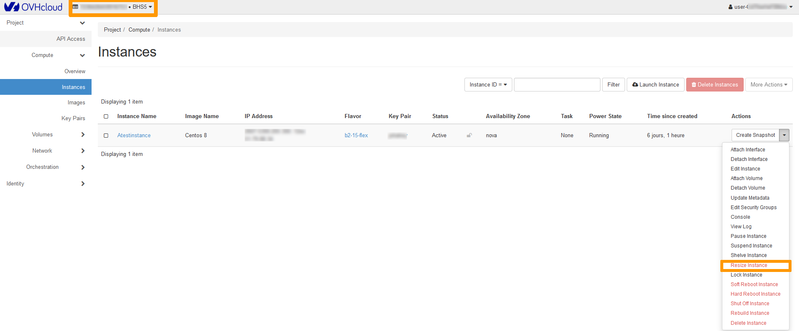

> [!primary]
> Esta traducción ha sido generada de forma automática por nuestro partner SYSTRAN. En algunos casos puede contener términos imprecisos, como en las etiquetas de los botones o los detalles técnicos. En caso de duda, le recomendamos que consulte la versión inglesa o francesa de la guía. Si quiere ayudarnos a mejorar esta traducción, por favor, utilice el botón «Contribuir» de esta página.
>

## Objetivo

En algunos casos, bien debido a un aumento de la actividad o a sus nuevas necesidades, es posible que su instancia no pueda dar respuesta a esta nueva carga debido a la falta de recursos. Sin embargo, Public Cloud le permite aumentar los recursos de su instancia, con tal solo unos clics.

**Esta guía explica los pasos que debe seguir para cambiar el tamaño de su instancia desde el panel OpenStack Horizon.**

> [!warning]
>
> Sólo es posible redimensionar a un modelo superior para los modelos clásicos.
> Además, esta operación interrumpe la instancia durante la operación.
> 

> [!warning]
>
> Las instancias de Metal sólo pueden redimensionarse desde y hacia otras instancias de Metal.
>

> [!success]
>
> Las instancias de tipo *flex* permiten redimensionar hacia modelos superiores o inferiores gracias a un único tamaño de disco.
> 

## Requisitos

- Haber [creado una instancia de Public Cloud](/pages/platform/public-cloud/public-cloud-first-steps#3-crear-una-instancia) en su cuenta de OVHcloud
- [Conectarse a Horizon](/pages/public_cloud/compute/introducing_horizon)

## Procedimiento

Accede a la [interfaz de Horizon](https://horizon.cloud.ovh.net/auth/login/) y asegúrate de que estás en la región correcta. Puedes comprobarlo en la esquina superior izquierda. 
Haga clic en el menú `Compute`{.action} a la izquierda y seleccione `Instances`{.action}. Seleccione `Resize Instance`{.action} en el menú desplegable situado a la derecha de la instancia correspondiente.

{.thumbnail}

### Elección del plantilla (*Flavor Choice*)

Esta sección indica la plantilla actual (*old flavor*) y le permite seleccionar una nueva plantilla (*new flavor*) para el recurso de la instancia.

{.thumbnail}

#### Detalles de la plantilla (*Flavor Details*)

En esta sección se muestran los recursos asociados a la plantilla seleccionada. 

#### Límites de Proyecto (*Project Limits*)

Consulte aquí los recursos ocupados en relación con los recursos totales asignados al proyecto.

> [!warning]
> Tenga en cuenta que solo puede redimensionar una instancia de un modelo Linux a otro modelo Linux y de un modelo Windows a otro modelo Windows.
>

### Opciones avanzadas (*Advanced Options*)

Esta sección permite gestionar la partición del disco (*Disk Partition*) y el grupo de servidores (*Server Group*).

{.thumbnail}

Una vez completada la configuración, haga clic en `Resize`{.action}.

### Redimensionar el disco en Windows

Atención: Al redimensionar una instancia Windows, el tamaño de la partición no se actualiza automáticamente, por lo que deberá ampliarse utilizando el **disk manager**:

- Haga clic derecho en el menú `Start`{.action} e inicie el gestor del disco haciendo clic en `Disk Management`{.action}:

{.thumbnail}

- Haga clic derecho en la partición principal y seleccione `Extend Volume`{.action}.

{.thumbnail}

- Haga clic en `Next`{.action} para acceder al `Extend Volume Wizard`. Seleccione los recursos del disco que quiera ampliar y haga clic en `Next`{.action}. 

{.thumbnail}

Haga clic en `Finish`{.action} para aceptar la opción que prefiera.

{.thumbnail}

- El nuevo tamaño del disco se mostrará en el gestor de disco.

{.thumbnail}

## Más información

Interactúe con nuestra comunidad de usuarios en <https://community.ovh.com/en/>.