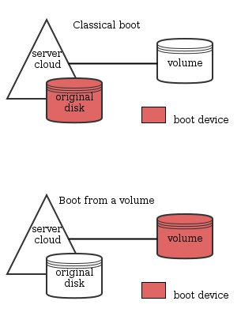

## 
Los servidores cloud se entregan con un disco original copiado a partir de una imagen de sistema (Debian 8, Windows 10...), aunque también se pueden utilizar volúmenes adicionales, que son discos persistentes que permiten almacenar datos.

Una posibilidad consiste en instalar un sistema operativo en un volumen y arrancarlo desde ahí. El servidor se iniciará entonces sobre ese volumen en lugar de sobre el disco original.

{.thumbnail}

## Otra funcionalidad:
OpenStack permite de forma nativa arrancar desde un volumen. Solo hay que hacer el volumen bootable e iniciar el servidor cloud a partir de ese volumen. Como efecto colateral, esta operación hace desaparecer el disco original, ya que el volumen lo sustituirá, ocupando su lugar. 

La funcionalidad descrita en esta guía permite evitar perder el acceso al disco original para así poder disfrutar de su capacidad.

## Requisitos
Para iniciar una instancia en un volumen asociado es necesario:

- Cargar las variables de entorno OpenStack
- Disponer de un volumen con un sistema operativo.

## Marcar el volumen como prioritario en el orden de arranque
Es necesario añadir un metadato al volumen para que el servidor cloud pueda priorizar este disco en la fase de arranque:

```
cinder metadata 897ec71d-bae2-4394-b8c1-4d8fd373a725 set boot_from=True
```

## Asociar el volumen
Una vez que el volumen esté configurado con el metadato boot_from en True, hay que asociar el volumen a la instancia:

```
nova volume-attach myinstance01 897ec71d-bae2-4394-b8c1-4d8fd373a72
```

## 
Para que la instancia arranque sobre el volumen adicional, es necesario reiniciarla, bien mediante la acción nova stop seguida de nova start, o bien a través de un reinicio forzado:

```
nova reboot --hard myinstance01
```

## Atención:
Un reinicio «soft» no es suficiente para que se aplique el cambio.
Para comprobar que el orden de reinicio es correcto, solo hay que observar los puntos de montaje:

```
$ lsblk
NAME MAJ:MIN RM SIZE RO TYPE MOUNTPOINT
vda 252:0 0 10G 0 disk
└─vda1 252:1 0 10G 0 part
vdb 252:16 0 15G 0 disk
└─vdb1 252:17 0 15G 0 part /
```

Aquí vemos que, efectivamente, el punto de montaje / se monta desde /dev/vdb1.