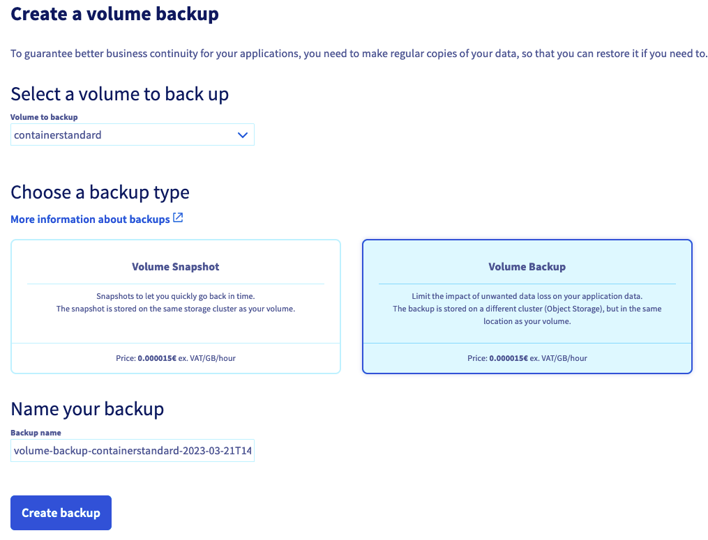

> [!primary]
> Esta traducción ha sido generada de forma automática por nuestro partner SYSTRAN. En algunos casos puede contener términos imprecisos, como en las etiquetas de los botones o los detalles técnicos. En caso de duda, le recomendamos que consulte la versión inglesa o francesa de la guía. Si quiere ayudarnos a mejorar esta traducción, por favor, utilice el botón «Contribuir» de esta página.
>

## Objetivo

Si concede importancia a los datos almacenados en sus volúmenes de Block Storage, debe organizarlos para limitar el impacto potencial de cualquier problema en dichos datos, ya se trate de un error humano o de un incidente en el cluster.

Un **volumen Snapshot** es un punto de recuperación almacenado en el mismo cluster de almacenamiento que el volumen original. Las operaciones de creación y restauración son rápidas, pero en caso de incidencia en el cluster, el volumen y volumen Snapshot pueden no estar disponibles. 
No es necesario desvincular el volumen de la instancia para crear un volumen Snapshot.

Un **volumen Backup** es una imagen creada a partir de su volumen, que se almacena en el cluster Object Storage de la localización del volumen original.
Este nivel de resiliencia es ideal para reaccionar rápidamente ante cualquier incidencia en su volumen, creando otro volumen a partir del backup. 
Para crear una copia de seguridad, el volumen debe desvincularse de la instancia.

El volumen de snapshot y el volumen de backup le permiten:

- crear copias de seguridad de su volumen en pocos clics y conservarlas el tiempo que sea necesario.
- utilizar las copias de seguridad para restaurar el estado del volumen.
- utilizar las copias de seguridad como modelo para crear volúmenes idénticos.

**Esta guía explica cómo crear una copia de seguridad de su volumen Block Storage desde el área de cliente de OVHcloud.**

## Requisitos

- Haber iniciado sesión en el [área de cliente de OVHcloud](https://www.ovh.com/auth/?action=gotomanager&from=https://www.ovh.es/&ovhSubsidiary=es).
- Un volumen de [Block Storage](/pages/public_cloud/compute/create_and_configure_an_additional_disk_on_an_instance) creado en su proyecto de [Public Cloud.](https://www.ovhcloud.com/es-es/public-cloud/)

## Procedimiento

Conéctese al [área de cliente de OVHcloud](https://www.ovh.com/auth/?action=gotomanager&from=https://www.ovh.es/&ovhSubsidiary=es), acceda a la sección `Public Cloud`{.action} y seleccione el proyecto de Public Cloud correspondiente.

Abra el menú `Block Storage`{.action} en la barra de navegación a la izquierda con **Storage**.

A la derecha del volumen correspondiente, haga clic en el botón `...`{.action} y, seguidamente, en `Crear una copia de seguridad`{.action}. No es necesario desvincular en primer lugar el volumen de su instancia. No obstante, si desea desvincular su volumen de su instancia, consulte esta [sección](/pages/platform/public-cloud/create_and_configure_an_additional_disk_on_an_instance#en-linux) de la guía correspondiente para Linux y esta [sección](/pages/platform/public-cloud/create_and_configure_an_additional_disk_on_an_instance#en-windows) para Windows.

{.thumbnail}

Si viene desde la sección Block Storage, se indica el volumen correspondiente. Seleccione el volumen que quiera guardar.

Seleccione el tipo de backup que quiera crear: **Volumen Snapshot** o **volumen de backup**.

- Si elige **Volume Snapshot**, podrá cambiar el nombre del volumen Snapshot que quiera crear antes de validar mediante el botón `Crear la copia de seguridad`{.action}.
- Seleccionando el **Volume backup**, deberá desvincular el volumen de la instancia para poder continuar. Podrá cambiar el nombre del volumen Snapshot que quiera crear antes de validar el backup utilizando el botón `Crear la copia de seguridad`{.action}.

{.thumbnail}

El tiempo de creación de la copia de seguridad, tanto si se trata de un volumen Snapshot como de un volumen Backup, puede tardar varias horas, en función de la cantidad de datos presentes en el volumen, del uso de los recursos de la instancia para el volumen Snapshot, así como de otros factores específicos del host.

> [!primary]
>
> **Buenas prácticas:**
>
> - realice copias de seguridad del volumen fuera de sus horas de producción;
> - evite crear snapshots en las horas punta (entre las 04:00 y las 22:00, hora de París);
> - instale el agente qemu-guest si no lo ha hecho o intente desactivarlo si es necesario.
> - intente no "solicitar" demasiado al servidor durante la creación del snapshot (limitación de I/O, consumo de RAM, etc.).
> - aunque no es obligatorio, al crear un volumen Snapshot deberá desvincularse del volumen.
> - compruebe regularmente que puede recuperar sus datos desde el volumen Snapshot o el volumen de backup.
>

Un volumen Snapshot o un volumen de backup son clones del conjunto del disco, por lo que tendrá el tamaño máximo del volumen original, independientemente de la asignación real del espacio en disco.

En la columna izquierda, en la columna `Volume Snapshot`{.action}, encontrará una lista de los Volúmenes Snapshots.
Una vez creado el volumen Snapshot, aparecerá en esta lista.

{.thumbnail}

En la columna izquierda podrá consultar la lista de volúmenes de backup en la sección `Volume Backup`{.action}.
Una vez que se ha solicitado la creación del volumen de backup, se añade a la lista.

{.thumbnail}

Haga clic en el botón `...`{.action} para `Eliminar`{.action} o `Crear un volumen`{.action} a partir del volumen Snapshot o del volumen de backup correspondiente.

Para más información, consulte [nuestra guía sobre la creación de un volumen](/pages/public_cloud/compute/create-volume-from-snapshot).

{.thumbnail}

## Más información

[Crear un volumen a partir de un snapshot](/pages/public_cloud/compute/create-volume-from-snapshot)

[Crear y configurar un disco adicional en una instancia](/pages/public_cloud/compute/create_and_configure_an_additional_disk_on_an_instance)

[Aumentar el tamaño de un disco adicional](/pages/public_cloud/compute/increase_the_size_of_an_additional_disk)

Interactúe con nuestra comunidad de usuarios en <https://community.ovh.com/en/>.
