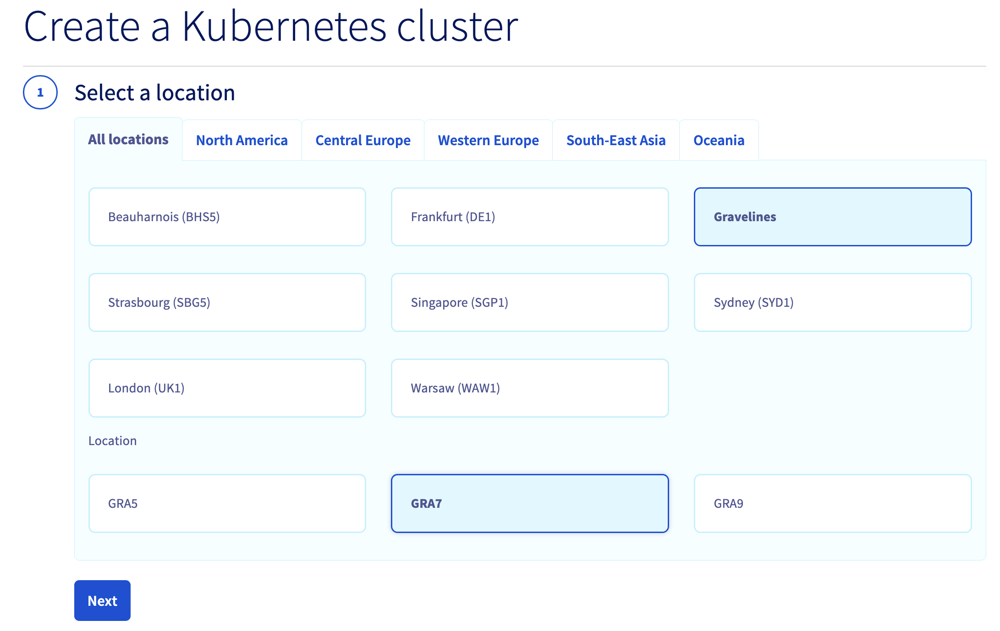
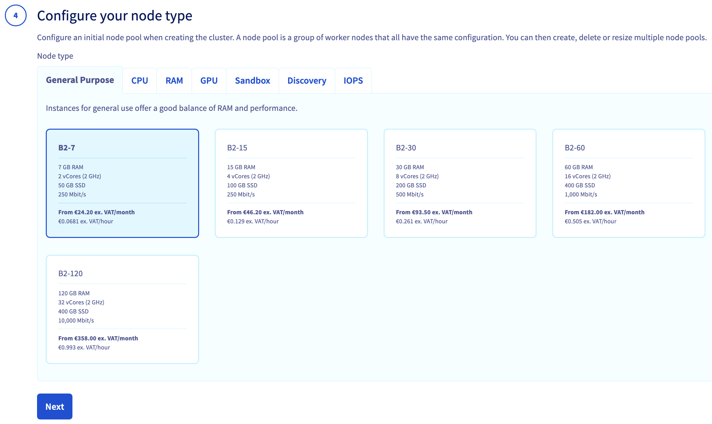
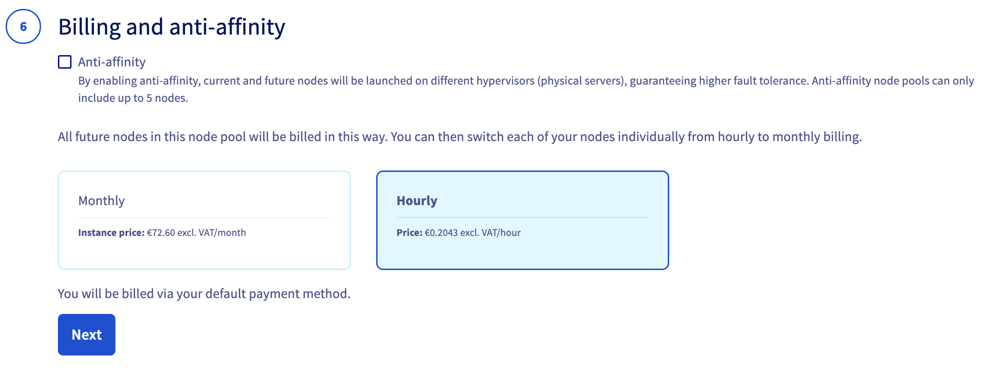

## Objective

The OVHcloud Managed Kubernetes service provides you Kubernetes clusters without the hassle of installing or operating them. This guide will cover the creation of a new cluster.

<iframe width="560" height="315" src="https://www.youtube-nocookie.com/embed/ApfujBFT82g" title="YouTube video player" frameborder="0" allow="accelerometer; autoplay; clipboard-write; encrypted-media; gyroscope; picture-in-picture" allowfullscreen></iframe>

## Requirements

- A [Public Cloud project](https://www.ovhcloud.com/en-sg/public-cloud/) in your OVHcloud account
- Access to the [OVHcloud Control Panel](https://ca.ovh.com/auth/?action=gotomanager&from=https://www.ovh.com/sg/&ovhSubsidiary=sg)

## Instructions

Log in to the [OVHcloud Control Panel](https://ca.ovh.com/auth/?action=gotomanager&from=https://www.ovh.com/sg/&ovhSubsidiary=sg), go to the `Public Cloud`{.action} section and select the Public Cloud project concerned.

Access the administration UI for your OVHcloud Managed Kubernetes clusters by clicking on `Managed Kubernetes Service`{.action} in the left-hand menu and click on `Create a cluster`{.action}.

{.thumbnail}

Select a location for your new cluster.

{.thumbnail}

Choose the minor version of Kubernetes.

{.thumbnail}

> [!primary]
> We recommend to always use the last stable version. 
> Please read our [End of life / end of support](/pages/public_cloud/containers_orchestration/managed_kubernetes/eos-eol-policies) page to understand our version policy.
>

You can now choose to integrate your Kubernetes cluster into a private network using OVHcloud vRack. For more information about this option, please read our guide [Using the vRack](/pages/public_cloud/containers_orchestration/managed_kubernetes/using-vrack).

{.thumbnail}

Now you can configure the default node pool. A node pool is a group of nodes sharing the same configuration, allowing you a lot of flexibility in your cluster management. 

> [!primary]
> You can read the [Managing node pools](/pages/public_cloud/containers_orchestration/managed_kubernetes/managing-nodes) guide for more information on node pools.
>

{.thumbnail}

In the next step, define the size of the default node pool.

{.thumbnail}

Alternatively, you can enable the `Autoscaling`{.action} feature for the cluster. Define the minimum and maximum pool size in that case.

{.thumbnail}

In the next step, choose the appropriate billing mode (monthly or hourly). You can also enable the anti-affinity mode here. 

{.thumbnail}

> [!primary]
> By enabling anti-affinity, current and future nodes will be launched on different hypervisors (physical servers), guaranteeing higher fault tolerance. Anti-affinity node pools can only include up to 5 nodes.
>
> Moreover, if you choose the monthly billing method, you cannot change later from monthly to hourly. A change is only possible the other way around.
> 

Enter a name for your cluster.

{.thumbnail}

Finally, click the `Send`{.action} button.

The cluster creation is now in progress. It should be available within a few minutes in your OVHcloud Control Panel.

### Warning

After a cluster is created, you can no longer change: 
\-  The region. 
\-  The private network ID.

## Go further

To have an overview of OVHcloud Managed Kubernetes service, you can go to the [OVHcloud Managed Kubernetes page](https://www.ovhcloud.com/en-sg/public-cloud/kubernetes/).

To deploy your first application on your Kubernetes cluster, we invite you to follow our guide to [configuring default settings for `kubectl`](/pages/public_cloud/containers_orchestration/managed_kubernetes/configuring-kubectl-on-an-ovh-managed-kubernetes-cluster) and [deploying a Hello World application](/pages/public_cloud/containers_orchestration/managed_kubernetes/deploying-hello-world) .

- If you need training or technical assistance to implement our solutions, contact your sales representative or click on [this link](https://www.ovhcloud.com/en-sg/professional-services/) to get a quote and ask our Professional Services experts for assisting you on your specific use case of your project.

- Join our community of users on <https://community.ovh.com/en/>.
