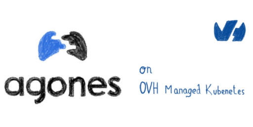
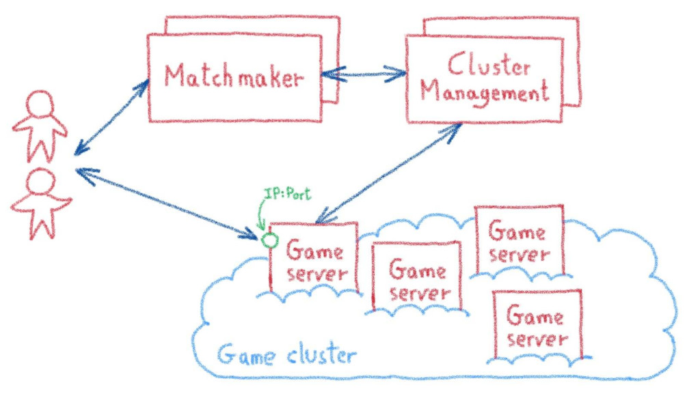
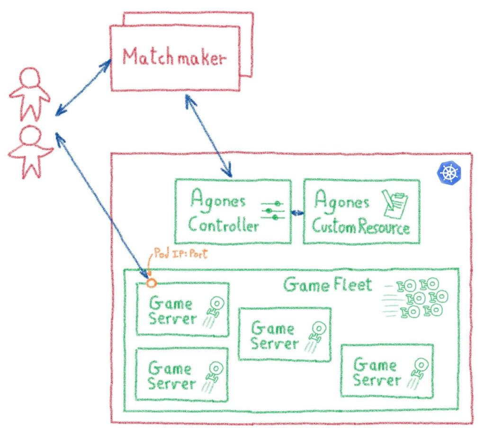
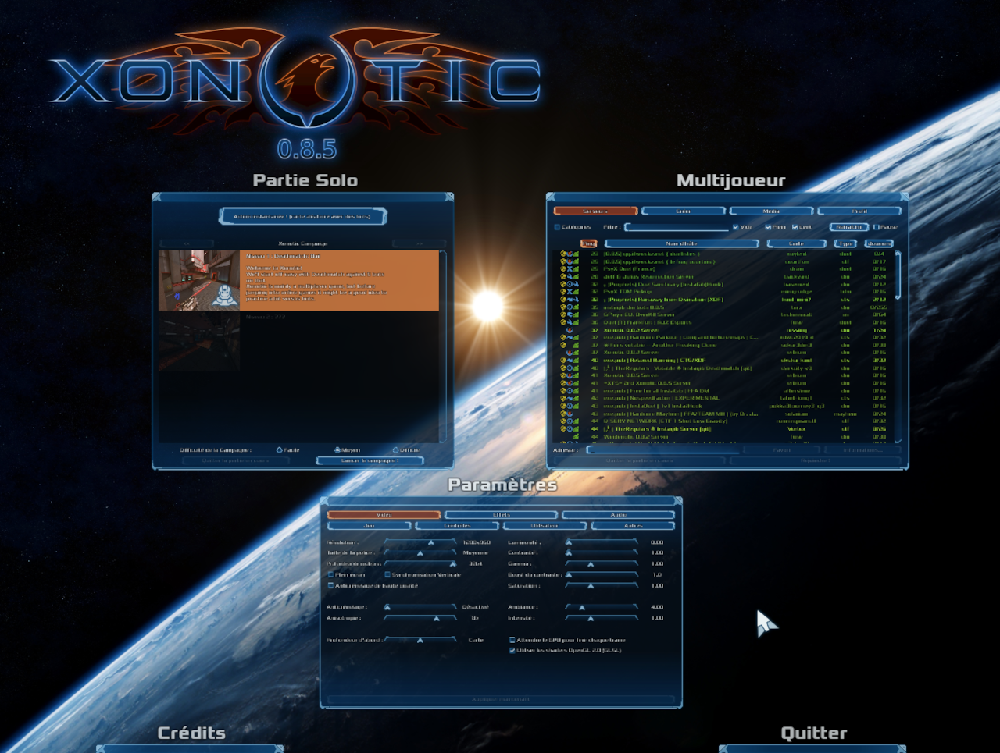
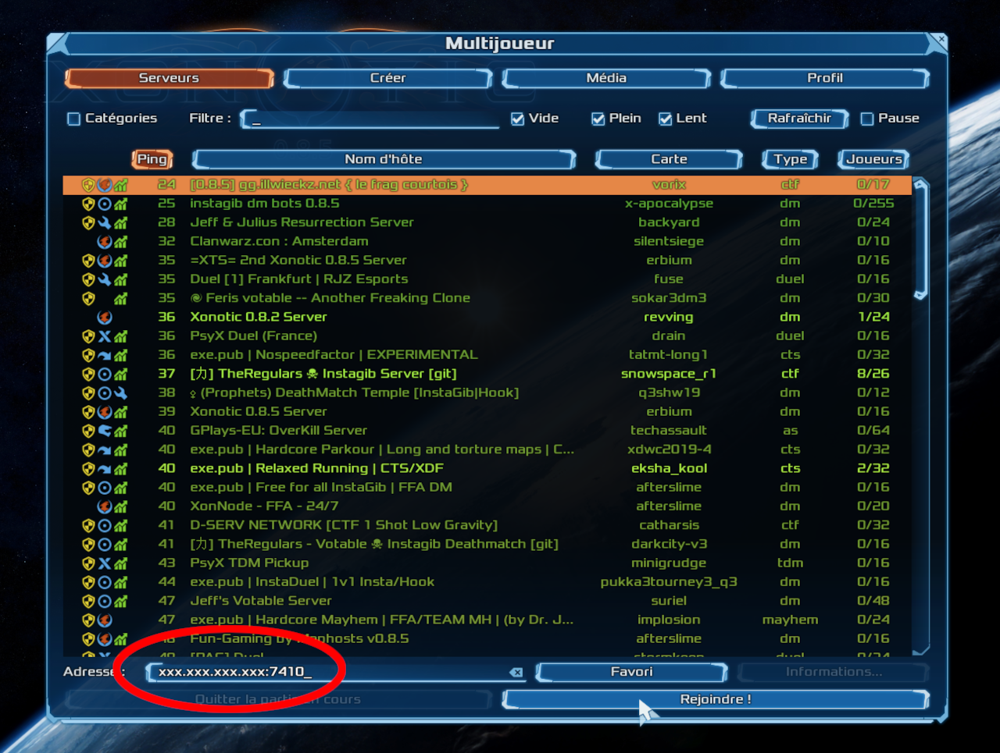
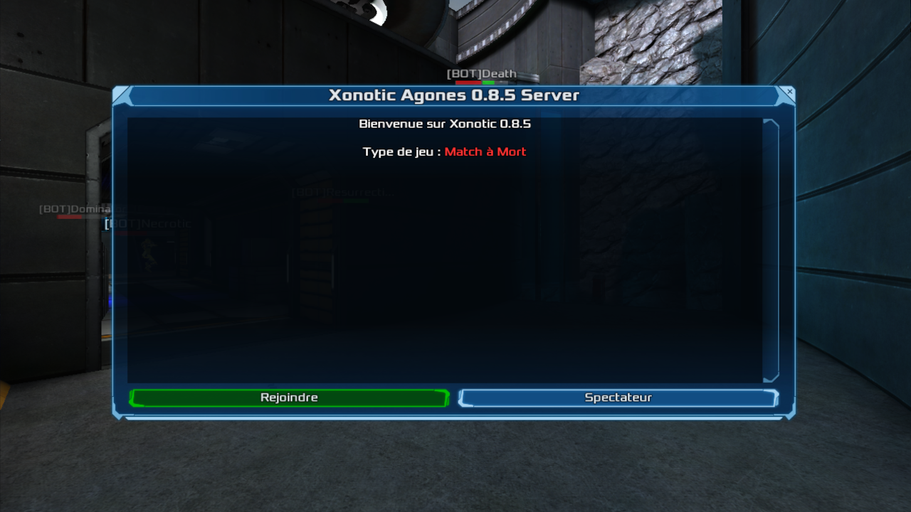

<style>
 pre {
     font-size: 14px;
 }
 pre.console {
   background-color: #300A24;
   color: #ccc;
   font-family: monospace;
   padding: 5px;
   margin-bottom: 5px;
 }
 pre.console code {
   border: solid 0px transparent;
   font-family: monospace !important;
   font-size: 0.75em;
   color: #ccc;
 }
 .small {
     font-size: 0.75em;
 }
</style>


In this tutorial we are going to guide you with the install of [Agones](https://agones.dev){.external} on your OVHcloud Managed Kubernetes Service. Agones is an open-source, multiplayer, dedicated game-server hosting built on Kubernetes.

And to test your install, you will install a [Xonotic](http://www.xonotic.org/){.external} game server and playing some old-school deathmatches...

## Before you begin

This tutorial presupposes that you already have a working OVHcloud Managed Kubernetes cluster, and some basic knowledge of how to operate it. If you want to know more on those topics, please look at the [deploying a Hello World application](/pages/public_cloud/containers_orchestration/managed_kubernetes/deploying-hello-world) documentation.

You also need to have [Helm](https://docs.helm.sh/){.external} installed on your workstation and your cluster, please refer to the [How to install Helm on OVHcloud Managed Kubernetes Service](/pages/public_cloud/containers_orchestration/managed_kubernetes/installing-helm) tutorial.

## What is Agones?

One of the key advantages of using Kubernetes is the formidable ecosystem around it. From [Rancher](http://rancher.com/){.external} to [Istio](https://istio.io/){.external}, from [Rook](http://rook.io){.external} to [Fission](https://fission.io/), from [gVisor](https://gvisor.dev/){.external} to [KubeDB](https://kubedb.com/){.external}, the Kubernetes ecosystem is rich, vibrant and ever-growing. We are getting to the point where for most deployment needs we can say *there is a K8s-based open-source project for that*.

One of the latests additions to this ecosystem is the [Agones](https://agones.dev){.external}  project, an open-source, multiplayer, dedicated game-server hosting built on Kubernetes, developed by Google in collaboration with [Ubisoft](https://www.ubisoft.com/en-us/){.external}. The project was [announced in March](https://cloud.google.com/blog/products/gcp/introducing-agones-open-source-multiplayer-dedicated-game-server-hosting-built-on-kubernetes){.external}, and has already made quite a bit of noise...

{.thumbnail}

## Why Agones?

Agones ([derived from the Greek word *agōn*](https://www.merriam-webster.com/dictionary/agones){.external}, contests held during public festivals or more generally "contest" or "competition at games") aims to replace the usual proprietary solutions to deploy, scale and manage game servers.

Agones enriches Kubernetes with a [Custom Controller](https://kubernetes.io/docs/concepts/api-extension/custom-resources/#custom-controllers){.external} and a [Custom Resource Definition](https://kubernetes.io/docs/concepts/api-extension/custom-resources/#customresourcedefinitions){.external} With them, you can standardise Kubernetes tooling and APIs to create, scale and manage game server clusters.

### What kind of game servers

Well, Agones's main focus is online multiplayer games such as [FPS](https://en.wikipedia.org/wiki/First-person_shooter){.external}s and [MOBA](https://en.wikipedia.org/wiki/Multiplayer_online_battle_arena){.external}s, fast-paced games requiring dedicated, low-latency game servers that synchronize the state of the game between players and serve as a source of truth for gaming situations.

These kinds of games ask for relatively ephemeral dedicated gaming servers, with every match running on a server instance. The servers need to be stateful (they must keep the game status), with the state usually held in memory for the duration of the match.

Latency is a key concern, as the competitive real-time aspects of the games ask for quick responses from the server. That means that the connection from the player device to the game server should be the most direct possible, ideally bypassing any intermediate server such as a load-balancer.

### Connecting players to the right server

Every game publisher used to have their own proprietary solutions, but most on them follow a similar flow, with a matchmaking service that groups players into a match, deals with a cluster manager to provision a dedicated instance of game server and send to the players its IP address and port, to allow them to directly connect to the server and play the game.

{.thumbnail}

Agones and it's Custom Controller and Custom Resource Definition replaces the complex cluster management infrastructure with a standardised, Kubernetes-based tooling and APIs. The matchmaker services interact with these APIs to spawn new game server pods and get their IP address and ports to the concerned players.

{.thumbnail}

> [!primary]
> ### The cherry on the cake
>
> Using Kubernetes for these tasks also gives some nice additional bonus, like being able to deploy the full gaming infrastructure in a developer environnement [minikube](https://github.com/kubernetes/minikube), or easily clone it to deploy in a new data center or cloud region, but also offering a whole platform to host all the additional services needed to build a game: account management, leaderboards, inventory...
>
> And of course, the simplicity of operating Kubernetes-based platforms, especially when they dynamic, heterogeneous and distributed, as most online gaming platforms.

## Deploying Agones on OVHcloud Managed Kubernetes

There are several ways to install Agones in a Kubernetes cluster. For our test we chose the easiest one: installing with [Helm](https://helm.sh/).

### Enabling creation of RBAC resources

The first step to install Agones is to setup a service account with enough permissions to create some special RBAC resource types.

```bash
kubectl create clusterrolebinding cluster-admin-binding --clusterrole=cluster-admin --serviceaccount=kube-system:default
```

Now we have the [Cluster Role Binding](https://kubernetes.io/docs/reference/access-authn-authz/rbac/#rolebinding-and-clusterrolebinding){.external} needed for the installation:

<pre class="console"><code>$ kubectl create clusterrolebinding cluster-admin-binding --clusterrole=cluster-admin --serviceaccount=kube-system:default
clusterrolebinding.rbac.authorization.k8s.io/cluster-admin-binding created
</code></pre>

## Installing the Agones chart

Now let's continue by adding Agones repository to Helm's repository list.

```bash
helm repo add agones https://agones.dev/chart/stable
```

And then installing the stable Agones chart:

```bash
helm install my-agones --namespace agones-system --create-namespace agones/agones 
```

After some moments, Agones should we installed:

<pre class="console"><code>$ helm repo add agones https://agones.dev/chart/stable
"agones" has been added to your repositories

$ helm install my-agones --namespace agones-system --create-namespace agones/agones
NAME: my-agones
LAST DEPLOYED: Fri Dec  9 09:35:16 2022
NAMESPACE: agones-system
STATUS: deployed
REVISION: 1
TEST SUITE: None
NOTES:
The Agones components have been installed in the namespace agones-system.

You can get their status by running:
kubectl --namespace agones-system get pods -o wide

Once ready you can create your first GameServer using our examples https://agones.dev/site/docs/getting-started/create-gameserver/ .

Finally don't forget to explore our documentation and usage guides on how to develop and host dedicated game servers on top of Agones:

 - Create a Game Server (https://agones.dev/site/docs/getting-started/create-gameserver/)
 - Integrating the Game Server SDK (https://agones.dev/site/docs/guides/client-sdks/)
 - GameServer Health Checking (https://agones.dev/site/docs/guides/health-checking/)
 - Accessing Agones via the Kubernetes API (https://agones.dev/site/docs/guides/access-api/)
 </code></pre>

> [!warning]
> The installation we have just done isn't suited for production, as the official install instructions recommend running Agones and the game servers in separate, dedicated pools of nodes.
> But for the needs of our test, the basic setup is enough.

## Confirming Agones started successfully

To verify that Agones is running on our Kubernetes cluster, we can look at the pods in the `agones-system` namespace:

```bash
kubectl get --namespace agones-system pods
```

If everything is ok, you should see an `agones-controller` pod with a `Running` status:

<pre class="console"><code>$ kubectl get --namespace agones-system pods

NAME                                READY   STATUS    RESTARTS   AGE
agones-allocator-6db787b757-4vd7r   1/1     Running   0          95s
agones-allocator-6db787b757-kvdkz   1/1     Running   0          95s
agones-allocator-6db787b757-w9mjw   1/1     Running   0          95s
agones-controller-fc95bcbd7-8zv4q   1/1     Running   0          95s
agones-ping-6fd4dd9b48-r49qq        1/1     Running   0          95s
agones-ping-6fd4dd9b48-w6pzd        1/1     Running   0          95s
</code></pre>

You can also see more details using:

```bash
kubectl describe --namespace agones-system pods
```

Looking at the `agones-controller` description, you should see something like:

<pre class="console"><code>$ kubectl describe --namespace agones-system pods
Name:                 agones-controller-fc95bcbd7-8zv4q
Namespace:            agones-system
[...]
Conditions:
  Type              Status
  Initialized       True
  Ready             True
  ContainersReady   True
  PodScheduled      True
</code></pre>

Where all the `Conditions` should have status `True`.

## Deploying a game server

The Agones <em>Hello world</em> is rather boring, a simple [Xonotic game server](https://github.com/googleforgames/agones/tree/release-1.27.0/examples/xonotic){.external}.

[Xonotic](https://www.xonotic.org/){.external} is an open-source multi-player FPS, and a rather good one, with lots of interesting game modes, maps, weapons and customization options.

Deploying a Xonotic game server over Agones is rather easy:

```bash
kubectl create -f https://raw.githubusercontent.com/googleforgames/agones/release-1.27.0/examples/xonotic/gameserver.yaml
```

This command installs Xonotic:

<pre class="console"><code>$kubectl create -f https://raw.githubusercontent.com/googleforgames/agones/release-1.27.0/examples/xonotic/gameserver.yaml
gameserver.agones.dev/xonotic created
</code></pre>

The game server deployment can take some moments, so we need to wait until its status is `Ready` or `Unhealthy` before using it. We can fetch the status with:

```bash
kubectl get gameserver
```

We wait until the fetch gives a `Ready` or `Unhealthy` status on our game server:

<pre class="console"><code>$ kubectl get gameserver

NAME      STATE   ADDRESS         PORT   NODE                                         AGE
xonotic   Ready   51.83.xxx.yyy   7410   nodepool-f636da5d-3d0d-481d-aa-node-f4d042   24s
</code></pre>

When the game server is ready, we also get the address and the port we should use to connect to our deathmatch game (in my example, `51.83.xxx.yyy:7410`).

## It's frag time

So now that you have a server, let's test it!

Download the [Xonotic client](https://xonotic.org/) (it runs on Windows, Linux and MacOS, so there is no excuse), and launch it:

{.thumbnail}

Then go to the <em>Multiplayer</em> menu and enter the address and port of our game server:

{.thumbnail}

And you are ready to play!

{.thumnbnail}

### And on the server side?

On the server side, you can spy how things are going for your game server, using `kubectl logs`. Let's begin by finding the pod running the game:

```bash
kubectl get pods
```

You will see that your game server is running in a pod called `xonotic`:

<pre class="console"><code>$ kubectl get pods
NAME      READY   STATUS    RESTARTS   AGE
xonotic   2/2     Running   0          2m28s
</code></pre>

You can then use `kubectl logs` on it. In the pod there are two containers, the main `xonotic` one and a Agones <em>sidecar</em>, so we must specify that we want the logs of the `xonotic` container:

<pre class="console"><code>$ kubectl logs xonotic xonotic
>>> Connecting to Agones with the SDK
>>> Starting health checking
>>> Starting wrapper for Xonotic!
>>> Path to Xonotic server script: /home/xonotic/Xonotic/server_linux.sh []
Game is Xonotic using base gamedir data
gamename for server filtering: Xonotic
Xonotic Linux 20:37:34 Jun 27 2022 - release
Current nice level is below the soft limit - cannot use niceness
Skeletal animation uses SSE code path
execing quake.rc
[...]
>>> Found 'listening' statement: 2
Server using port 26000
Server listening on address 0.0.0.0:26000
Server listening on address [0:0:0:0:0:0:0:0]:26000
execing server.cfg
maxplayers can not be changed while a server is running.
It will be changed on next server startup ("map" command).
"maxplayers" set to "8"
Game type successfully switched to dm
Maplist contains no usable maps!  Resetting it to default map list.
Switching to map silentsiege
menu: unknown program name
Server using port 26000
>>> Found 'listening' statement: 3
Server listening on address 0.0.0.0:26000
>>> Found 'listening' statement: 4
>>> Moving to READY: Server listening on address [0:0:0:0:0:0:0:0]:26000
Server listening on address [0:0:0:0:0:0:0:0]:26000
</code></pre>

### Add some friends

The next step is mostly enjoyable: ask some friends to connect to the server and do a true deathmatch like in *Quake 2* times.

## Cleanup

Uninstall Xonotic game server:

```bash
kubectl delete gameserver
```

To uninstall Agones, as you installed it through Helm, you can use the `helm uninstall` command in order to delete the Agones Helm installed chart:

```bash
helm uninstall my-agones -n agones-system
```

Remove installed ClusterRoleBinding:

```bash
kubectl delete clusterrolebinding cluster-admin-binding
```

## Go further

- If you need training or technical assistance to implement our solutions, contact your sales representative or click on [this link](https://www.ovhcloud.com/de/professional-services/) to get a quote and ask our Professional Services experts for assisting you on your specific use case of your project.

- Join our community of users on <https://community.ovh.com/en/>.
