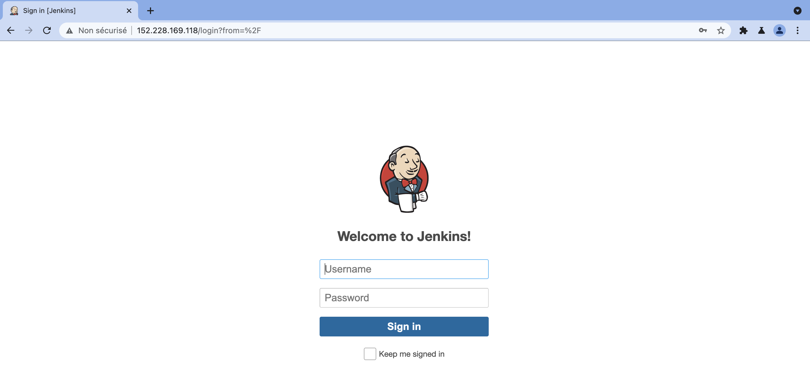
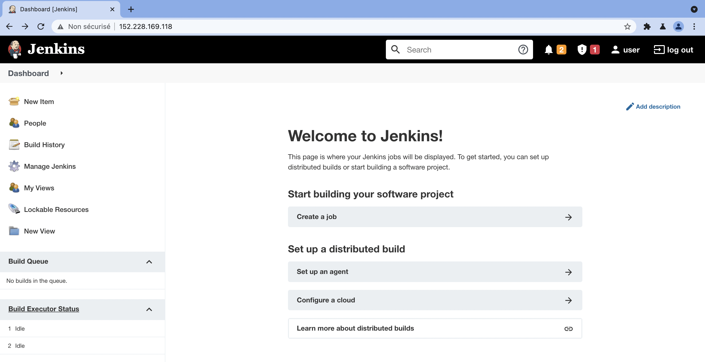

<style>
 pre {
     font-size: 14px;
 }
 pre.console {
   background-color: #300A24; 
   color: #ccc;
   font-family: monospace;
   padding: 5px;
   margin-bottom: 5px;
 }
 pre.console code {
   border: solid 0px transparent;
   font-family: monospace !important;
   font-size: 0.75em;
   color: #ccc;
 }
 .small {
     font-size: 0.75em;
 }
</style>

In this tutorial we are going to guide you with the install of [Jenkins](https://jenkins.io/){.external} on your OVHcloud Managed Kubernetes Service.

We are going to install Jenkins master and slave cluster utilizing the [Jenkins Kubernetes plugin](https://plugins.jenkins.io/kubernetes/){.external}.

## Before you begin

This tutorial presupposes that you already have a working OVHcloud Managed Kubernetes cluster, and some basic knowledge of how to operate it. If you want to know more on those topics, please look at the [OVHcloud Managed Kubernetes Service Quickstart](/pages/public_cloud/containers_orchestration/managed_kubernetes/deploying-hello-world).

You also need to have [Helm](https://docs.helm.sh/){.external} installer on your workstation and your cluster, please refer to the [How to install Helm on OVHcloud Managed Kubernetes Service](/pages/public_cloud/containers_orchestration/managed_kubernetes/installing-helm) tutorial.

## Pre-requisites

We (the OVHcloud Managed Kubernetes Service team) are working on a patch to be released in early 2022. In the meantime, please remove the default storage class and install the new one.

- Delete the concerned `StorageClass` that you are using by default 

```bash
kubectl delete storageclasses.storage.k8s.io csi-cinder-high-speed
```

It will delete the existing `StorageClass`:

<pre class="console"><code>$ kubectl delete storageclasses.storage.k8s.io csi-cinder-high-speed
storageclass.storage.k8s.io "csi-cinder-high-speed" deleted
</code></pre>

- Create a new `StorageClass` with the required fix

```bash
kubectl apply -f https://raw.githubusercontent.com/ovh/docs/develop/pages/public_cloud/containers_orchestration/managed_kubernetes/fix-persistent-volumes-permissions/files/fixed-cinder-high-speed-storage-class.yaml
```

It will apply the correct `StorageClass` YAML manifest:

<pre class="console"><code>$ kubectl apply -f https://raw.githubusercontent.com/ovh/docs/develop/pages/public_cloud/containers_orchestration/managed_kubernetes/fix-persistent-volumes-permissions/files/fixed-cinder-high-speed-storage-class.yaml
storageclass.storage.k8s.io/csi-cinder-high-speed created
</code></pre>

## Installing the Jenkins Helm chart

> [!warning]
> As with Helm 2, the official Helm `stable` repository is currently deprecated.
> The Helm community is currently transitioning to a hub model, with a [Helm Hub](https://hub.helm.sh/), where charts can be searched using `helm search hub <keyword>`
> As most charts from the Helm _stable_ repository have been transferred to the [Bitnami repository](https://github.com/bitnami/charts/) we are using it in the tutorial.

For this tutorial we are using the [Jenkins Helm chart](https://github.com/bitnami/charts/tree/master/bitnami/jenkins){.external} found on Bitnami Helm repositories.

The chart is fully configurable, but here we are using the default configuration.

> [!primary]
>
> ### Customizing your install
>
> Maybe you would like your admin username to be different, or be able to set your admin password, or modify the resources allocated...
>
> In order to customize your install, without having to leave the simplicity of using helm and the Jenkins helm chart, you can simply set some of the [configurable parameters of the Jenkins chart](https://github.com/bitnami/charts/tree/master/bitnami/jenkins#parameters). Then you can add it to your `helm install` with the `--set` option (`--set param1=value1,param2=value2`)

```bash
helm install my-first-jenkins bitnami/jenkins
```

This will install your Jenkins master:

<pre class="console"><code>$ helm install my-first-jenkins bitnami/jenkins

NAME: my-first-jenkins
LAST DEPLOYED: Mon Dec 20 11:30:59 2021
NAMESPACE: default
STATUS: deployed
REVISION: 1
TEST SUITE: None
NOTES:
CHART NAME: jenkins
CHART VERSION: 8.0.22
APP VERSION: 2.319.1

** Please be patient while the chart is being deployed **

1. Get the Jenkins URL by running:

** Please ensure an external IP is associated to the my-first-jenkins service before proceeding **
** Watch the status using: kubectl get svc --namespace default -w my-first-jenkins **

  export SERVICE_IP=$(kubectl get svc --namespace default my-first-jenkins --template "{{ range (index .status.loadBalancer.ingress 0) }}{{.}}{{ end }}")
  echo "Jenkins URL: http://$SERVICE_IP/"

2. Login with the following credentials

  echo Username: user
  echo Password: $(kubectl get secret --namespace default my-first-jenkins -o jsonpath="{.data.jenkins-password}" | base64 --decode)
</code></pre>

As the instructions say, you will need to wait a few moments to get the `LoadBalancer` URL.
You can test if the `LoadBalancer` is ready using:

```bash
kubectl get svc --namespace default -w my-first-jenkins
```

After some minutes, you will get the `LoadBalancer` URL:

<pre class="console"><code>$ kubectl get svc --namespace default -w my-first-jenkins

NAME               TYPE           CLUSTER-IP   EXTERNAL-IP   PORT(S)                      AGE
my-first-jenkins   LoadBalancer   10.3.3.52    <pending>     80:32193/TCP,443:32260/TCP   49s
my-first-jenkins   LoadBalancer   10.3.3.52    152.228.169.118   80:32193/TCP,443:32260/TCP   54s
</code></pre>

The URL under `EXTERNAL-IP` is your Jenkins URL. You can the follow the instructions on the Helm Chart to get the connection parameters. In my case:

<pre class="console"><code>$ export SERVICE_IP=$(kubectl get svc --namespace default my-first-jenkins --template "{{ range (index .status.loadBalancer.ingress 0) }}{{.}}{{ end }}")

$ echo "Jenkins URL: http://$SERVICE_IP/"
Jenkins URL: http://152.228.169.118/

$ echo Username: user
Username: user

$ echo Password: $(kubectl get secret --namespace default my-first-jenkins -o jsonpath="{.data.jenkins-password}" | base64 --decode)
Password: KMhUs53TJT
</code></pre>

And putting the URL in your browser will take you to the new Jenkins:

{.thumbnail}

Log in with user `admin` and the password you got before. And here you have your Jenkins:

{.thumbnail}

You have a working Jenkins on your OVHcloud Managed Kubernetes Service, congratulations!

## Cleaning up

To clean up your cluster, simply use Helm to delete your Jenkins release.

```bash
helm delete my-first-jenkins
```

It will delete your Jenkins and its associated resources from your cluster:

<pre class="console"><code>$ helm delete my-first-jenkins
release "my-first-jenkins" uninstalled
</code></pre>

## Go further

- If you need training or technical assistance to implement our solutions, contact your sales representative or click on [this link](https://www.ovhcloud.com/pl/professional-services/) to get a quote and ask our Professional Services experts for assisting you on your specific use case of your project.

- Join our [community of users](https://community.ovh.com/en/).
