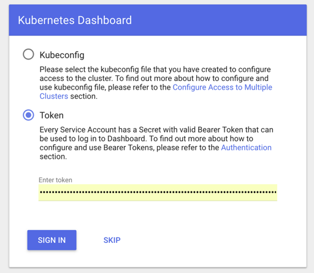

**Last updated 16th February 2023.**

<style>
 pre {
     font-size: 14px;
 }
 pre.console {
   background-color: #300A24;
   color: #ccc;
   font-family: monospace;
   padding: 5px;
   margin-bottom: 5px;
 }
 pre.console code {
   border: solid 0px transparent;
   font-family: monospace !important;
   font-size: 0.75em;
   color: #ccc;
 }
 .small {
     font-size: 0.75em;
 }
</style>

The [Kubernetes Dashboard](https://github.com/kubernetes/dashboard){.external} is a general purpose, web-based UI for Kubernetes clusters. It allows users to manage and troubleshoot applications running in their cluster, as well as manage the cluster itself.

{.thumbnail}

## Before you begin

This tutorial assumes that you already have a working OVHcloud Managed Kubernetes cluster, and some basic knowledge of how to operate it. If you want to know more on those topics, please look at the [OVHcloud Managed Kubernetes Service Quickstart](/pages/public_cloud/containers_orchestration/managed_kubernetes/deploying-hello-world).

> [!primary]
> This tutorial describes the most basic way of using the Dashboard with your OVHcloud Managed Kubernetes cluster. Please refer to the [official docs](https://github.com/kubernetes/dashboard){.external} for a deeper understanding, specially on subjects like [access control](https://github.com/kubernetes/dashboard/blob/master/docs/user/access-control/README.md){.external}, for more in-depth information.
>

## Deploy the Dashboard in your cluster

Depending on the version of Kubernetes you are running, you have to choose the right Dashboard version to deploy in order to avoid incompatibilities.

```bash
kubectl apply -f https://raw.githubusercontent.com/kubernetes/dashboard/v2.7.0/aio/deploy/recommended.yaml
```

It should display something like this:

<pre class="console"><code>$ kubectl apply -f https://raw.githubusercontent.com/kubernetes/dashboard/v2.7.0/aio/deploy/recommended.yaml
namespace/kubernetes-dashboard created
serviceaccount/kubernetes-dashboard created
service/kubernetes-dashboard created
secret/kubernetes-dashboard-certs created
secret/kubernetes-dashboard-csrf created
secret/kubernetes-dashboard-key-holder created
configmap/kubernetes-dashboard-settings created
role.rbac.authorization.k8s.io/kubernetes-dashboard created
clusterrole.rbac.authorization.k8s.io/kubernetes-dashboard created
rolebinding.rbac.authorization.k8s.io/kubernetes-dashboard created
clusterrolebinding.rbac.authorization.k8s.io/kubernetes-dashboard created
deployment.apps/kubernetes-dashboard created
service/dashboard-metrics-scraper created
deployment.apps/dashboard-metrics-scraper created
</code></pre>

## Create An Authentication Token (RBAC)

In order to access the Dashboard, you need to create a new user with the service account mechanism in Kubernetes. Grant this user admin permissions, then log in to the Dashboard using their bearer token. Let's look at these steps in more detail.

### Create Service Account

First, we will create a service account with the name `admin-user` in the `kubernetes-dashboard` namespace.

To do this, please copy the following YAML into a `dashboard-service-account.yml` file:

```yaml
apiVersion: v1
kind: ServiceAccount
metadata:
  name: admin-user
  namespace: kubernetes-dashboard
```

You should then apply the file to add the service account to your cluster:

```bash
kubectl apply -f dashboard-service-account.yml
```

It should display something like this:

<pre class="console"><code>$ kubectl apply -f dashboard-service-account.yml
serviceaccount/admin-user created
</code></pre>

### Create a RoleBinding

Using the `cluster-admin` role for your cluster, we will create a `RoleBinding`, binding it to your `ServiceAccount`.

To do this, please copy the following YAML into a `dashboard-cluster-role-binding.yml` file:

```yaml
apiVersion: rbac.authorization.k8s.io/v1
kind: ClusterRoleBinding
metadata:
  name: admin-user
roleRef:
  apiGroup: rbac.authorization.k8s.io
  kind: ClusterRole
  name: cluster-admin
subjects:
- kind: ServiceAccount
  name: admin-user
  namespace: kubernetes-dashboard
```

You should then apply the file to add the `RoleBinding` to your cluster:

```bash
kubectl apply -f dashboard-cluster-role-binding.yml
```

It should display something like this:

<pre class="console"><code>$ kubectl apply -f dashboard-cluster-role-binding.yml
clusterrolebinding.rbac.authorization.k8s.io/admin-user created
</code></pre>

### Create a Secret ServiceAccountToken

In Kubernetes **v1.24.0** Secret API objects containing service account tokens are no longer auto-generated for every ServiceAccount. Because of this, we'll need to create it ourselves.

To do this, please copy the following YAML into a `service-account-token.yml` file:

```yaml
apiVersion: v1
kind: Secret
type: kubernetes.io/service-account-token
metadata:
  name: admin-user-token
  namespace: kubernetes-dashboard
  annotations:
    kubernetes.io/service-account.name: admin-user
```

You should then apply the file to add the `Secret` to your cluster:

```bash
kubectl apply -f service-account-token.yml
```

It should display something like this:

<pre class="console"><code>$ kubectl apply -f service-account-token.yml
secret/admin-user-token created
</code></pre>

### Bearer Token

Next step is recovering the bearer token you will use to log in your Dashboard. Execute the following command:

```bash
kubectl -n kubernetes-dashboard describe secret $(kubectl -n kubernetes-dashboard get secret | grep admin-user-token | awk '{print $1}')
```

It should display something like:

<pre class="console"><code>$ kubectl -n kubernetes-dashboard describe secret $(kubectl -n kubernetes-dashboard get secret | grep admin-user-token | awk '{print $1}')
Name:         admin-user-token
Namespace:    kubernetes-dashboard
Labels:       <none>
Annotations:  kubernetes.io/service-account.name: admin-user
              kubernetes.io/service-account.uid: xxxxxxxx-xxxx-xxxx-xxxx-xxxxxxxxxxxx

Type:  kubernetes.io/service-account-token

Data
====
ca.crt:     1801 bytes
namespace:  20 bytes
token:      <sensitive>
</code></pre>

Copy the token and store it securely, as it's your key to the Dashboard.

## Access the Dashboard

To access the Dashboard from your local workstation, you must create a secure channel to your OVHcloud Managed Kubernetes cluster. You can do this by using `kubectl` as a proxy from your workstation to the cluster:

```bash
kubectl proxy
```

Your kubectl is opening a connection and acting as a proxy from your workstation to the cluster. Any HTTP request to your local port (8001) will be proxified and sent to the cluster API.

<pre class="console"><code>$ kubectl proxy
Starting to serve on 127.0.0.1:8001
</code></pre>

Next, access the Dashboard at:  
<http://localhost:8001/api/v1/namespaces/kubernetes-dashboard/services/https:kubernetes-dashboard:/proxy/>

In the log-in page, select authentication by token, and use the bearer token you recovered in the previous step.

{.thumbnail}

You will then be taken directly to your Dashboard:

{.thumbnail}

## Delete all kubernetes-dashboard resources

To remove all resources created by your previous `kubernetes-dashboard` deployment, just execute the following command line:

```bash
kubectl delete -f https://raw.githubusercontent.com/kubernetes/dashboard/v2.7.0/aio/deploy/recommended.yaml
kubectl delete -f dashboard-cluster-role-binding.yml
```

## Go further

- If you need training or technical assistance to implement our solutions, contact your sales representative or click on [this link](https://www.ovhcloud.com/it/professional-services/) to get a quote and ask our Professional Services experts for assisting you on your specific use case of your project.

- Join our [community of users](https://community.ovh.com/en/).
