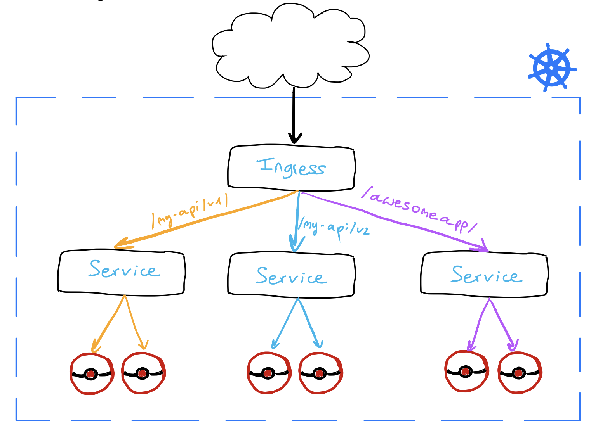

<style>
 pre {
     font-size: 14px;
 }
 pre.console {
   background-color: #300A24; 
   color: #ccc;
   font-family: monospace;
   padding: 5px;
   margin-bottom: 5px;
 }
 pre.console code {
   border: solid 0px transparent;
   font-family: monospace !important;
   font-size: 0.75em;
   color: #ccc;
 }
 .small {
     font-size: 0.75em;
 }
</style>


In this tutorial we are going to guide you with the setup of [Nginx Ingress](https://github.com/kubernetes/ingress-nginx){.external} on your OVHcloud Managed Kubernetes Service.


## Before you begin

This tutorial presupposes that you already have a working OVHcloud Managed Kubernetes cluster, and some basic knowledge of how to operate it. If you want to know more on those topics, please look at the [OVHcloud Managed Kubernetes Service Quickstart](/pages/public_cloud/containers_orchestration/managed_kubernetes/deploying-hello-world).

You also need to have [Helm](https://docs.helm.sh/){.external} installer on your workstation and your cluster, please refer to the [How to install Helm on OVHcloud Managed Kubernetes Service](/pages/public_cloud/containers_orchestration/managed_kubernetes/installing-helm) tutorial.

## Ingress resources and Nginx Ingress Controller

In Kubernetes, an Ingress resource allows you to access to your Services from outside the cluster. The goal is to avoid creating a Load Balancer per Service but only one per Ingress.



An Ingress is implemented by a 3rd party: an Ingress Controller that extends specs to support additional features.

In this tutorial you will install a Nginx Ingress Controller.<br>
It is an Ingress controller for Kubernetes using a Nginx web server as a reverse proxy and Load Balancer.

Specifically, when you are deploying and running a Nginx Ingress Controller, you will have a Pod that runs Nginx and watches the Kubernetes Control Plane for new and updated Ingress Resource objects.

Imagine an Ingress Resource as a list of traffic routing rules for backend Services.

After deploying the Nginx Ingress Controller, you will also have an OVHcloud Load Balancer. Thanks to this Load Balancer the external traffic will be routed to the Ingress Controller Pod running Nginx, which then forwards traffic to the appropriate backend Services you will configure in Ingress resources.

## Installing the Nginx Ingress Controller Helm chart

For this tutorial we are using the [Nginx Ingress Controller  Helm chart](https://github.com/kubernetes/ingress-nginx/tree/master/charts/ingress-nginx){.external} found on its own Helm repository.

The chart is fully configurable, but here we are using the default configuration.


```
helm repo add ingress-nginx https://kubernetes.github.io/ingress-nginx
helm repo update
helm -n ingress-nginx install ingress-nginx ingress-nginx/ingress-nginx --create-namespace
```

The install process will begin:

<pre class="console"><code>$ helm -n ingress-nginx install ingress-nginx ingress-nginx/ingress-nginx --create-namespace
NAME: ingress-nginx
LAST DEPLOYED: Mon Jun 27 09:20:44 2022
NAMESPACE: ingress-nginx
STATUS: deployed
REVISION: 1
TEST SUITE: None
NOTES:
</code></pre>

At the end of the install, as usual with most Helm charts, you get the configuration information and some tips to
test your `nginx-ingress`:

<pre class="console"><code>NOTES:
The ingress-nginx controller has been installed.
It may take a few minutes for the LoadBalancer IP to be available.
You can watch the status by running 'kubectl --namespace ingress-nginx get services -o wide -w ingress-nginx-controller'

An example Ingress that makes use of the controller:
  apiVersion: networking.k8s.io/v1
  kind: Ingress
  metadata:
    name: example
    namespace: foo
  spec:
    ingressClassName: nginx
    rules:
      - host: www.example.com
        http:
          paths:
            - pathType: Prefix
              backend:
                service:
                  name: exampleService
                  port:
                    number: 80
              path: /
    # This section is only required if TLS is to be enabled for the Ingress
    tls:
      - hosts:
        - www.example.com
        secretName: example-tls

If TLS is enabled for the Ingress, a Secret containing the certificate and key must also be provided:

  apiVersion: v1
  kind: Secret
  metadata:
    name: example-tls
    namespace: foo
  data:
    tls.crt: <base64 encoded cert>
    tls.key: <base64 encoded key>
  type: kubernetes.io/tls
</code></pre>

As the `LoadBalancer` creation is asynchronous, and the provisioning of the load balancer can take several minutes, you will surely get a `<pending>` `EXTERNAL-IP`. 

If you try again in a few minutes you should get an `EXTERNAL-IP`:

<pre class="console"><code>$ kubectl get svc -n ingress-nginx ingress-nginx-controller
NAME                       TYPE           CLUSTER-IP     EXTERNAL-IP       PORT(S)                      AGE
ingress-nginx-controller   LoadBalancer   10.3.232.157   51.178.69.190   80:30903/TCP,443:31546/TCP   19h
</code></pre>

You can then access your `nginx-ingress` at `http://[YOUR_LOAD_BALANCER_IP]` via HTTP or `https://[YOUR_LOAD_BALANCER_IP]` via HTTPS.

Enter the following command to retrieve it:

```bash
export INGRESS_URL=$(kubectl get svc ingress-nginx-controller -n ingress-nginx -o jsonpath='{.status.loadBalancer.ingress[].ip}')
```

You should have a content like this:

<pre class="console"><code>$ export INGRESS_URL=$(kubectl get svc ingress-nginx-controller -n ingress-nginx -o jsonpath='{.status.loadBalancer.ingress[].ip}')
echo Ingress URL: http://$INGRESS_URL/
Ingress URL: http://51.178.69.190/
</code></pre>


In order to test your `nginx-ingress`, you can for example [install a WordPress](/pages/public_cloud/containers_orchestration/managed_kubernetes/installing-wordpress) on your cluster, and then create a YAML file for the Ingress that uses the controller:

```
apiVersion: networking.k8s.io/v1
kind: Ingress
metadata:
  annotations:
    kubernetes.io/ingress.class: nginx
  name: ingress
  namespace: default
spec:
  rules:
  - http:
      paths:
      - backend:
          service:
            name: [YOUR_WORDPRESS_SERVICE_NAME]
            port:
              number: 80
        path: /
        pathType: Prefix
```

> [!primary]
> Don't forget to replace `[YOUR_WORDPRESS_SERVICE_NAME]`.

In our example, the `ingress.yaml` produces this result:

```
apiVersion: networking.k8s.io/v1
kind: Ingress
metadata:
  annotations:
    kubernetes.io/ingress.class: nginx
  name: ingress
  namespace: default
spec:
  rules:
    - http:
        paths:
          - path: /
            pathType: Prefix
            backend:
              service:
                name: my-first-k8s-wordpress
                port:
                  number: 80
```

Apply the file:

```
kubectl apply -f ingress.yml
```

And the Ingress is created. 

<pre class="console"><code>$ kubectl apply -f ingress.yml 
ingress.extensions/ingress created
</code></pre>

So now if you point your browser to `http://$INGRESS_URL/`, you will see your WordPress:

{.thumbnail}

## Go further

- If you need training or technical assistance to implement our solutions, contact your sales representative or click on [this link](https://www.ovhcloud.com/asia/professional-services/) to get a quote and ask our Professional Services experts for assisting you on your specific use case of your project.

- Join our [community of users](https://community.ovh.com/en/).
