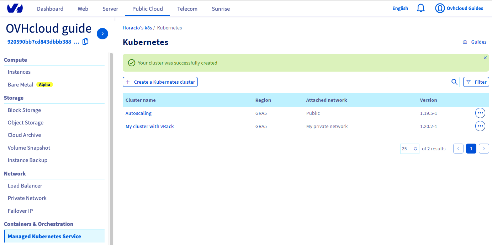

<style>
 pre {
     font-size: 14px;
 }
 pre.console {
   background-color: #300A24; 
   color: #ccc;
   font-family: monospace;
   padding: 5px;
   margin-bottom: 5px;
 }
 pre.console code {
   border: solid 0px transparent;
   font-family: monospace !important;
   font-size: 0.75em;
   color: #ccc;
 }
 .small {
     font-size: 0.75em;
 }
</style>

## Objective

OVHcloud Managed Kubernetes service provides you Kubernetes clusters without the hassle of installing or operating them. 

By default, your Kubernetes clusters will have public IPs. For some uses cases, or for security reasons, you might prefer having your Kubernetes cluster inside a private network. 

OVHcloud [vRack](https://www.ovh.co.uk/solutions/vrack/) is a private networking solution that enables our customers to route traffic between OVHcloud dedicated servers as well as other OVHcloud services. 

**This guide will cover the integration of OVHcloud Managed Kubernetes clusters into vRack private networks.**

## Requirements

- A Public Cloud project in your OVHcloud account

## Instructions

First of all, you will need to set up vRack private network for your Public Cloud. To do it, please follow the [Configuring vRack for Public Cloud](/pages/public_cloud/public_cloud_network_services/getting-started-07-creating-vrack) guide. Once you have created a vRack and added it into a private network, you can continue. 

Integrating a cluster into a vRack private network must be done at the third step on cluster creation, when you can choose an existing private network for the cluster:

{.thumbnail}

Your new cluster will be created inside the vRack private network you have chosen.

In the Managed Kubernetes service dashboard, you will see the cluster, with the chosen private network in the *Attached network* column:

{.thumbnail}

## Known limits

- All nodes within a Kubernetes cluster with a vRack private network activated are available within that single private network. (No public/private mix, single private network available.)
- To expose some workload on the Internet, you can use the External Load Balancers that are now compatible with nodes in vRack.
- The OVHcloud Public Cloud does not support security groups on vRack. This is planned to be supported late 2021.
- You will still see a public IPv4 address on your worker nodes. This IP won't be reachable from the Internet, and used exclusively for the administration of your nodes and its link to the Kubernetes control plane.
- As explained in the [Known limits guide](/pages/public_cloud/containers_orchestration/managed_kubernetes/known-limits), the following subnets are not compliant with the `vRack` feature and can generate some incoherent behaviours with our overlay networks:

```bash
10.2.0.0/16 # Subnet used by pods
10.3.0.0/16 # Subnet used by services
172.17.0.0/16 # Subnet used by the Docker daemon
```

## Go further

- If you need training or technical assistance to implement our solutions, contact your sales representative or click on [this link](https://www.ovhcloud.com/en-ie/professional-services/) to get a quote and ask our Professional Services experts for assisting you on your specific use case of your project.

- Join our community of users on <https://community.ovh.com/en/>.
