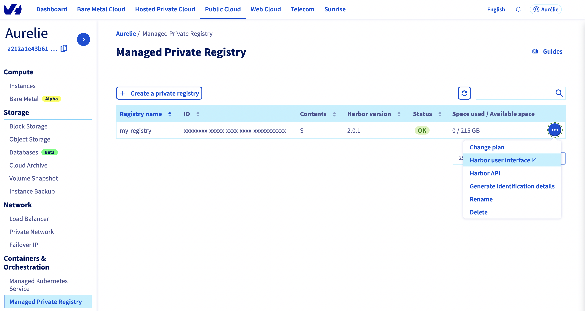
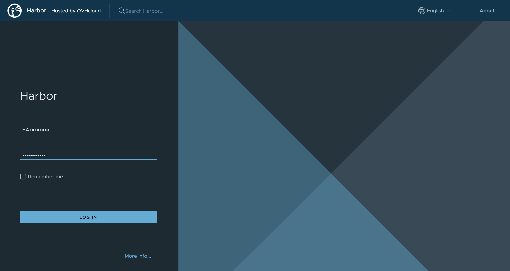

**Last updated 24 September, 2021.**

## Objective

OVHcloud Managed Private Registry service provides you a managed, authenticated Docker registry where you can privately store your Docker images. This managed private registry is an instance of [Harbor](https://goharbor.io/), an open source trusted cloud native registry project that stores, signs, and scans Docker images. This guide will explain how connect to Harbor UI to operate your OVHcloud Managed Private Registry service.

## Requirements

- An OVHcloud Managed Private Registry (see the [creating a private registry](/pages/public_cloud/containers_orchestration/managed_private_registry/creating-a-private-registry) guide for more information)

## Instructions

1. In your [OVHcloud Control Panel](https://ca.ovh.com/auth/?action=gotomanager&from=https://www.ovh.com/ca/fr/&ovhSubsidiary=qc), select your `Managed Private Registry`{.action}, click on the *more options* (`...`{.action}) button at the right end and click on `Harbor user interface`{.action}:

    {.thumbnail}

2. On the login page of the [Harbor](https://goharbor.io/) UI, the open source engine running your OVHcloud Managed Private Registry, enter the credentials (user and password) of your OVHcloud Managed Private Registry:

    {.thumbnail}

Now you can use the Harbor UI to manage your private registry

{.thumbnail}

## Go further

To go further you can look at our guide on [Managing users and projects](/pages/public_cloud/containers_orchestration/managed_private_registry/managing-users-and-projects).
