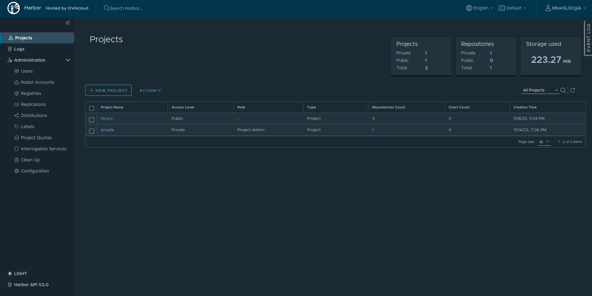
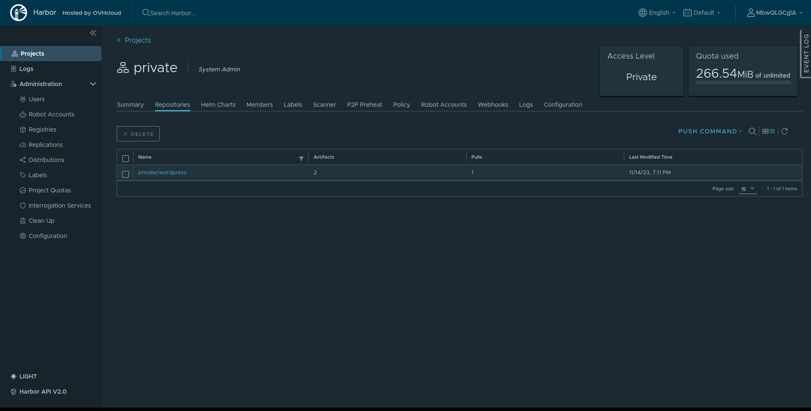
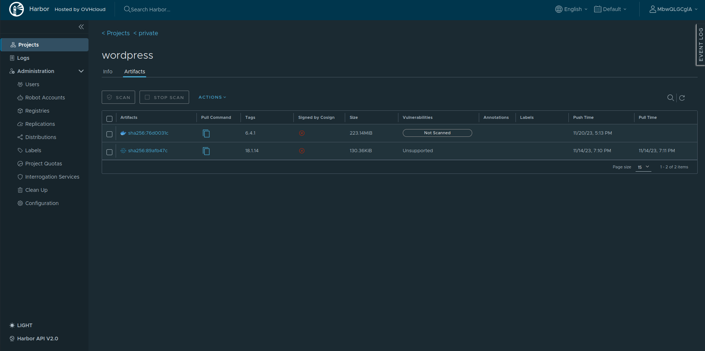

OVHcloud Managed Private Registry service is a composite cloud-native registry which supports both container image management and [Helm](https://helm.sh/){.external} [chart](https://helm.sh/docs/topics/charts/){.external} management.

This guide will explain how to manage Helm charts in the OVHcloud Managed Private Registry service: how to upload charts, and use them.

## Before you begin

This tutorial presupposes that you already have a working OVHcloud Managed Kubernetes cluster, and some basic knowledge of how to operate it. If you want to know more on those topics, please look at the [deploying a Hello World application](/pages/public_cloud/containers_orchestration/managed_kubernetes/deploying-hello-world) documentation. You will need to have Helm installed on your cluster (see the [installing helm](/pages/public_cloud/containers_orchestration/managed_kubernetes/installing-helm) guide for more information).

You also need to have a working OVHcloud Managed Private Registry and have followed the guides on [creating a private registry](/pages/public_cloud/containers_orchestration/managed_private_registry/creating-a-private-registry), [connecting to the UI](/pages/public_cloud/containers_orchestration/managed_private_registry/connecting-to-the-ui), [managing users and projects](/pages/public_cloud/containers_orchestration/managed_private_registry/managing-users-and-projects), [creating and using private images](/pages/public_cloud/containers_orchestration/managed_private_registry/creating-and-using-a-private-image) and [using Private Registry with OVHcloud Managed Kubernetes](/pages/public_cloud/containers_orchestration/managed_private_registry/using-private-registry-with-kubernetes).

## Prerequisites

### Install Helm v3.8+

Check if Helm is installed in the required version:

```bash
$ helm version
version.BuildInfo{Version:"v3.12.0", GitCommit:"c9f554d75773799f72ceef38c51210f1842a1dea", GitTreeState:"clean", GoVersion:"go1.20.3"}
```

If the version is less than v3.8.0, follow the [official instructions](https://helm.sh/docs/intro/install/) to install Helm in latest version.

## Instructions

### Preparing a Helm chart

In order to do this tutorial, you will need a Helm chart to upload to your OVHcloud Managed Private Registry.

If you already have a Helm chart in your filesystem, you can use it for the example, but in this section we are assuming you haven't any. We are using a well known Helm chart often used as example: the [WordPress](https://github.com/helm/charts/tree/master/stable/wordpress) chart.

#### Download the chart

The first step is downloading the WordPress chart using `helm`:

```bash
helm fetch bitnami/wordpress
```

The WordPress Helm chart is downloaded as a `tgz` file.

```console
$ helm fetch bitnami/wordpress

$ ls
wordpress-18.1.14.tgz
```

#### Inspect the chart (optional)

The file you have downloaded is a packaged Helm chart, useful for downloading it, and for uploading it to your OVHcloud Private Registry. Let's unpack it to have a peek inside it and get a better undestanding of its structure,

An unpackaged chart is organized as a collection of files inside of a directory. The directory name is the name of the chart (without versioning information). Thus, the chart describing WordPress should be stored in a 'wordpress/' folder.

Inside of this directory, Helm will expect a structure that matches this:

```bash
wordpress/
  Chart.yaml          # A YAML file containing information about the chart
  LICENSE             # OPTIONAL: A plain text file containing the license for the chart
  README.md           # OPTIONAL: A human-readable README file
  values.yaml         # The default configuration values for this chart
  values.schema.json  # OPTIONAL: A JSON Schema for imposing a structure on the values.yaml file
  charts/             # A directory containing any charts upon which this chart depends.
  crds/               # Custom Resource Definitions
  templates/          # A directory of templates that, when combined with values,
                      # will generate valid Kubernetes manifest files.
  templates/NOTES.txt # OPTIONAL: A plain text file containing short usage notes
```

Let's uncompress the Helm chart:

```bash
tar zxf wordpress-18.1.14.tgz
```

As expected, the file is uncompressed into a `wordpress` folder, with the required files and folders inside it:

```console
$ tar zxf wordpress-18.1.14.tgz

$ ls -l
total 132
drwxr-xr-x 4 avache staff   4096 Nov 14 19:07 wordpress
-rw-r--r-- 1 avache staff 130981 Nov 14 19:07 wordpress-18.1.14.tgz

$ ls -l wordpress
total 148
-rw-r--r-- 1 avache staff   405 Nov 14 01:02 Chart.lock
drwxr-xr-x 5 avache staff  4096 Nov 14 19:07 charts
-rw-r--r-- 1 avache staff  1287 Nov 14 01:02 Chart.yaml
-rw-r--r-- 1 avache staff 73911 Nov 14 01:02 README.md
drwxr-xr-x 2 avache staff  4096 Nov 14 19:07 templates
-rw-r--r-- 1 avache staff  5706 Nov 14 01:02 values.schema.json
-rw-r--r-- 1 avache staff 48675 Nov 14 01:02 values.yaml
```

You can now remove the `tgz` file, as we are recreating it.

To package a chart from a chart directory, you can use `helm package`:

```bash
helm package wordpress
```

It creates the packaged chart, with the version appended to the filename:

```console
$ helm package wordpress
Successfully packaged chart and saved it to: /Users/avache/tmp/test-doc-k8s/helm/wordpress-18.1.14.tgz
```

### Manage Helm Charts via the Helm CLI

#### Login

Before being able to pull or push Helm charts, log in to Harbor:

```bash
helm registry login <registry url>
```

For example:

```bash
helm registry login https://8xghzr01.c1.bhs5.container-registry.ovh.net
```

#### Push Helm chart

Upload a chart to a registry:

```bash
helm push <chart name>-<version>.tgz oci://<registry url>/<project>
```

For example, to push the Helm chart WordPress in the version "18.1.14" in the Harbor project named "private":

```bash
helm push wordpress-18.1.14.tgz oci://8xghzr01.c1.bhs5.container-registry.ovh.net/private
```

#### Pull Helm Chart

Download a chart from a registry:

```bash
helm pull oci://<registry url>/<project>/<chart name> --version <version>
```

For example to pull the Helm chart WordPress in the version "18.1.14" from the Harbor project named "private":

```bash
helm pull oci://8xghzr01.c1.bhs5.container-registry.ovh.net/private/wordpress --version 18.1.14
```

You should see a new file:
```bash
$ ls -l

-rw-r--r-- 1 avache staff 130981 Nov 14 19:11 wordpress-18.1.14.tgz
```

#### Install Helm Chart

Install a chart to a Kubernetes cluster:

```bash
helm install myrelease oci://<registry url>/<project>/<chart name> --version <version>
```

For example, to install the Helm chart WordPress in the version "18.1.14" from the Harbor project named "private":

```bash
helm install myrelease oci://8xghzr01.c1.bhs5.container-registry.ovh.net/private/wordpress --version 18.1.14
```

### Manage Helm Charts via the Harbor UI

The charts pushed to the OCI-compatible registry of Harbor are treated like any other type of artifact.

We can list, copy, delete, update labels, get details, add or remove tags for them just like we can for container images.

In the following example we pushed the WordPress Helm chart in version 18.1.14 and the WordPress Docker image in version 6.4.1:

{.thumbnail}

Click on the `private` project name to list its repositories:

{.thumbnail}

Then click on the `private/wordpress` repository name to see its 2 artifacts: the Docker image and the Helm Chart, the logo on the left of the artifact hash allows to differentiate them:

{.thumbnail}

Finally click on the hash of the second artifact to see the Helm chart details:

{.thumbnail}

## Go further

To have an overview of OVHcloud Managed Private Registry service, you can go to the [OVHcloud Managed Private Registry site](/products/public-cloud-containers-orchestration-managed-private-registry).

Join our community of users on <https://community.ovh.com/en/>.
