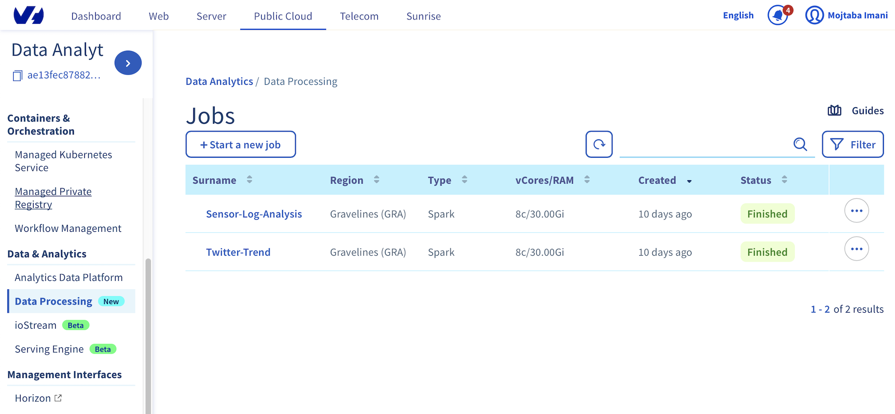

## Objective

This guide helps you to upload an Apache Spark job in Java or Scala to your OVHcloud Object Storage and run your job with Data Processing using the OVHcloud Control Panel.

If you would like to submit an Apache Spark job in Python language, you can read this document: [How to submit a Python job to Data Processing using the OVHcloud Control Panel](/pages/public_cloud/data_analytics/data_processing/31_HOWTO_submit-python-ui){.external}

In this guide, we are assuming that you're using the [OVHcloud Control Panel](https://www.ovh.com/auth/?action=gotomanager&from=https://www.ovh.es/&ovhSubsidiary=es){.external} to use Data Processing platform.

To read an introduction about Data Processing service you can visit [Data Processing Overview](/pages/public_cloud/data_analytics/data_processing/00_CONCEPTS_Overview){.external}.

## Requirements

- Access to the [OVHcloud Control Panel](https://www.ovh.com/auth/?action=gotomanager&from=https://www.ovh.es/&ovhSubsidiary=es){.external}
- A [Public Cloud project](/pages/public_cloud/compute/create_a_public_cloud_project) in your OVHcloud account
- An Openstack user in your cloud project and access to Openstack Horizon dashboard (see [How to create an Openstack user and access to Horizon](/pages/public_cloud/compute/introducing_horizon){.external} for details.)
- A jar file containing your Java or Scala code to be run in Apache Spark environment

## Instructions

### Step 1: Upload your application code to Object Storage

Before running your job in Data Processing platform, you will need to create a container in OVHcloud Object Storage for your job and upload your application jar file into this container. You can work with your Object Storage using either the OVHcloud Control Panel or the Openstack Horizon dashboard.

Please see [Creating Storage Containers in the OVHcloud Control Panel](/pages/cloud/storage/object_storage/pcs_create_container#controlpanel) or [Create an object container in Horizon](/pages/cloud/storage/object_storage/pcs_create_container#horizon) for more details.

If you don’t currently have an application code and you still would like to try OVHcloud Data Processing, you can download an [Apache Spark package](http://spark.apache.org/downloads.html) and extract it. Inside, you can find a jar file in examples/jars folder to run the SparkPi sample (which will just compute the Pi value).

Once you have a Storage container and an application to run on OVHcloud Data Processing, upload the jar file to the root directory of your object container.

### Step 2: Submit your Spark job
To submit your job with your required parameters follow these steps:

- Login to the OVHcloud Control Panel and select `Public Cloud`{.action}
- Select the relevant project if you have multiple projects in your OVHcloud account
- Select `Data Processing`{.action} from the left panel
- Select `Submit a new job`{.action}

{.thumbnail}

- Fill the "**Submit a job**" form that is now displayed, and at the end push `Submit job`{.action} button to submit your Apache Spark job. Please see [How to fill job submit form in Data Processing Manager](/pages/public_cloud/data_analytics/data_processing/32_HOWTO_fill-job-submit-form){.external} for more details.

### Step 3: Check information, status and logs of a job
In the **Data Processing** section of Manager you can see the list of all the jobs that you have submitted so far. If you click on a job's name, you can see detailed information on it, including its status. Then you can click on the `Logs`{.action} to see the live logs while the job is running.

> [!warning]
>If your jobs are stuck in "Running", you probably forgot to stop the spark context in your code. To stop it, please refer to the [java spark context documentation](https://spark.apache.org/docs/latest/api/java/index.html?org/apache/spark/api/java/JavaSparkContext.html).

Once the job will be finished, the complete logs will be saved to your Object Storage container. You will be able to download it from your account whenever you would like.

Please see [How to check your job's logs in the Data Processing manager page](/pages/public_cloud/data_analytics/data_processing/21_GETTINGSTARTED_check-job-logs){.external} for more details.

### Step 4: Check your job's results
After your Spark job is finished, you will be able to check the results from your logs as well as in any connected storage your job was designed to update.

## Go further

To learn more about using Data Processing and how to submit a job and process your data, we invite you to look at [Data Processing documentations page](/products/public-cloud-data-analytics-data-processing).

You can send your questions, suggestions or feedbacks in our community of users on [https://community.ovh.com/en/](https://community.ovh.com/en/){.external} or on our [Discord](https://discord.gg/VVvZg8NCQM){.external} in the channel **#dataprocessing-spark**

