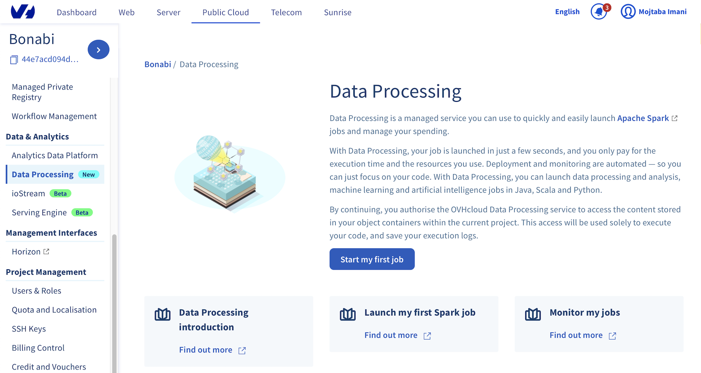

## Objective

This guide explains how you can activate the OVHcloud Data Processing service on your cloud project. It will also explain what activating the service implies for you and your cloud project. 

In this guide, we are assuming that you're using the [OVHcloud Manager](https://ca.ovh.com/auth/?action=gotomanager&from=https://www.ovh.com/sg/&ovhSubsidiary=sg){.external} to use the Data Processing platform. 

To read an introduction about Data Processing service you can visit [Data Processing Overview](/pages/public_cloud/data_analytics/data_processing/00_CONCEPTS_Overview){.external}.

## Requirements 
- Access to [OVHcloud Manager](https://ca.ovh.com/auth/?action=gotomanager&from=https://www.ovh.com/sg/&ovhSubsidiary=sg){.external}
- An OVHcloud account 
- A cloud project in your OVHcloud account (see [How to create a cloud project](/pages/public_cloud/compute/create_a_public_cloud_project){.external} for details.)

## How to activate the Data Processing service

By default, the Data Processing service is not activated on any cloud project. You will need to go on the OVHcloud Manager and select the cloud project you would like to enable the service for first. Once done, if you access the Data Processing menu from the OVHcloud Manager, you will be greeted by a welcome page.

{.thumbnail}

To activate the service on the selected cloud project, click on the `Start my first job`{.action} button.

## Activating the OVHcloud Data Processing service: What does it mean for you?

When activating the Data Processing service on one of your cloud projects, you are authorizing the OVHcloud Data Processing platform to have READ and WRITE access to the Object Storage associated with said cloud project. This is required to  perform a restricted list of actions:

- READ your cloud project's Object Storage:
    - We need to list all of your cloud project's Object Storage containers (in oder to make them selectable in the "Job Submit" form).
    - We need to read all files in the selected Object Storage container (in order to retrieve the application you want the Data Processing platform to execute).
- READ your cloud project quotas.
- WRITE to your cloud project's Object Storage:
    - We need to create a new container called "odp-logs".
    - We need to write your Data Processing job's output logs to this new container.

As the OVHcloud Data Processing service will continue to evolve and improve over time, the list of required permissions is subject to change.

To manage these permissions, the Data Processing service makes use of the Openstack Keystone mechanism called “Trust”. (you can learn more about it here [https://wiki.openstack.org/wiki/Keystone/Trusts](https://wiki.openstack.org/wiki/Keystone/Trusts){.external}).
Openstack Keystone Trusts are immutable: They can't be modified once they have been created. 
At this moment, the Data Processing platform can only create an Openstack Keystone Trust once for a given cloud project and can't delete it.
This means that, for now, the only way to remove the Openstack Keystone Trust created by the Data Processing service is to delete the cloud project where it was applied.

We therefore recommend you to use a dedicated cloud project to minimize impacts if you decided to stop using the Data Processing service in the future.
To learn more about cloud projects, please visit these pages: 

- [How to create a cloud project in OVHcloud account](/pages/public_cloud/compute/create_a_public_cloud_project)
- [How to delete a cloud project in OVHcloud account](/pages/public_cloud/compute/delete_a_project)

## Go further

To learn more about using Data Processing and how to submit a job and process your data, we invite you to look at [Data Processing documentations page](/products/public-cloud-data-analytics-data-processing).

You can send your questions, suggestions or feedbacks in our community of users on [https://community.ovh.com/en/](https://community.ovh.com/en/){.external} or on our [Discord](https://discord.gg/VVvZg8NCQM){.external} in the channel **#dataprocessing-spark**
