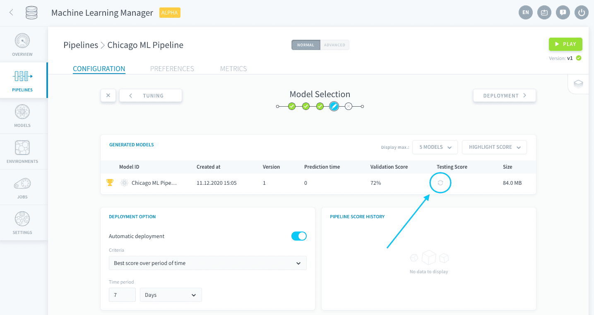
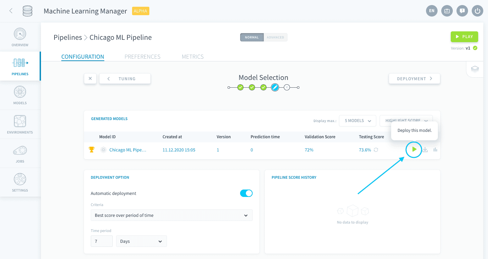
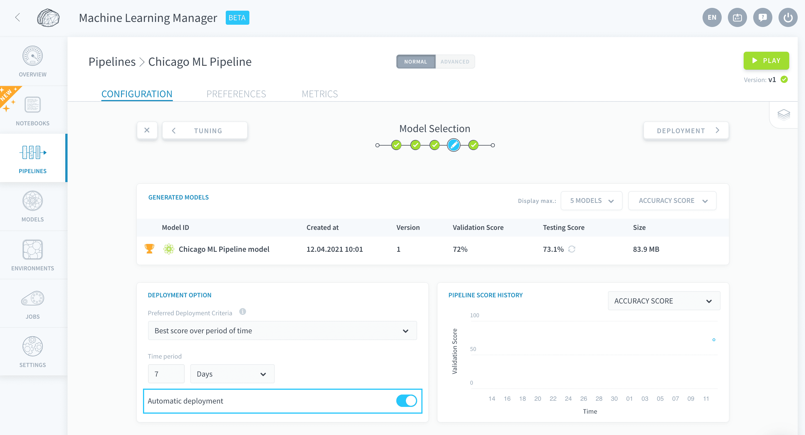
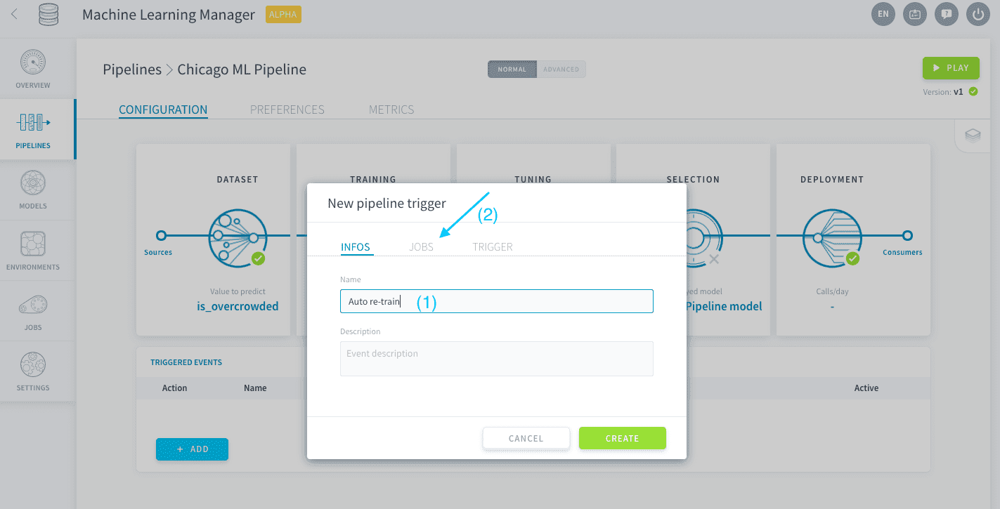
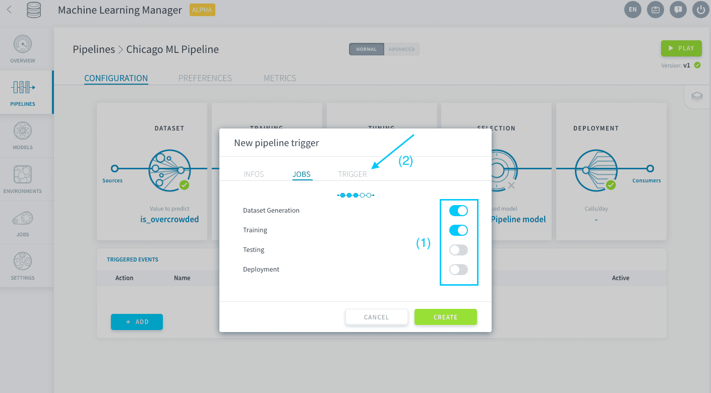
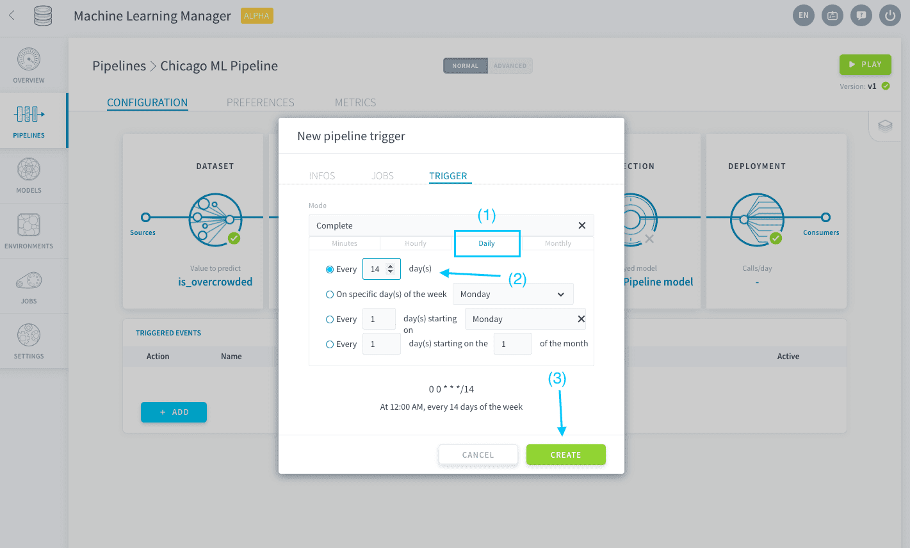

## Confirm your choice of model and deploy it

The Model Selection step is the **watchtower where you'll be able to control all models created by your pipeline over time**. Pipelines in the Data Platform are designed to live and evolve as new data is fed into your models, and as your models are trained, validated and tested. Keeping track of the model versions and score drift is essential for a production AI application.

### Manually deploy a model

The *Generated Models* table lists **all the models that have been trained and saved** since the pipeline was created. For the moment, you can only see one model. It is the best model that was returned by the hyper-parameter exploration in the previous step!

In order to limit the amount of resources used, the Data Platform doesn't automatically test your models with the testing dataset. You need to choose when to test your model. To do so, you can either press the pipeline's Play button and select the third option *'Testing'*, or manually click on the **refresh icon** for a specific model.

Now, it is time to deploy a model. To do this, click on the **Play icon** which is located on the right-hand side of the line of the model you wish to deploy.

It's that simple! Your model has been deployed, as indicated by the green atom icon next to its name, and is now available for predictions.

### Set automatic management options

#### Configure auto-deployment

As you have seen above, it is really easy to deploy a model. But, it’s still manual work! So, the Data Platform makes it even easier, by allowing you to auto-deploy your models. Once in production, if you are regularly gathering new data, this will save you the task of having to open the pipeline and manually launch the deployment.

The default criterion for deployment is the *best score over a period of time*. Leave it as it is. Simply note that you might also want to optimize the training or prediction time rather than only the score - this tab lets you do that too.

Set the time period to **14 days**.

Turn on **Automatic deployment**.

Your pipeline will now automatically deploy the best model every 14 days. Naturally, this feature should be combined with an automatic re-train / re-score of the model, else the deployed model cannot possibly change.

#### Configure triggers

The remaining automation options, such as re-training, can be set through **triggers**. To do so you’ll need to go back to your pipeline main page. Click on the **X** button at the top-left.

> Note that pipelines autosave 💾! You can always exit and come back at any time.

As you can see, there are no triggered events yet. Click on **Add**.

Name your trigger *Auto re-train*, give the description of your choice and click on **Jobs**.

You will now need to set up your pipeline so that it refreshes the training and the testing datasets with the latest gathered new data, and that it builds a new model to be trained. To do so, turn on the *Dataset Generation* and *Training* sliders. Then click on **Trigger**.

Let’s have the pipeline do this every 14 days. Select *Daily* and choose *Every 14 days*. Click on **Create** to close the window.

Your pipeline will now not only incorporate all new data for training and scoring every 14 days but it will also train a new model and automatically deploy the one with the best score.