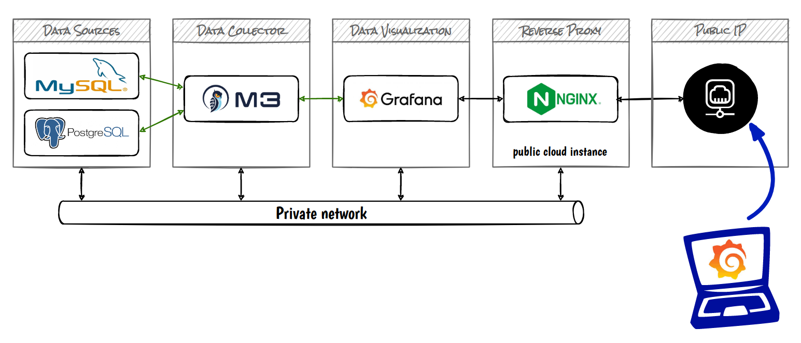
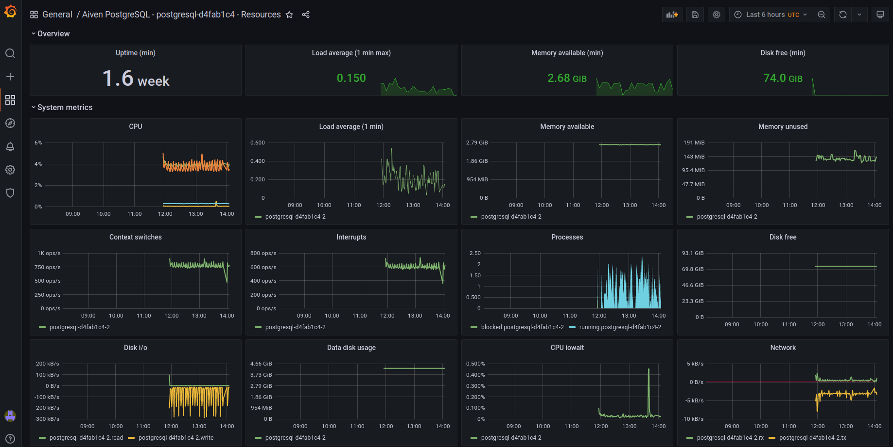

## Objective

Public Cloud Databases can be deployed over public network (internet) or private network.
When using private network, you don't have access by default to monitoring tools we provide as a service, like Public Cloud Databases for Grafana (metrics) or Opensearch (logs).

**This guide explains how to expose your managed Grafana to internet through the configuration of a NGINX instance in reverse proxy mode.**

Schema concept:

{.thumbnail}

> [!warning]
> OVHcloud provides services for which you are responsible, with regard to their configuration and management. It is therefore your responsibility to ensure that they function correctly.
>
> This guide is designed to assist you in common tasks as much as possible. Nevertheless, we recommend contacting a specialist service provider or reaching out to [our community](https://community.ovh.com/en/) if you experience any issues.
>

## Requirements

- A [Public Cloud project](https://www.ovhcloud.com/en-sg/public-cloud/) in your OVHcloud account
- Access to the [OVHcloud Control Panel](https://ca.ovh.com/auth/?action=gotomanager&from=https://www.ovh.com/sg/&ovhSubsidiary=sg)
- A Grafana database running on your OVHcloud Public Cloud project. ([This guide](/pages/public_cloud/public_cloud_databases/databases_01_order_control_panel) can help you to create a managed Grafana. If you need more details on the private network configuration use [this guide](/pages/public_cloud/public_cloud_databases/databases_08_vrack))

## Instructions

### Create a new instance in your vRack

> [!primary]
>
> [This guide](/pages/public_cloud/public_cloud_databases/databases_01_order_control_panel) can help you to create a new instance in your vRack.

For this tutorial, we will use an Ubuntu 22.10 image to install NGINX.

Log in to your [OVHcloud Control Panel](https://ca.ovh.com/auth/?action=gotomanager&from=https://www.ovh.com/sg/&ovhSubsidiary=sg) and create a new compute instance in your vRack.
If you need to expose your Reverse Proxy to a public network, please select the IP Floating address option.

### Install NGINX

Once you have access to your new instance, update your system and install NGINX:

```bash
sudo apt update
sudo apt full-upgrade
sudo apt install nginx
```

Check if your NGINX service is installed and running correctly:

```bash
sudo systemctl status nginx
```

### Configure NGINX

Regarding the NGINX configuration we are going to follow the [official Grafana documentation](https://grafana.com/tutorials/run-grafana-behind-a-proxy/).

Create a configuration file in the `/etc/nginx/sites-enabled/` file:

```nginx
# this is required to proxy Grafana Live WebSocket connections.
map $http_upgrade $connection_upgrade {
  default upgrade;
  '' close;
}

# this is upstream grafana. You can use dns name
upstream grafana {
  server your-grafana-12345abc-12345abc.database.cloud.ovh.net:443;
}

server {
  listen 443 ssl;
  ssl_certificate /etc/nginx/ssl/your_certificate.crt
  ssl_certificate_key /etc/nginx/ssl/your_certificate.key

  location / {
    proxy_set_header Host $http_host;
    proxy_pass https://grafana;
  }

  # Proxy Grafana Live WebSocket connections.
  location /api/live/ {
    proxy_http_version 1.1;
    proxy_set_header Upgrade $http_upgrade;
    proxy_set_header Connection $connection_upgrade;
    proxy_set_header Host $http_host;
    proxy_pass https://grafana;
  }
}

```

Be careful, replace the hostname of the Grafana server ***your-grafana-12345abc-12345abc.database.cloud.ovh.net:443*** by your own.

Also update the certificates and SSL key. If necessary, you can create them for testing purposes or in a non-productive environment using the following command:

```bash
sudo openssl req -x509 -nodes -days 365 -newkey rsa:2048 -keyout /etc/nginx/ssl/your_certificate.key -out /etc/nginx/ssl/your_certificate.crt
```

Now the NGNIX is configured in reverse proxy mode

### IP Packet forwarding

To redirect traffic from your Public IP to your Private IP, uncomment the following line in `/etc/sysctl.conf` to enable packet forwarding for IPv4:

```bash
net.ipv4.ip_forward=1
```

Then force the system to reload the kernel variables:
```bash
sudo sysctl -p
```

## Connect to your managed Grafana

Connect to your https reverse proxy server with your browser (accept the SSL certificate if needed). You do have now access to your predefined or customized dashboards.



## We want your feedback!

We would love to help answer questions and appreciate any feedback you may have.

If you need training or technical assistance to implement our solutions, contact your sales representative or click on [this link](https://www.ovhcloud.com/en-sg/professional-services/) to get a quote and ask our Professional Services experts for a custom analysis of your project.

Are you on Discord? Connect to our channel at <https://discord.gg/PwPqWUpN8G> and interact directly with the team that builds our databases service!
