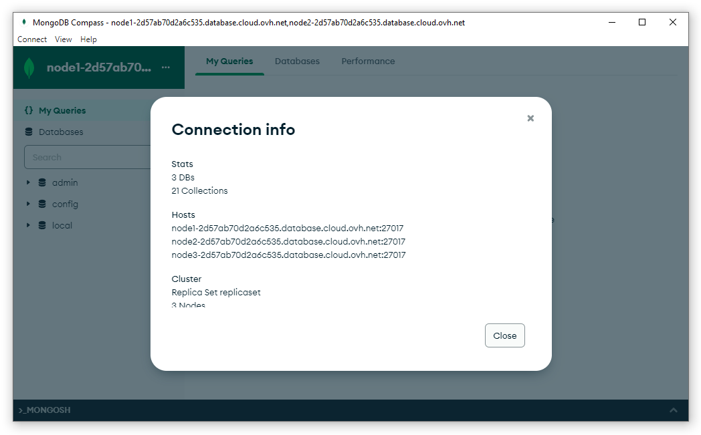

## Objective

This guide will help you understand the connection strings URI syntax and how to connect applications to MongoDB instances.

MongoDB 3.6 introduced the concept of a seed list that is specified using DNS records, specifically SRV records. Previously, clients had to specify at least one replica set member (and may specify several of them) when connecting. This allows a client to connect to a replica set even if one of the nodes that the client specifies is unavailable.

**This guide explains how to leverage the DNS seed list connection string format to ease the connection to a MongoDB service.**

## Requirements

- A [Public Cloud project](https://www.ovhcloud.com/fr-ca/public-cloud/) in your OVHcloud account
- Access to the [OVHcloud Control Panel](https://ca.ovh.com/auth/?action=gotomanager&from=https://www.ovh.com/ca/fr/&ovhSubsidiary=qc)
- A MongoDB instance running on your OVHcloud Public Cloud Databases ([this guide](/pages/public_cloud/public_cloud_databases/databases_01_order_control_panel) can help you to meet this requirement)
- [Configure your MongoDB instance](/pages/public_cloud/public_cloud_databases/mongodb_02_manage_control_panel) to accept incoming connections
- A MongoDB Compass stable version installed and public network connectivity (Internet). This guide was made in MongoDB Compass version 1.30.1

## Concepts

Once a MongoDB instance is running, you can connect multiple applications to it, from various libraries, drivers, and more.<br>
In each case, from `mongosh` shell to Python code or NodeJS app, you need to specify some parameters such as a host, a port, a user, a password, ..

Merged all together, this exact syntax is called a URI, for *Uniform Resource Identifier*. MongoDB currently supports two connection string URI formats.

### Standard Connection String format

This is the first format provided by MongoDB since version 1. 
Since MongoDB 3.6, **best practice is to avoid this format**. It will be soon hidden in the OVHcloud Control Panel.

The standard URI connection string has the following format:

```bash
mongodb://[username:password@]host1[:port1][,...hostN[:portN]][/[defaultauthdb][?options]]
```

For example, with Public Cloud Databases it may look like this:

```bash
mongodb://<username>:<password>@node1-2d57ab70d2a6c535.database.cloud.ovh.net,node2-2d57ab70d2a6c535.database.cloud.ovh.net,node3-2d57ab70d2a6c535.database.cloud.ovh.net/admin?replicaSet=replicaset&tls=true
```

### DNS Seed List Connection Format

Introduced since MongoDB 3.6, this new connection string URI format brings convenience and ergonomy.

Instead of listing all the hosts one by one, MongoDB introduced the concept of DNS-based lists. This method is recommended for drivers > 3.6.

Using DNS to construct the available servers list allows more flexibility of deployment and the ability to modify the hosts without reconfiguring clients.

Without the SRV record, configuration clients must list several nodes in their connection string.

The use of SRV records eliminates the requirement for clients to pass in a complete set of state information for the cluster. Instead, a single SRV record identifies all the nodes associated with the cluster.

The DNS seed list connection string has the following format:

```bash
mongodb+srv://<username>:<password>@server.example.com/[/[defaultauthdb][?options]]
```

As an example, it may look like this with Public Cloud Databases, even with 3 nodes:

```bash
mongodb+srv://<username>:<password>@mongodb-d2a6c535-o099ad5c9.database.cloud.ovh.net/admin?replicaSet=replicaset&tls=true
```

The corresponding DNS configuration (SRV records) is specified at the instantiation of the MongoDB service and might resemble:

```bash
Record                                                  TTL   Class    Priority Weight Port  Target
_mongodb._tcp.mongodb-d2a6c535-o099ad5c9.database.cloud.ovh.net. 1440 IN SRV   0        5      27017 node1-2d57ab70d2a6c535.database.cloud.ovh.net.
_mongodb._tcp.mongodb-d2a6c535-o099ad5c9.database.cloud.ovh.net. 1440 IN SRV   0        5      27017 node2-2d57ab70d2a6c535.database.cloud.ovh.net.
_mongodb._tcp.mongodb-708c0af6-o1b33fa01.database.cloud.ovh.net. 1440 IN SRV   0        5      27017 node3-2d57ab70d2a6c535.database.cloud.ovh.net.
```

## Example: add and remove MongoDB nodes without impact thanks to DNS Seed list

### Retrieve MongoDB DNS Seed List connection string

To retrieve the MongoDB URI (`mongodbSrv`), log in to your OVHcloud Control Panel and open your Public Cloud project.

Click on `Databases`{.action} in the left-hand navigation bar and select your MongoDB instance.

From the central `Login information` panel, select `mongodbSrv` as **Service** and copy the URI.

{.thumbnail}

### Test the connection to MongoDB

Open MongoDB Compass and fill in the connection field with the `mongodbSrv` connection string you just copied.
Substitute the username and password by their actual values and click `Connect`{.action}.

{.thumbnail}

MongoDB Compass establishes the connection and you should now be able to explore your databases.

{.thumbnail}

### Add a node to a cluster

Imagine you want to scale your cluster up to support additional load.<br>
From the OVHcloud Control Panel, click the `Add node`{.action} button and confirm.

{.thumbnail}

Once the new node is spawned, no need to reconfigure your connection.

Once MongoDB Compass has established the connection, click the three dots `...`{.action} menu besides the connection name.<br>
From the menu, click `Connection info`{.action}.

{.thumbnail}

Your MongoDB Compass is now connected to the 4 nodes of the cluster.

### Remove a node from the cluster

You now want to scale the cluster down by removing a node.

Go back to the OVHcloud Control Panel, click on the `Delete node`{.action} button and confirm.

{.thumbnail}

After a few seconds, the node is effectively deleted from the cluster.
Return to MongoDB Compass and open the `Connection info`{.action}.
You should be able to see that MongoDB Compass has updated the list of nodes of your cluster, and lists only 3 nodes.

{.thumbnail}

Without having updated the connection string, the client application has dynamically updated its connection information.

## Wrapping up

In summary, the DNS seed list connection string and the underlying SRV records simplify MongoDB cluster integration, limit errors, and facilitate evolution through transparent node management.

## Go further

Visit our dedicated Discord channel: [https://discord.gg/ovhcloud](https://discord.gg/ovhcloud).

Ask questions, provide feedback and interact directly with the team that builds our databases services.