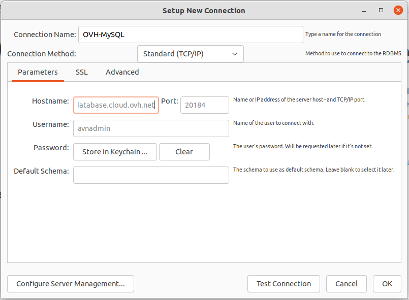
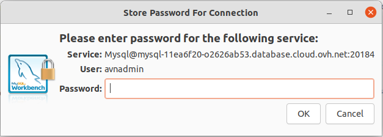
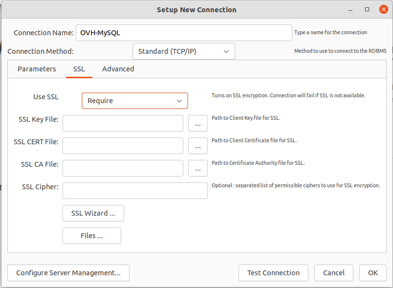
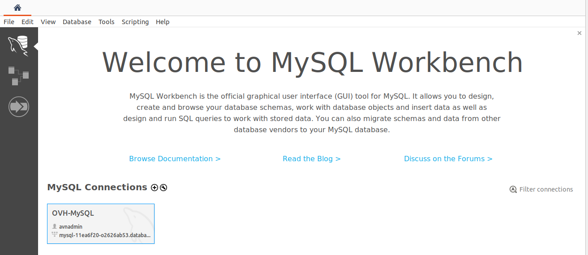
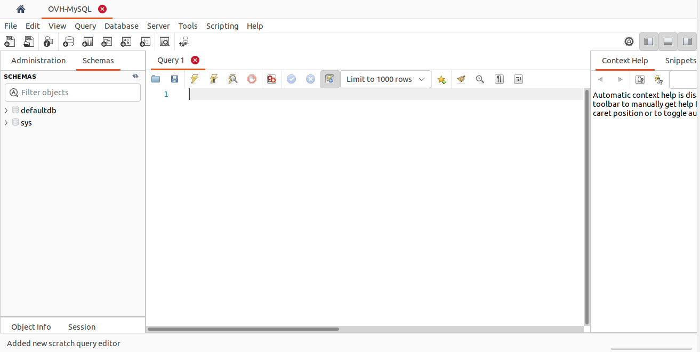

## Objective

Public Cloud Databases allow you to focus on building and deploying cloud applications while OVHcloud takes care of the database infrastructure and maintenance in operational conditions.

**This guide explains how to connect to a MySQL database instance with MySQL Workbench.**

## Requirements

- Access to the [OVHcloud Control Panel](https://www.ovh.com/auth/?action=gotomanager&from=https://www.ovh.co.uk/&ovhSubsidiary=GB)
- A [Public Cloud project](https://www.ovhcloud.com/en-gb/public-cloud/) in your OVHcloud account
- A MySQL database running on your OVHcloud Public Cloud Databases ([this guide](/pages/public_cloud/public_cloud_databases/databases_01_order_control_panel) can help you to meet this requirement)
- [Configure your MySQL instance](/pages/public_cloud/public_cloud_databases/mysql_07_prepare_for_incoming_connections) to accept incoming connections
- A MySQL Workbench stable version installed and public network connectivity (Internet). *This guide was made with MySQL Workbench version 8.0.28*.

## Concept

A MySQL instance can be managed through multiple ways.
One of the easiest, yet powerful, is to use a Command Line Interface (CLI), as shown in our guide: [Connect to MySQL with CLI](/pages/public_cloud/public_cloud_databases/mysql_03_connect_cli) or by using programming languages, such as [PHP](/pages/public_cloud/public_cloud_databases/mysql_04_connect_php) or [Python](/pages/public_cloud/public_cloud_databases/mysql_05_connect_python).

Another way is to interact directly using a management tool like MySQL Workbench.

## Instructions

### Installation

MySQL Workbench can be downloaded for free at the following link: <https://dev.mysql.com/downloads/workbench/>.

Once you have downloaded and installed it, follow the steps below to set up a remote connection to your MySQL instance.

### Connect with MySQL Workbench

#### Configuration

Click `New Connection`{.action}.

In the **Setup New Connection** dialog box, fill in the `Parameters`{.action} tab form with the previously collected information.

Store the password for connection in keychain.

Switch to `SSL`{.action} tab and set `Use SSL` to `Require`.

Once done, select your new connection.

Congratulations, in the `Schemas`{.action} tab, you will see your databases.

> [!primary]
>
> Once connected, MySQL Workbench facilitates many actions such as querying your databases and managing used or even import data. Please read the official documentation to discover the whole feature list: <https://www.mysql.com/products/workbench/features.html>.
>

## Go further

Visit our dedicated Discord channel: <https://discord.gg/ovhcloud>. Ask questions, provide feedback and interact directly with the team that builds our databases services.

If you need training or technical assistance to implement our solutions, contact your sales representative or click on [this link](https://www.ovhcloud.com/en-gb/professional-services/) to get a quote and ask our Professional Services experts for a custom analysis of your project.

Join our community of users on <https://community.ovh.com/en/>.
