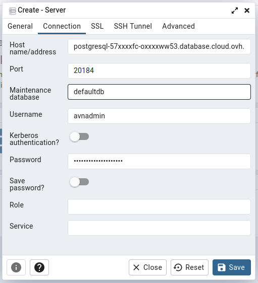
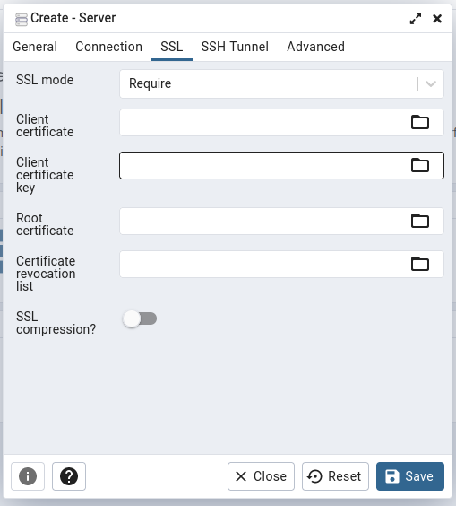
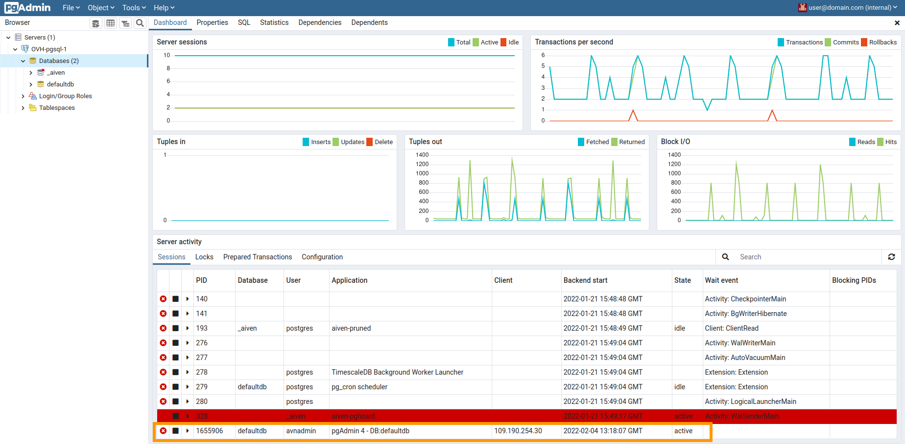

## Objective

Public Cloud Databases allow you to focus on building and deploying cloud applications while OVHcloud takes care of the database infrastructure and maintenance in operational conditions.

**This guide explains how to connect to a PostgreSQL database instance with one of the world's most famous Open Source management tool for PostgreSQL: pgAdmin.**

## Requirements

- Access to the [OVHcloud Control Panel](https://ca.ovh.com/auth/?action=gotomanager&from=https://www.ovh.com/asia/&ovhSubsidiary=asia).
- A [Public Cloud project](https://www.ovhcloud.com/asia/public-cloud/) in your OVHcloud account.
- A PostgreSQL database running on your OVHcloud Public Cloud Databases ([this guide](/pages/public_cloud/public_cloud_databases/databases_01_order_control_panel) can help you to meet this requirement)
- [Configure your PostgreSQL instance](/pages/public_cloud/public_cloud_databases/postgresql_07_prepare_for_incoming_connections) to accept incoming connections
- A pgAdmin stable version installed and public network connectivity (Internet). This guide was made in pgAdmin 4 version 6.4.

## Concept

A PostgreSQL instance can be managed through multiple ways.
One of the easiest, yet powerful, is to use a Command Line Interface (CLI), as shown in our guide: [Connect to PostgreSQL with CLI](/pages/public_cloud/public_cloud_databases/postgresql_03_connect_cli) or by using programming languages, such as [PHP](/pages/public_cloud/public_cloud_databases/postgresql_04_connect_php) or [Python](/pages/public_cloud/public_cloud_databases/postgresql_05_connect_python).

Another way is to interact directly using a management tool for PostgreSQL: pgAdmin.

In order to do so, we will need to install pgAdmin, then configure our Public Cloud Databases for PostgreSQL instances to accept incoming connections, and finally configure pgAdmin 4.

## Instructions

### Installation

To interact with your PostgreSQL instance with pgAdmin 4 you need to install it.

Please follow the official [pgAdmin](https://www.pgadmin.org/download/){.external} to get the latest information.

We are now ready to learn how to connect to our PostgreSQL instance.

### Connect with pgAdmin 4

#### Configuration

Once logged in pgAdmin, from the Servers dashboard view select `Add new server`{.action}.

In the **Create - Server** dialog of the `General`{.action} tab, fill in the Name field.

Then select the `Connection`{.action} tab and fill in the following fields with the collected credentials:

- Host
- Port
- Maintenance database
- Username
- Password

Finally, select the `SSL`{.action} tab and set the **SSL Mode** to **Require**.

> [!primary]
>
> If needed you can adjust the connection timeout in the `Advanced`{.action} tab.
>

Once saved, select your server in the servers list on the left. In the Dashboard view, you can observe that the connection is active:

> [!primary]
>
> pgAdmin has [useful functions](https://pgadmin.org/features){.external} such as:
>
> - [Backup & Restore](https://www.pgadmin.org/docs/pgadmin4/latest/backup_and_restore.html){.external} a single table, a schema, or a complete database
> - [Manage Roles](https://www.pgadmin.org/docs/pgadmin4/latest/role_dialog.html){.external}
>

## Go further

Visit the [Github examples repository](https://github.com/ovh/public-cloud-databases-examples/tree/main/databases/postgresql) to find how to connect to your database with several languages.

Visit our dedicated Discord channel: <https://discord.gg/ovhcloud>. Ask questions, provide feedback and interact directly with the team that builds our databases services.

If you need training or technical assistance to implement our solutions, contact your sales representative or click on [this link](https://www.ovhcloud.com/asia/professional-services/) to get a quote and ask our Professional Services experts for a custom analysis of your project.

Join our community of users on <https://community.ovh.com/en/>.
