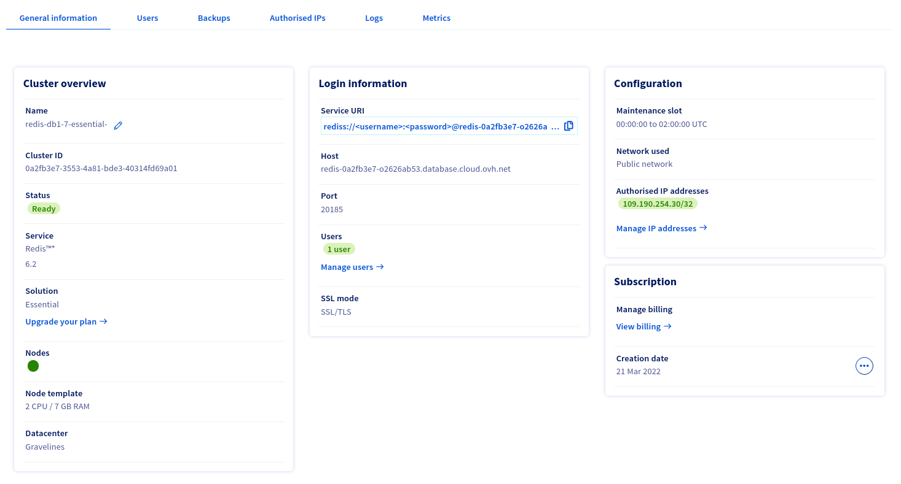

## Objective

Public Cloud Databases allow you to focus on building and deploying cloud applications while OVHcloud takes care of the database infrastructure and maintenance in operational conditions.

**This guide explains how to configure your Redis instance to accept incoming connections.**

## Requirements

- A [Public Cloud project](https://www.ovhcloud.com/en-sg/public-cloud/) in your OVHcloud account
- Access to the [OVHcloud Control Panel](https://ca.ovh.com/auth/?action=gotomanager&from=https://www.ovh.com/sg/&ovhSubsidiary=sg)
- A Redis database running on your OVHcloud Public Cloud Databases ([this guide](/pages/public_cloud/public_cloud_databases/databases_01_order_control_panel) can help you to meet this requirement)

## Instructions

### Configure your Redis instance to accept incoming connections

Before making a connection, we need to verify that our Redis instance is correctly configured.

Log in to your [OVHcloud Control Panel](https://ca.ovh.com/auth/?action=gotomanager&from=https://www.ovh.com/sg/&ovhSubsidiary=sg) and open your `Public Cloud`{.action} project. Click on `Databases`{.action} in the left-hand navigation bar and select your Redis instance.

#### Step 1: Verify your user roles and password

Select the `Users`{.action} tab. Verify that you have a user with sufficient rights and a password. If you don't remember the user's password, you can either create a new user or regenerate the password of an existing user. Be careful! By doing so you will need to update all the places where you already use this user/password pair.

In our example, we will create a user called *redisUser* and rights for :

- *allkeys* for keys (syntax equivalent to *<\*>*)
- the *ping* command (syntax equivalent to *<+ping>*)
- the *info* command (syntax equivalent to *<+info>*)
- the *echo* command (syntax equivalent to *<+echo>*)
- the *get* command (syntax equivalent to *<+get>*)  
- the *set* command (syntax equivalent to *<+set>*)  
- the *client* command (syntax equivalent to *<+client>*)
- *allchannels* for channels (syntax equivalent to *<\*>*).

{.thumbnail}

Once created or updated, the user has to be ready and with the "Enabled" status in the Control Panel.

{.thumbnail}

> [!primary]
>
> Follow the [Commands Official Documentation](https://redis.io/commands/) to learn more.
>
> Follow this [guide](/pages/platform/databases/redis_01_capabilities#users-and-roles) to learn more about users and roles capabilities and limitations.
>

#### Step 2: Authorise incoming connections from the Redis client

> [!warning]
> For security reasons the default network configuration doesn't allow any incoming connections. It is thus critical you authorise the suitable IP addresses in order to successfully access your database.

In this step, select the `Authorised IPs`{.action} tab. IP addresses must be authorised here before they can connect to your database.

Clicking on `Add an IP address or IP address block (CIDR)`{.action} opens a new window in which you can add single IP addresses or blocks to allow access to the database.

{.thumbnail}

You can edit and retract database access via the `...`{.action} button in the IP table.

> [!primary]
>
> If you want to allow connections from the outside, you can enter the IP 0.0.0.0/0. Please use it carefully.
>

#### Collect required information

Select the `General information`{.action} tab to find the required login credentials in the `Login informations` section.

## Go further

Visit the [Github examples repository](https://github.com/ovh/public-cloud-databases-examples/tree/main/databases/redis) to find how to connect to your database with several languages.

Visit our dedicated Discord channel: <https://discord.gg/ovhcloud>. Ask questions, provide feedback and interact directly with the team that builds our databases services.

If you need training or technical assistance to implement our solutions, contact your sales representative or click on [this link](https://www.ovhcloud.com/en-sg/professional-services/) to get a quote and ask our Professional Services experts for a custom analysis of your project.

Join our community of users on <https://community.ovh.com/en/>.
