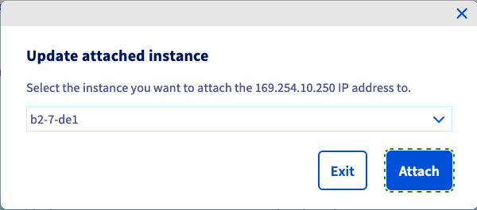

**Última atualização: 04/01/2023**

> [!primary]
>
> A partir de 6 de outubro de 2022, a nossa solução "Failover IP" passou a designar-se [Additional IP](https://www.ovhcloud.com/pt/network/additional-ip/). Isto não afeta as suas funcionalidades.
>

## Objetivo

Se precisa de configurar um endereço Additional IP numa das suas instâncias, quer seja para:

- Tem vários sítios na sua instância. 
- Acolhe projectos internacionais.
- Deseja migrar a sua atividade de um servidor dedicado para uma instância Public Cloud.

Pode importar um endereço Additional IP associado a outro serviço OVHcloud.

**Este guia explica como poderá importar esse Additional IP para o seu projeto Public Cloud OVHcloud.**

## Requisitos

- Um [projeto Public Cloud](https://www.ovhcloud.com/pt/public-cloud/) criado na sua conta OVHcloud
- Acesso à [Área de Cliente OVHcloud](https://www.ovh.com/auth/?action=gotomanager&from=https://www.ovh.pt/&ovhSubsidiary=pt){.external}
- Um [endereço Additional IP](https://www.ovhcloud.com/pt/bare-metal/ip/){.external}

> [!warning]
> Esta funcionalidade não está atualmente disponível para as instâncias Metal.
>

## Instruções

Ligue-se à sua Área de [Cliente OVHcloud](https://www.ovh.com/auth/?action=gotomanager&from=https://www.ovh.pt/&ovhSubsidiary=pt) e selecione o seu projeto na secção `Public Cloud `{.action}.

No menu à esquerda, abra o `Public IPs`{.action} em `Network`.

Abra o separador `Additional IP`{.action} e clique no botão `Ações`{.action}. Selecione `Importar um Additional IP`{.action} para apresentar todos os endereços de IP que podem ser importados no seu projeto Public Cloud.

{.thumbnail}

Se ainda não tiver um IP adicional no seu projeto Public Cloud, a opção de importação de um IP adicional será apresentada na página inicial.

Clique em `...`{.action} junto do endereço IP que deseja importar e clique em `Importar este Additional IP`{.action}.

{.thumbnail}

Valide clicando em `Importar`{.action}.

{.thumbnail}

Aguarde alguns minutos até que a importação seja concluída. Abra o separador `Additional IP`{.action} para encontrar o endereço Additional IP importado. Atualize a página caso seja necessário.

Clique em `...`{.action} do lado direito e selecione `Alterar a instância associada`{.action}.

{.thumbnail}

Surgirá uma janela de contexto para escolher a instância à qual o seu endereço IP deve estar associado.

{.thumbnail}

Clique em `Adicionar`{.action} para confirmar. A página apresenta então uma mensagem de modificação.

> [!warning]
>
> Um IP adicional não pode ser migrado entre diferentes zonas. Por exemplo, um IP localizado no datacenter SBG pode ser migrado para GRA ou RBX mas não para BHS.
>

O seu endereço Additional IP será associado à sua instância.

O próximo passo consiste em configurar o IP no seu sistema operativo. Consulte o [nosso guia dedicado a esta configuração](/pages/public_cloud/public_cloud_network_services/getting-started-04-configure-additional-ip-to-instance).

## Quer saber mais?

Se precisar de formação ou de assistência técnica para implementar as nossas soluções, contacte o seu representante comercial ou clique em [esta ligação](https://www.ovhcloud.com/pt/professional-services/) para obter um orçamento e solicitar uma análise personalizada do seu projecto aos nossos especialistas da equipa de Serviços Profissionais.

Fale com nossa comunidade de utilizadores: <https://community.ovh.com/en/>.