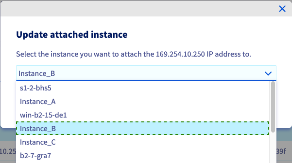

**Last updated 4th January 2023**

> [!primary]
>
> Since October 6th, 2022 our service "Failover IP" is named [Additional IP](https://www.ovhcloud.com/en/network/additional-ip/). This renaming has no effect on its technical features.
>

## Objective

Being able to migrate IP addresses generally limits or removes the possibility that your service becomes unavailable. For example, you can effectively update a whole website to a new version or you can keep a replicated server active while running maintenance or installing updates on your production server.

**This guide explains how to migrate an Additional IP from one OVHcloud Public Cloud instance to another.**

## Prerequisites

- At least two [Public Cloud instances](https://www.ovhcloud.com/en/public-cloud/) in your OVHcloud account
- An Additional IP address
- Access to the [OVHcloud Control Panel](https://ca.ovh.com/auth/?action=gotomanager&from=https://www.ovh.com/world/&ovhSubsidiary=we)

> [!warning]
> This feature is currently not available for Metal instances.
>

## Instructions

> [!warning]
>
> An Additional IP cannot be moved between different zones. For example, an IP located in the SBG data centre can be moved to GRA or RBX, but cannot be moved to BHS.
>

In the [OVHcloud Control Panel](https://ca.ovh.com/auth/?action=gotomanager&from=https://www.ovh.com/world/&ovhSubsidiary=we), select your project from the `Public Cloud`{.action} section.

In the left-hand menu, open `Public IPs`{.action} under `Network`. Click on the `Additional IP`{.action} tab.

In this example, the Additional IP address routed to "Instance_A" will be migrated to "Instance_B".

Click on `...`{.action} in the row of the Additional IP and select `Update attached instance`{.action}.

{.thumbnail}

Click on the drop-down menu to choose the destination instance from the list.

{.thumbnail}

Confirm by clicking on `Attach`{.action}.

After a few seconds, the Control Panel will be updated and a confirmation message will be displayed if the migration was done sucessfully.

{.thumbnail}

> [!primary]
>
The Additional IP can be configured on the destination server before or after carrying out the migration. If it was preconfigured, it will begin to respond as soon as the routing operation is completed.
>

## Go further

[Configuring an Additional IP](/pages/public_cloud/public_cloud_network_services/getting-started-04-configure-additional-ip-to-instance)

[Importing an Additional IP](/pages/public_cloud/public_cloud_network_services/additional-ip-import)

If you need training or technical assistance to implement our solutions, contact your sales representative or click on [this link](https://www.ovhcloud.com/en/professional-services/) to get a quote and ask our Professional Services experts for assisting you on your specific use case of your project.

Join our community of users on <https://community.ovh.com/en/>.
