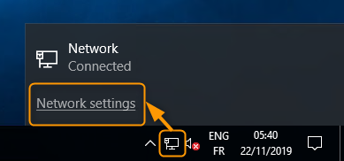

## Objective

The default DNS server configured on instances you create will be the OVHcloud server (IP address 213.186.33.99 for example). You can add a secondary server or replace this configuration with your own. However, the DNS servers are configured automatically by a DHCP server and you will not be able to change the DNS configuration by editing the `resolv.conf` file.

**This guide explains how to change the DHCP configuration of an instance in order to change the DNS servers.**

> [!warning]
>OVHcloud is providing you with services for which you are responsible, with regard to their configuration and management. You are therefore responsible for ensuring they function correctly.
>
>This guide is designed to assist you in common tasks as much as possible. Nevertheless, we recommend that you contact a [specialist service provider](https://partner.ovhcloud.com/en-ie/directory/) if you have difficulties or doubts concerning the administration, usage or implementation of services on a server. You can find more information in the [Go further](#gofurther) section of this guide.
>

## Requirements

- A [Public Cloud instance](https://www.ovhcloud.com/en-ie/public-cloud/) in your OVHcloud account
- Administrative access (root) to the instance via SSH or RDP
- Basic networking and administration knowledge

## Instructions

Log in to your instance via SSH. Refer to our guide on [Connecting to a Public Cloud instance](/pages/public_cloud/compute/public-cloud-first-steps#connect-to-instance) if necessary.

Switch to the root user. Refer to our guide on [Becoming the root user and selecting a password](/pages/public_cloud/compute/become_root_and_change_password) if necessary.

### Debian/Ubuntu

Using a text editor of your choice, edit the file `/etc/dhcp/dhclient.conf` in order to configure the DNS servers you want.

Here you can use different "statements" to add your desired DNS servers. Add the respective line and replace IP1/IP2 with their IP addresses.

- To add DNS servers that will effectively replace the one configured by default, add this line:
  
```console
supersede domain-name-servers IP1, IP2;
```

- To add DNS servers that will be preferred to the one configured by default:
    
```console
prepend domain-name-servers IP1, IP2;
```

- To add DNS servers that will only be used if the one configured by default is unavailable:
    
```console
append domain-name-servers IP1, IP2;
```

Save your changes to the config file and exit the editor.

Check that the configuration has been applied properly with the following command:

```bash
cat /etc/resolv.conf

domain openstacklocal
search openstacklocal
nameserver IP1
nameserver IP2
```

### CentOS/Fedora

Check the current configuration with the command `nmcli`:

```bash
nmcli
 
eth0: connected to System eth0
        "Red Hat Virtio"
        ethernet (virtio_net), FA:16:3E:B6:FB:89, hw, mtu 1500
        ip4 default
        inet4 51.77.205.51/32
        route4 0.0.0.0/0
        route4 51.77.205.51/32
        route4 51.77.204.1/32
        inet6 fe80::f816:3eff:feb6:fb89/64
        route6 ff00::/8
        route6 fe80::/64
 
lo: non-managed
        "lo"
        loopback (unknown), 00:00:00:00:00:00, sw, mtu 65536
 
DNS configuration:
        servers: 127.0.0.1 213.186.33.99
        interface: eth0
```

Retrieve the name of your public interface:

```bash
nmcli connection show
 
NAME         UUID                                  TYPE      DEVICE
System eth0  5fb06bd0-0bb0-7ffb-45f1-d6edd65f3e03  ethernet  eth0
```

Disable the automatic DNS modification and add the IP addresses (replace IP1/IP2) of the DNS servers you want to configure. (Replace `System eth0` with the actual value retrieved previously.)

```bash
nmcli con mod "System eth0" ipv4.ignore-auto-dns yes
nmcli con mod "System eth0" ipv4.dns "IP1 IP2"
```

Apply the configuration. (Replace `System eth0` with the actual value retrieved previously.)

```bash
nmcli con down "System eth0" && nmcli con up "System eth0"
```

Check that the configuration has been properly applied:

```bash
nmcli | grep -E 'DNS|server|interface'
 
DNS configuration:
        servers: IP1 IP2
        interface: eth0
```

### On Windows

Connect to the instance via remote desktop session or with the VNC console. Refer to our guide on [Connecting to a Public Cloud instance](/pages/public_cloud/compute/public-cloud-first-steps#connect-to-instance) if necessary.

Open the `Network settings`{.action}.

{.thumbnail}

Go to your public network adapter’s IPv4 configuration via the control panel.

{.thumbnail}

Add the servers you want to use in the `Advanced`{.action} settings.

{.thumbnail}

> [!primary]
>
In PowerShell, you can use the command `nslookup` to check which DNS server is used by default.
>

## Go further <a name="gofurther"></a>

[First steps with Public Cloud instances](/pages/public_cloud/compute/public-cloud-first-steps)

[Becoming the root user and selecting a password](/pages/public_cloud/compute/become_root_and_change_password)

[Changing the hostname of a Public Cloud instance](/pages/public_cloud/compute/changing_the_hostname_of_an_instance)

Join our community of users on <https://community.ovh.com/en/>.