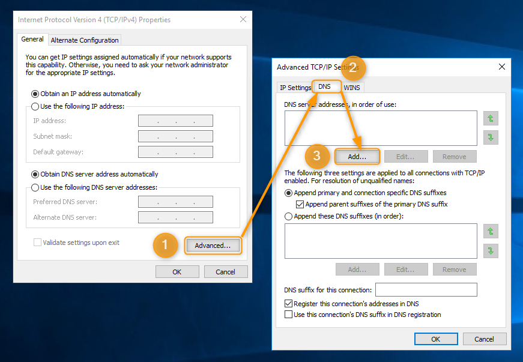

> [!primary]
> Questa traduzione è stata generata automaticamente dal nostro partner SYSTRAN. I contenuti potrebbero presentare imprecisioni, ad esempio la nomenclatura dei pulsanti o alcuni dettagli tecnici. In caso di dubbi consigliamo di fare riferimento alla versione inglese o francese della guida. Per aiutarci a migliorare questa traduzione, utilizza il pulsante "Contribuisci" di questa pagina.
>

**Ultimo aggiornamento: 29/10/2021**

## Obiettivo

Di default, il server DNS configurato sulle istanze Public Cloud è quello di OVHcloud (ad esempio, 213.186.33.99).<br>
È possibile aggiungere un server secondario o sostituire questa configurazione con la propria. Tuttavia, i server DNS sono configurati automaticamente da un server DHCP e non è possibile modificare la configurazione DNS modificando il file `resolv.conf`.

**Questa guida ti mostra come modificare la configurazione DHCP di un'istanza per modificare i server DNS.**

> [!warning]
> OVHcloud fornisce servizi di cui è responsabile la configurazione e la gestione. Spetta quindi a lei garantire che tali servizi funzionino correttamente.
>
> Questa guida ti aiuta a eseguire le operazioni necessarie sul tuo VPS. Tuttavia, in caso di difficoltà o dubbi relativi all'amministrazione, all'utilizzo o alla creazione di un servizio su un server, ti consigliamo di contattare un esperto del settore. Per maggiori informazioni consulta la sezione [Per saperne di più](#gofurther) su questa guida.
>

## Prerequisiti

- Disporre di un'[istanza Public Cloud](https://www.ovhcloud.com/it/public-cloud/) nel proprio account OVHcloud
- Avere accesso amministratore (root) all'istanza via SSH o RDP
- Conoscenze di base in rete e amministrazione

## Procedura

Accedi alla tua istanza via SSH Per maggiori informazioni, consulta la guida [Connettersi a un'istanza Public Cloud](/pages/public_cloud/compute/public-cloud-first-steps#connect-to-instance).

Passare all'utente root. Se hai bisogno di aiuto, consulta la guida per [passare da root e impostare una password](/pages/public_cloud/compute/become_root_and_change_password).

### Debian / Ubuntu

Utilizza l'editor di testo che preferisci, modifica il file `/etc/dhcp/dhclient.conf` per configurare i server DNS di tua scelta.

Per aggiungere i server DNS di tua scelta, puoi utilizzare diverse linee guida. Utilizza il comando che preferisci e sostituisci IP1/IP2 con i loro indirizzi IP.

- Per aggiungere server DNS che sostituiranno effettivamente quello configurato di default, aggiungi questa riga:
  
```console
supersede domain-name-servers IP1, IP2;
```

- Per aggiungere server DNS che saranno preferiti a quelli configurati di default:
    
```console
prepend domain-name-servers IP1, IP2;
```

- Per aggiungere server DNS che saranno utilizzati solo se quello configurato di default non è disponibile:
    
```console
append domain-name-servers IP1, IP2;
```

Salva le modifiche nel file di configurazione e lascia l'editor.

Verifica che la configurazione sia stata eseguita correttamente con il comando:

```bash
cat /etc/resolv.conf

domain openstacklocal
search openstacklocal
nameserver IP1
nameserver IP2
```

### CentOS/Fedora

Verifica la configurazione corrente eseguendo il comando `nmcli`:

```bash
nmcli
 
eth0: connected to System eth0
        "Red Hat Virtio"
        ethernet (virtio_net), FA:16:3E:B6:FB:89, hw, mtu 1500
        ip4 default
        inet4 51.77.205.51/32
        route4 0.0.0.0/0
        route4 51.77.205.51/32
        route4 51.77.204.1/32
        inet6 fe80::f816:3eff:feb6:fb89/64
        route6 ff00::/8
        route6 fe80::/64
 
lo: non-managed
        "lo"
        loopback (unknown), 00:00:00:00:00:00, sw, mtu 65536
 
DNS configuration:
        servers: 127.0.0.1 213.186.33.99
        interface: eth0
```

Recupera il nome della tua interfaccia pubblica:

```bash
nmcli connection show
 
NAME         UUID                                  TYPE      DEVICE
System eth0  5fb06bd0-0bb0-7ffb-45f1-d6edd65f3e03  ethernet  eth0
```

Disattiva la modifica automatica dei DNS e aggiungi gli indirizzi IP (sostituisci IP1/IP2) dei server DNS che vuoi configurare. (Sostituisci `System eth0` con il valore reale recuperato precedentemente)

```bash
nmcli con mod "System eth0" ipv4.ignore-auto-dns yes
nmcli con mod "System eth0" ipv4.dns "IP1 IP2"
```

Applica la configurazione (Sostituisci `System eth0` con il valore reale recuperato precedentemente)

```bash
nmcli con down "System eth0" && nmcli con up "System eth0"
```

Verifica che la configurazione sia stata applicata correttamente:

```bash
nmcli | grep -E 'DNS|server|interface'
 
DNS configuration:
        servers: IP1 IP2
        interface: eth0
```

### Windows

Accedi all'istanza tramite una sessione desktop remoto o con la console VNC. Per maggiori informazioni, consulta la guida [Connettersi a un'istanza Public Cloud](/pages/public_cloud/compute/public-cloud-first-steps#connect-to-instance).

Apri le `Impostazioni di rete`{.action}.

{.thumbnail}

Accedi alla configurazione IPv4 della tua scheda di rete pubblica tramite il pannello di configurazione.

{.thumbnail}

Aggiungi i server che vuoi utilizzare nelle `Impostazioni avanzate`{.action}.

{.thumbnail}

> [!primary]
>
In un PowerShell, il comando `nslookup` permette di verificare quale server DNS è utilizzato di default.
>

## Per saperne di più <a name="gofurther"></a>

[Creare una prima istanza Public Cloud e connettersi](/pages/public_cloud/compute/public-cloud-first-steps)

[Accedere come utente root e impostare una password](/pages/public_cloud/compute/become_root_and_change_password)

[Modificare l’hostname di un’istanza Public Cloud](/pages/public_cloud/compute/changing_the_hostname_of_an_instance)

Contatta la nostra Community di utenti all’indirizzo <https://community.ovh.com/en/>.