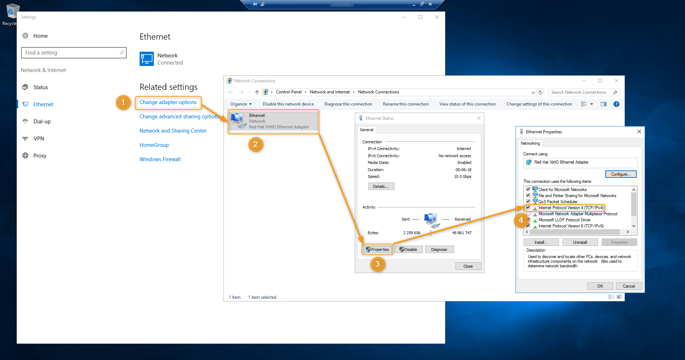

> [!primary]
> Esta tradução foi automaticamente gerada pelo nosso parceiro SYSTRAN. Em certos casos, poderão ocorrer formulações imprecisas, como por exemplo nomes de botões ou detalhes técnicos. Recomendamos que consulte a versão inglesa ou francesa do manual, caso tenha alguma dúvida. Se nos quiser ajudar a melhorar esta tradução, clique em "Contribuir" nesta página.
>

**Última atualização: 29/10/2021**

## Objetivo

Por predefinição, o servidor DNS configurado nas instâncias Public Cloud será o da OVHcloud (213.186.33.99, por exemplo).<br>
Pode adicionar um servidor secundário ou substituir esta configuração pela sua. No entanto, os servidores DNS são configurados automaticamente por um servidor DHCP e não poderá modificar a configuração DNS editando o ficheiro `resolv.conf`.

**Este manual explica-lhe como alterar a configuração DHCP de uma instância para alterar os servidores DNS.**

> [!warning]
> A OVHcloud fornece-lhe serviços cuja configuração e gestão são da sua responsabilidade. Por conseguinte, é da sua responsabilidade garantir que estes serviços funcionam corretamente.
>
> Este manual fornece as instruções necessárias para realizar as operações mais habituais. No entanto, se encontrar dificuldades ou dúvidas relativamente à administração, utilização ou implementação de um serviço num servidor, recomendamos que recorra a um [prestador de serviços especializado](https://partner.ovhcloud.com/pt/directory/). Para mais informações, aceda à secção [Quer saber mais](#gofurther)?
>

## Requisitos

- Ter uma [instância Public Cloud](https://www.ovhcloud.com/pt/public-cloud/) na sua conta OVHcloud.
- Dispor de um acesso de administrador (root) à instância através de SSH ou RDP.
- Conhecimentos básicos de rede e administração.

## Instruções

Ligue-se à sua instância em SSH. Para mais informações, consulte o manual "[Aceder a uma instância Public Cloud](/pages/public_cloud/compute/public-cloud-first-steps#connect-to-instance)".

Passar para o utilizador root. Se necessário, consulte o nosso guia para [passar root e definir uma palavra-passe](/pages/public_cloud/compute/become_root_and_change_password).

### Debian / Ubuntu

Com a ajuda do editor de texto à sua escolha, edite o ficheiro `/etc/dhcp/dhclient.conf` para configurar os servidores DNS à sua escolha.

Pode aqui utilizar diferentes diretivas para adicionar os servidores DNS à sua escolha. Utilize a encomenda à sua escolha e substitua o IP1/IP2 pelos seus endereços IP.

- Para adicionar servidores DNS que substituam efetivamente o configurado de forma padrão, adicione esta linha:
  
```console
supersede domain-name-servers IP1, IP2;
```

- Para adicionar servidores DNS que serão preferidos ao configurado de forma padrão:
    
```console
prepend domain-name-servers IP1, IP2;
```

- Para adicionar servidores DNS que só serão utilizados se o configurado por predefinição estiver indisponível:
    
```console
append domain-name-servers IP1, IP2;
```

Registe as suas modificações no ficheiro de configuração e saia do editor.

Verifique que a configuração foi corretamente aplicada com o seguinte comando:

```bash
cat /etc/resolv.conf

domain openstacklocal
search openstacklocal
nameserver IP1
nameserver IP2
```

### CentOS/Fedora

Verifique a configuração atual com o comando `nmcli`:

```bash
nmcli
 
eth0: connected to System eth0
        "Red Hat Virtio"
        ethernet (virtio_net), FA:16:3E:B6:FB:89, hw, mtu 1500
        ip4 default
        inet4 51.77.205.51/32
        route4 0.0.0.0/0
        route4 51.77.205.51/32
        route4 51.77.204.1/32
        inet6 fe80::f816:3eff:feb6:fb89/64
        route6 ff00::/8
        route6 fe80::/64
 
lo: non-managed
        "lo"
        loopback (unknown), 00:00:00:00:00:00, sw, mtu 65536
 
DNS configuration:
        servers: 127.0.0.1 213.186.33.99
        interface: eth0
```

Obtenha o nome da sua interface pública:

```bash
nmcli connection show
 
NAME         UUID                                  TYPE      DEVICE
System eth0  5fb06bd0-0bb0-7ffb-45f1-d6edd65f3e03  ethernet  eth0
```

Desative a modificação automática dos DNS e adicione os endereços IP (substitua o IP1/IP2) dos servidores DNS que pretende configurar. (Substitua `System eth0` pelo valor real que aparecia na posição anterior).

```bash
nmcli con mod "System eth0" ipv4.ignore-auto-dns yes
nmcli con mod "System eth0" ipv4.dns "IP1 IP2"
```

Aplicar a configuração (Substitua `System eth0` pelo valor real anteriormente recuperado).

```bash
nmcli con down "System eth0" && nmcli con up "System eth0"
```

Verifique que a configuração é bem aplicada:

```bash
nmcli | grep -E 'DNS|server|interface'
 
DNS configuration:
        servers: IP1 IP2
        interface: eth0
```

### Windows

Ligue-se à instância através de uma sessão de ambiente de trabalho remoto ou com a consola VNC. Para mais informações, consulte o guia "[Aceder a uma instância Public Cloud](/pages/public_cloud/compute/public-cloud-first-steps#connect-to-instance)".

Abra os `Parâmetros de rede`{.action}.

{.thumbnail}

Através do painel de configuração, aceda à configuração IPv4 da sua placa de rede pública.

{.thumbnail}

Adicione os servidores que deseja utilizar nos `Parâmetros avançados`{.action}.

{.thumbnail}

> [!primary]
>
Num PowerShell, o comando `nslookup` permite verificar qual o servidor DNS utilizado por predefinição.
>

## Quer saber mais? <a name="gofurther"></a>

[Criar uma primeira instância Public Cloud e ligar-se a ela](/pages/public_cloud/compute/public-cloud-first-steps)

[Tornar-se o utilizador root e selecionar uma palavra-passe](/pages/public_cloud/compute/become_root_and_change_password)

[Modificar o hostname de uma instância Public Cloud](/pages/public_cloud/compute/changing_the_hostname_of_an_instance)

Junte-se à nossa comunidade de utilizadores em <https://community.ovh.com/en/>.