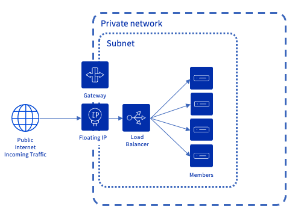
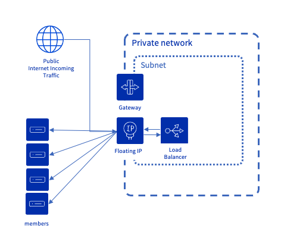

## Objective

The Public Cloud Load Balancer (based on Octavia OpenStack project) provides a lot of features and its configuration can be complex. The goal of this page is to explain the different configuration concepts that are powering the Load Balancer so that you have a high level understanding of all the features and the associated configuration items.

## Load Balancer Configuration concepts

Here are 2 drawings of 2 configurations : a simple one that contains the minimum number of concepts to configure a Load Balancer and a more complex one that uses them all. The following chapters provide a definition of each concept used in those configurations.

### Listener

The listener specifies a listening endpoint where the incoming traffic is received. Its mains attributes are the protocol and the port, for instance `HTTPS` and `443`. Note that you can have multiple listeners on one Load Balancer.

The following protocols are available for incoming traffic: `HTTP`, `HTTPS`, `TCP`, `UDP`, `SCTP`.

A specific protocol is `PROMETHEUS`, it enables configuring a prometheus endpoint and does not handle traffic itself. Find more information about this configuration on [this page](/pages/public_cloud/public_cloud_network_services/technical-resources-02-octavia-monitoring-prometheus).

### Pool

A pool specifies a group of members to which the listener forwards client requests. A pool is associated to one listener. For complex configuration using L7 Policies, a listener can be associated to multiple pools.
The main pool attributes are the load balancing algorithm (e.g. `Round Robin`) and the protocol that is used to query the members, e.g. `HTTPS`.

The following protocols are available: `HTTP`, `HTTPS`, `PROXY`, `PROXYV2`, `SCTP`, `TCP`, or `UDP`.

You can find more information on proxy protocol [here](https://www.haproxy.org/download/1.8/doc/proxy-protocol.txt).

The following table provides the compatibility matrix between the listener protocol and the pool protocol :

| Listener Pool | HTTP | HTTPS | SCTP | TCP | TERMINATED_HTTPS | UDP |
|-------------|-------|--------|-------|------|-------------------|------|
| HTTP        | Y  | N   | N  | Y | Y              | N |
| HTTPS       | N  | Y   | N  | Y | N              | N |
| PROXY       | Y  | Y   | N  | Y | Y              | N |
| PROXYV2     | Y  | Y   | N  | Y | Y              | N |
| SCTP        | N  | N   | Y  | N | N              | N |
| TCP         | N  | Y   | N  | Y | N              | N |
| UDP         | N  | N   | N  | N | N              | Y |

### Member

A member represents the configuration for a target back-end server to which the traffic is sent. Its main attributes are its IP (e.g. `192.168.1.10`) and a port (e.g. `443`). A member is part of a pool. 

### Health Monitor

The health monitor defines how the load balancer will check the health of the pool members. Its main attributes are the check method (e.g. `PING`) with various delays and timeouts. It is associated with exactly one pool.

The following Health Monitors are available : `HTTP`, `HTTPS`, `PING`, `SCTP`, `TCP`, `TLS-HELLO`, `UDP-CONNECT`.

The following table provides the compatibility matrix between the pool protocol and the Health Monitor type :

| Health Monitor Pool    | HTTP  | HTTPS | PING  | SCTP  | TCP   | TLS-HELLO | UDP-CONNECT   |
|------------------------   |------ |-------|------ |------ |-----  |-----------|-------------  |
| HTTP                      | Y     | Y     | Y     | N     | Y     | Y         | N             |
| HTTPS                     | Y     | Y     | Y     | N     | Y     | Y         | N             |
| PROXY                     | Y     | Y     | Y     | N     | Y     | Y         | N             |
| PROXYV2                   | Y     | Y     | Y     | N     | Y     | Y         | N             |
| SCTP                      | Y     | N     | N     | Y     | Y     | N         | Y             |
| TCP                       | Y     | Y     | Y     | N     | Y     | Y         | N             |
| UDP                       | Y     | N     | N     | Y     | Y     | N         | Y             |

### L7 rule

An L7 rule is a single logical expression that is used to match a condition present in a given HTTP or terminated HTTPS request. L7 rules typically match against a specific header or part of the URI. An L7 rule is associated with exactly one L7 policy.

For example, a L7 rule can evaluate if an URI begins with “/api”.

### L7 policy

An L7 policy associates one or many L7 rules to a listener. Its main attribute is the action that is performed if all the L7 rules evaluation returns `true`. For example, a user could specify an L7 policy so that any client request that matches the L7 rule “request URI starts with ‘/api’” should get routed to a specific “api” pool.

When a request is received on a listener, the L7 policies are evaluated in the order defined by the `position` attribute. If the evaluation returns `true` then the evaluation stops and the L7 policy action is executed. If all L7 policies returns `false` then the request is forwarded to the listener default pool. 

## Network considerations

The requirements for the Public Cloud Load Balancer vary, depending on incoming traffic type (private or public) and member IP addresses (private or public). The following chapters show the 3 different types of architecture the Load Balancer can address. The table below also shows the prerequisites on the network / additional components related to each architecture.

### Private to Private Load Balancer

{.thumbnail}

Incoming traffic originates from a private network and is routed to instances accessible from this private network. In this case, a Floating IP or Public Gateway are not needed.

### Public to Private Load Balancer

{.thumbnail}

Incoming traffic originates from the Internet and reaches a Floating IP that is associated to the Load Balancer. The instances behind the Load Balancer are located on a private network and have no public IP, which ensures they remain completely private and isolated from the Internet.

### Public to Public Load Balancer

{.thumbnail}

Incoming traffic originates from the Internet and reaches a Floating IP that is associated to the Load Balancer. The instances to which the Load Balancer routes traffic are accessible with a public IP. Hence, the Load Balancer uses the Floating IP with an egress to reach these instances.

### Network prerequisites 

| Architecture Type | Private network & subnet | Gateway IP defined in subnet attributes | Number of 'free' IPs in subnet | Gateway & Floating IP component \* |
|---|---|---|---|---|
|Private to Private | Required | Not required | 3 ([src](/pages/public_cloud/public_cloud_network_services/known-limits)) | Not required |
|Public to Private  | Required | Required | 5 ([src](/pages/public_cloud/public_cloud_network_services/known-limits)) | Required |
|Public to Public  | Required | Required | 5 ([src](/pages/public_cloud/public_cloud_network_services/known-limits)) | Required |

\*: according to the control interface you choose, either those components will be created for you (OVHcloud Control Panel) or you will have to specifically create them (OpenStack CLI, Terraform or GUI).

## Operating and Provisioning status 

Two statuses are used for all the Load Balancer concepts. The operating status describes how the component is operating whereas the provisioning status describes the lifecycle state. The provisioning status is inherited from the components that are "contained" by the father component. For instance if a member is updated, its provisioning status will change as well as the provisioning status of the pool, the listener and the load balancer.
As such in the description below, when the wording "component" is used, it means the component and all its contained "components".

### Provisioning status

- `ACTIVE`: The component was provisioned successfully.
- `DELETED`: The component has been successfully deleted.
- `ERROR`: The provisioning of the component failed, please contact support.
- `PENDING_CREATE`: The component is being created.
- `PENDING_UPDATE`: The component is being updated.
- `PENDING_DELETE`: The component is being deleted.

### Operating status

- `ONLINE`: The component is operating normally, e.g. all pool members are healthy.
- `DRAINING`: Applicable to a member of a UDP pool: the member is not accepting new connections, this happens because its `weight` has been set to `0`.
- `OFFLINE`: The status after a disable action or setting `admin_state_up` to `false` is done on a component (listener or load balancer). This status is also used during the component creation. 
- `DEGRADED`: Applicable to pool & load balancer only. One or more of the contained components are in ERROR. For instance, if a member is in `ERROR` then the pool and the load balancer are in `DEGRADED` as well.
- `ERROR`: The component has failed. For instance, the member is considered as failing if its health monitoring fails. A pool is considered as failed if all its members are in `ERROR`.
- `NO_MONITOR`: When no health monitor is configured for this pool, the member and the pool will have a `NO_MONITOR` status. This has no impact on the listener or the load balancer operating status.

## Go Further

- An exhaustive technical documentation on [OpenStack project page](https://docs.openstack.org/octavia/latest/).
- Configure your first load balancer with this [guide](/pages/public_cloud/public_cloud_network_services/getting-started-01-create-lb-service).

If you need training or technical assistance to implement our solutions, contact your sales representative or click on [this link](https://www.ovhcloud.com/en-au/professional-services/) to get a quote and ask our Professional Services experts for assisting you on your specific use case of your project.

Join our community of users on <https://community.ovh.com/en/>.
