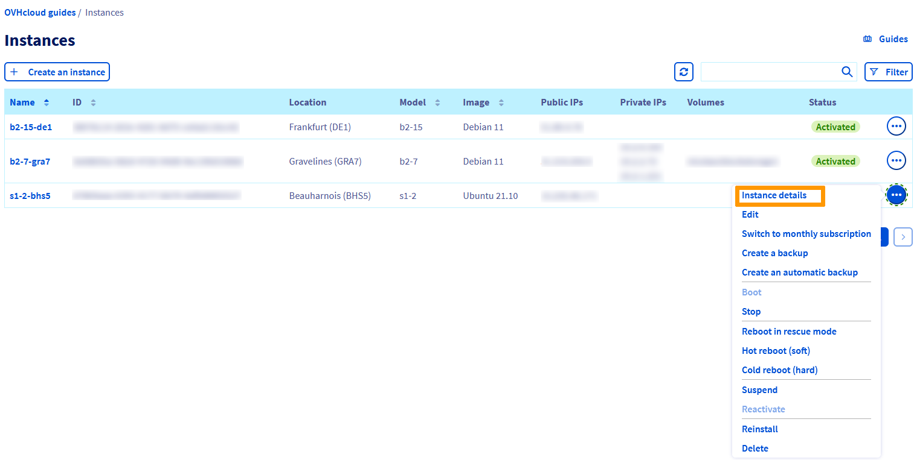
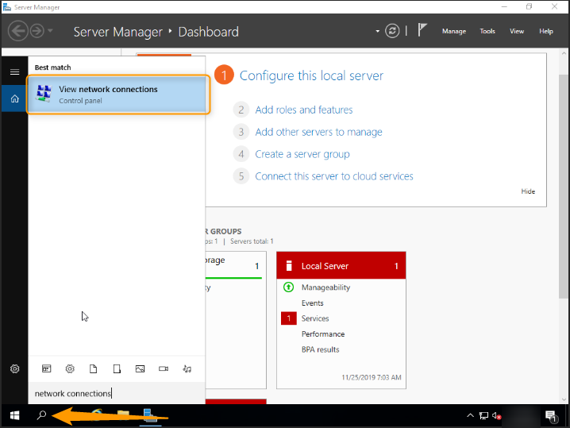

## Objective

Internet Protocol version 6 (IPv6) is the latest version of Internet Protocol (IP). It is designed to resolve the long-anticipated exhaustion of IPv4 addresses, by using addresses made up of 128-bits rather than the standard 32-bits of IPv4.

Each Public Cloud instance is delivered with an IPv4 address and an IPv6 address.

By default, only the IPv4 address is configured.

**This guide will show you how to configure an IPv6 address on a Public Cloud instance.**

> [!primary]
> 
> Floating IP and Gateway currently do not support IPv6. You can only use IPv6 with instances in [Public Mode](/pages/platform/network-services/concepts-01-public-cloud-networking-concepts#publicmode).
>

## Requirements

- A Public Cloud instance (any model)
- Administrative access (root) via SSH or remote desktop (Windows) to your server
- A basic understanding of networking
- Access to the [OVHcloud Control Panel](https://www.ovh.com/auth/?action=gotomanager&from=https://www.ovh.co.uk/&ovhSubsidiary=GB)

## Instructions

> [!warning]
>
> Please note that on recent versions of Linux operating systems, the IPv6 address is configured by default on Public Cloud instances. Be sure to check your OS configuration file before making any changes.
>

### Glossary

Here is a short glossary of the terms used in this tutorial:

|Glossary|Description|
|---|---|
|YOUR_IPV6|The IPv6 address assigned to your service.|
|IPV6_PREFIX|The prefix of your IPv6 block (e.g. 2607:5300:60:62ac::/128 -> netmask = 128)|
|IPV6_GATEWAY|The gateway of your IPv6 block.|

### Retrieve your network information.

Log in to the OVHcloud Control Panel and open your `Public Cloud`{.action} project. Then click on `Instances`{.action} in the left-hand menu. 

Click on `...`{.action} next to the corresponding instance and click on `Instance details`{.action}.

{.thumbnail}

All the information you need is in the **Networks** section.

{.thumbnail}

### Examples of persistent configuration.

> [!primary]
> **Examples**
> 
>The information below is provided as an example.
>
>Since you are the admin of your services, you will need to adapt the information to match your distribution or operating system.
>

> [!warning]
>
> Before modifying a configuration file always create a backup of the original.
> 

<br>First of all, connect to your instance via SSH.

#### On Debian

If we assume that your interface is eth0, the configuration should look like this:

File to edit (with su privileges): `/etc/network/interfaces`

```console
iface eth0 inet6 static
address YOUR_IPV6
netmask IPV6_PREFIX
post-up /sbin/ip -6 route add IPV6_GATEWAY dev eth0
post-up /sbin/ip -6 route add default via IPV6_GATEWAY dev eth0
pre-down /sbin/ip -6 route del default via IPV6_GATEWAY dev eth0
pre-down /sbin/ip -6 route del IPV6_GATEWAY dev eth0
```

Here is a concrete example:

```console
iface eth0 inet6 static
address 2001:41d0:xxx:xxxx::999
netmask 128
post-up /sbin/ip -6 route add 2001:41d0:xxx:xxxx::111 dev eth0
post-up /sbin/ip -6 route add default via 2001:41d0:xxx:xxxx::111 dev eth0
pre-down /sbin/ip -6 route del default via 2001:41d0:xxx:xxxx::111 dev eth0
pre-down /sbin/ip -6 route del 2001:41d0:xxx:xxxx::111 dev eth0
```

#### On Ubuntu

The network configuration files are located in the `/etc/netplan/` directory. First, create a copy of the IPv6 configuration file:

```bash
cd /etc/netplan
cp 50-cloud-init.yaml 51-cloud-init-ipv6.yaml
```

This allows you to separate the IPv6 configuration and easily revert the changes in case of an error.

If we assume that your interface is eth0, the configuration should look like this:

File to edit (with su privileges): `/etc/netplan/51-cloud-init-ipv6.yaml`

```yaml
network:
    ethernets:
        eth0:
            dhcp6: false
            match:
                macaddress: fb:17:3r:39:56:75
            set-name: eth0
            addresses:
              - "YOUR_IPV6/IPv6_PREFIX"
            gateway6: "IPv6_GATEWAY"
            routes:
              - to: "IPv6_GATEWAY"
                scope: link
    version: 2
```

> [!warning]
>
> It is important to respect the alignment of each element in this file as represented in the example above. Do not use the tab key to create your spacing. Only the space key is needed. 
>

You can test your configuration using this command:

```bash
netplan try
```

If it is correct, apply it using the following command:

```bash
netplan apply
```

#### On RedHat / CentOS

If we assume that your interface is eth0, the configuration should look like this:

File to edit (with sudo privileges): `/etc/sysconfig/network-scripts/ifcfg-eth0`

```console
IPV6INIT=yes
IPV6ADDR=YOUR_IPV6/IPV6_PREFIX
IPV6_DEFAULTGW=IPV6_GATEWAY
```

Here is a concrete example:

```console
IPV6INIT=yes
IPV6ADDR=2001:41d0:xxx:xxxx::999
IPV6_DEFAULTGW=2001:41d0:xxx:xxxx::111
```

#### On Windows

Go to `Network Connections`{.action} in Windows.

{.thumbnail}

Then go to `Properties`{.action} for your network card by right-clicking on it.

{.thumbnail}

Next, click on `IPv6`{.action}, and `Properties`{.action}.

{.thumbnail}

Lastly, enter your IPv6 details.

{.thumbnail}

### Diagnostic

Have you configured your IPv6, but found that nothing works? 

There is a simple operation to determine whether the error is in your configuration, or on the OVHcloud network.

Firstly, [put your instance into rescue-pro mode](/pages/public_cloud/compute/put_an_instance_in_rescue_mode).

Next, use the template commands below to configure your IP non-persistently, replacing ‘YOUR_IPV6’, ‘IPV6_PREFIX’, etc. with your own details:

```bash
ip addr add YOUR_IPV6/IPV6_PREFIX dev eth0
ip -6 route add IPV6_GATEWAY dev eth0
ip -6 route add default via IPV6_GATEWAY dev eth0
```

Test your network again via a ping6, for example:

```bash
ping6 ipv6.google.com
```
If your instance responds, it is likely that there is an error in one of the steps taken for your initial configuration.

In any case, please feel free to reach out to our support team with the elements tested above, and we can perform an analysis on our end.

## Go further

If you need training or technical assistance to implement our solutions, contact your sales representative or click on [this link](https://www.ovhcloud.com/en-gb/professional-services/) to get a quote and ask our Professional Services experts for assisting you on your specific use case of your project.

Join our community of users on <https://community.ovh.com/en/>.
