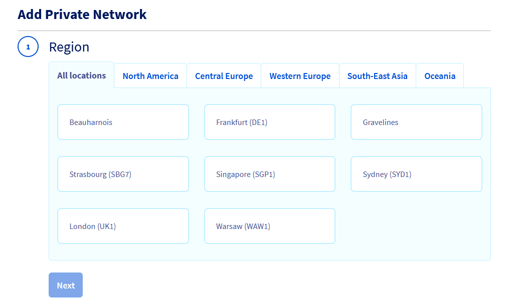
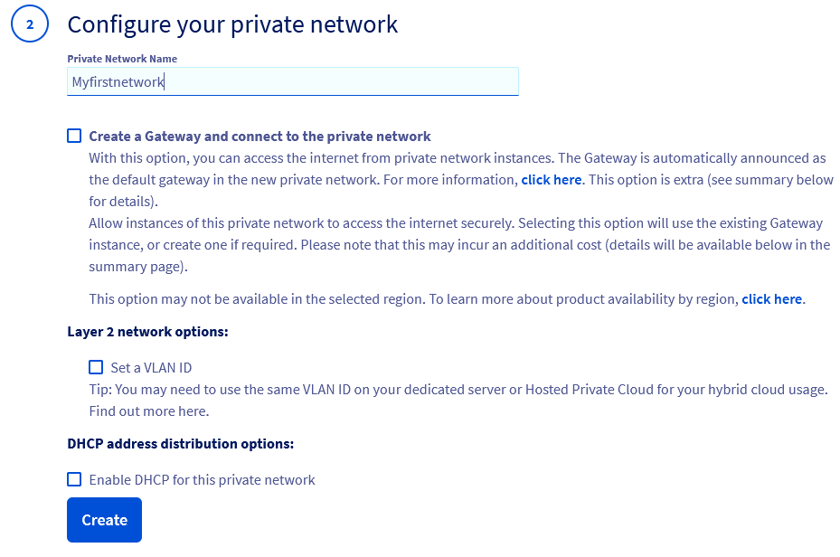
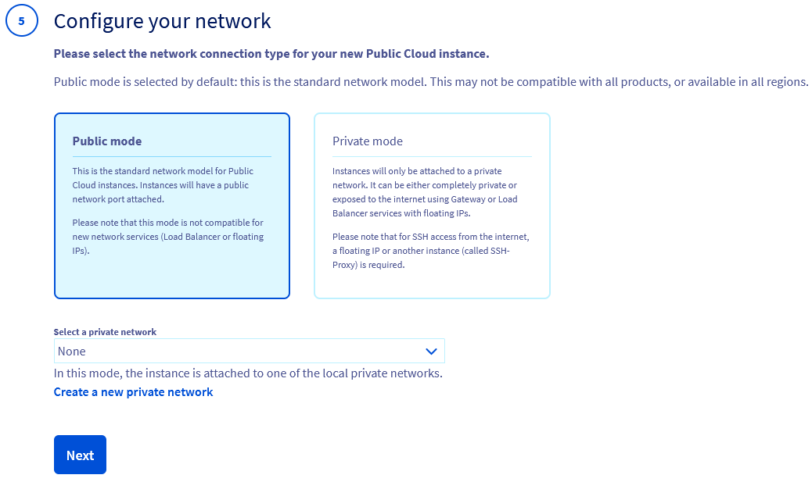
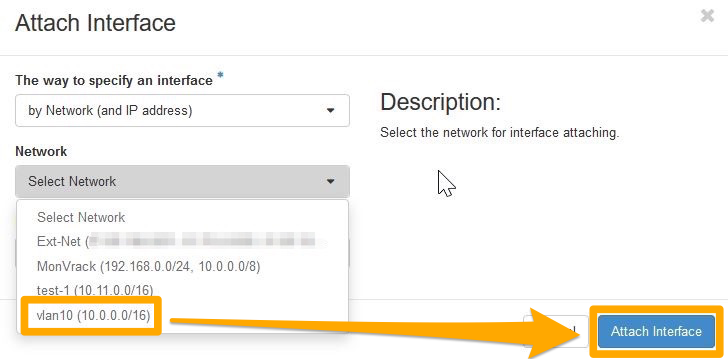

**Dernière mise à jour le 03/03/2023**

## Objectif

Le [vRack](https://www.ovh.com/ca/fr/solutions/vrack/) est un réseau privé qui vous permet de configurer l’adressage entre plusieurs serveurs dédiés OVHcloud. Mais il vous permet également d’ajouter des [instances Public Cloud](https://www.ovhcloud.com/fr-ca/public-cloud/) à votre réseau privé afin de créer une infrastructure de ressources physiques et virtuelles.

**Ce guide a pour objectif de vous accompagner dans la configuration de vos instances Public Cloud au sein de votre vRack.**

## Prérequis

- Posséder un [projet Public Cloud](/pages/public_cloud/compute/create_a_public_cloud_project)
- Être connecté à votre [espace client OVHcloud](https://ca.ovh.com/auth/?action=gotomanager&from=https://www.ovh.com/ca/fr/&ovhSubsidiary=qc){.external}
- Avoir [créé un utilisateur OpenStack](/pages/public_cloud/compute/create_and_delete_a_user) (facultatif)
- Connaissances réseaux élémentaires

## Présentation des interfaces

Que ce soit pour créer votre vRack ou ajouter une instance au sein de ce réseau, vous pouvez être amenés à utiliser l'espace client OVHcloud, les APIv6 OVHcloud, les API OpenStack, l'interface Horizon ou Terraform.

Selon votre profil technique et vos besoins, vous serez amenés à devoir choisir quelle interface ou méthode utiliser. Ainsi, pour chaque action, nous vous proposerons les différentes démarches envisageables.

**Voici un descriptif rapide des actions possibles suivant la méthode/interface choisie :**

### Espace client OVHcloud

[L'espace client OVHcloud](https://ca.ovh.com/auth/?action=gotomanager&from=https://www.ovh.com/ca/fr/&ovhSubsidiary=qc) est une interface entièrement et uniquement visuelle, ce qui en fait une interface idéale si vous n'avez qu'un seul VLAN à gérer. Vous ne pourrez personnaliser la plage d'IP privée qui sera uniquement en 10.x.x.x/16.

Les VLAN seront déployés par défaut sur toutes les zones. Vous aurez juste la possibilité d'activer ou non les passerelles.

Vous pourrez également gérer la facturation de vos services au travers de votre espace client OVHcloud.

### Interface Horizon

Interface visuelle indépendante d'OVHcloud, [Horizon](https://horizon.cloud.ovh.net/auth/login/){.external} est l'implémentation d’origine du tableau de bord d'OpenStack, qui fournit une interface utilisateur web aux services OpenStack, notamment Nova, Swift, Keystone, etc...

Cette interface complète et technique vous permet de gérer la quasi totalité des actions OpenStack. Ce sera une des interfaces nécessaires si vous souhaitez gérer plus de deux VLAN, ajouter des interfaces réseau privées à vos instances, gérer des images personnalisées, etc...

Consultez le guide [Accéder à l'interface Horizon](/pages/public_cloud/compute/introducing_horizon) pour vous familiariser à Horizon.

> [!primary]
> Horizon fonctionnant par zone, pensez bien à choisir votre zone géographique de travail tout en haut à gauche de votre interface (GRA5, SBG3, BHS1, etc...)
>

### APIv6 OVHcloud

Chaque action que vous effectuez dans l'espace client OVHcloud fait appel aux [APIv6 OVHcloud](https://ca.api.ovh.com/). 
Vous pouvez même aller plus loin dans les API que dans votre espace client.

L'interface est moins visuelle que l'espace client OVHcloud mais vous permettra d'effectuer un grand nombre d'actions. Vous pourrez par ce biais gérer et personnaliser vos VLAN, ajouter des interfaces à vos instances ou encore créer des serveurs hautement personnalisés.

Il vous sera parfois nécessaire de récupérer plusieurs informations avant l'utilisation d'une API spécifique.

Vous pouvez simplement accéder aux API depuis [notre page web](https://ca.api.ovh.com/), mais aussi créer vos scripts PHP ou Python pour y faire appel.

Ainsi, il vous sera possible de librement automatiser les tâches de base au moyen de scripts, optimiser vos propres fonctions, etc...

Consultez le guide [Premiers pas avec les API OVHcloud](/pages/manage_and_operate/api/first-steps) pour vous familiariser avec l'utilisation des APIv6 OVHcloud.

### API OpenStack

Il est possible d’administrer les services Public Cloud à l’aide de lignes de commandes Linux ou Windows, après le téléchargement et l’installation des outils OpenStack.

Cette méthode demande de bonnes connaissances Linux ou Windows pour en profiter, mais elle permet de profiter de toute la puissance d'OpenStack par ce biais.

Suivant la couche que vous souhaitez gérer, vous devrez utilisez le client Nova (Compute), Neutron (réseau), Glance (Image) ou encore Swift (Object Storage). Le dernier né de la famille, le client OpenStack, vous permet de gérer directement la quasi intégralité des couches OpenStack.

Grâce à l’API OpenStack, vous pouvez aussi facilement automatiser cette gestion au travers de vos scripts.

Afin de vous familariser avec l'API OpenStack, consultez tout d'abord les guides suivants :

- [Préparer l’environnement pour utiliser l’API OpenStack](/pages/public_cloud/compute/prepare_the_environment_for_using_the_openstack_api)
- [Charger les variables d’environnement OpenStack](/pages/public_cloud/compute/loading_openstack_environment_variables)

Vous pourrez alors, suivant votre besoin, utiliser les API dédiées à OpenStack :

- Nova (compute)
- Glance (image)
- Cinder (image)
- Neutron (réseau)

> [!primary]
>Dans certains cas, il sera plus simple d'utiliser les API OpenStack et dans d'autres, les API Nova, Neutron, etc...
>
> De même, certaines fonctionnalités peuvent être absentes de l'API OpenStack selon la version de votre client et de votre système d'exploitation.
> Dans le cadre de ce guide, le choix a été fait de vous proposer les alternatives les plus simples et les plus intuitives.
> Vous pouvez consulter à tout moment la [documentation officielle d'OpenStack](https://docs.openstack.org/fr/){.external} si vous souhaitez aller plus loin dans leur utilisation.
>

### Terraform

Terraform permet aussi de gérer les infrastructures d’OVHcloud.

Pour cela, vous devez choisir le bon fournisseur et la bonne ressource Terraform. Retrouvez plus d’informations dans notre [guide d’utilisation de Terraform](/pages/manage_and_operate/terraform/terraform-at-ovhcloud).

## En pratique

### Étape 1 : Activer et gérer un vRack <a name="activation"></a>

Avant toute chose, vous devez créer un vRack.

Ce produit est gratuit et la mise à disposition ne prend que quelques minutes. Cependant, il nécessite la création et la validation d'un bon de commande.

Une fois le vRack actif, vous retrouverez ce service sous l’appellation « pn-xxxxxx ».

#### Depuis l'espace client OVHcloud

Connectez-vous à votre [espace client OVHcloud](https://ca.ovh.com/auth/?action=gotomanager&from=https://www.ovh.com/ca/fr/&ovhSubsidiary=qc){.external}, accédez à la section `Public Cloud`{.action} et sélectionnez ensuite le projet Public Cloud de votre choix en haut à gauche.

{.thumbnail}

Cliquez alors sur `Private network`{.action} dans le menu latéral de gauche. 

{.thumbnail}

Cliquez sur le bouton `Pour commencer, créez un vRack`{.action}. Vous devrez alors choisir de créer un nouveau vRack ou d'utiliser un vRack existant. Dans notre exemple, nous allons créer un nouveau vRack. Une fois votre choix effectué, cliquez sur `Créer`{.action}.

{.thumbnail}

Pour continuer la configuration du vRack depuis l'espace client OVHcloud, poursuivez la lecture de ce guide à partir de [Créer un VLAN dans le vRack depuis l'espace client OVHcloud](./#creer-un-vlan-depuis-lespace-client-ovhcloud).

#### Depuis les APIv6 OVHcloud

Pour activer et gérer un vRack depuis les APIv6 OVHcloud, cliquez [ici](/pages/public_cloud/public_cloud_network_services/getting-started-08-creating-vrack-with-api#etape-1-activer-et-gerer-un-vrack) pour consulter le guide spécifique à cette méthode.

### Étape 2 : Créer un réseau privé dans le vRack

Il est nécessaire de créer un réseau privé afin que les instances reliées au vRack puissent communiquer entre elles.

Sur l'offre Public Cloud, vous pouvez créer jusqu'à 4 000 VLAN au sein d’un seul vRack. Cela signifie donc que vous pouvez utiliser chaque adresse IP privée jusqu’à 4 000 fois.
Ainsi, par exemple, l'IP 192.168.0.10 du VLAN 2 est différente de l'IP 192.168.0.10 du VLAN 42.

Cela peut vous être utile afin de segmenter votre vRack entre plusieurs réseaux virtuels.

Depuis l'espace client OVHcloud, vous pourrez affecter le VLAN de votre choix, mais vous ne pourrez pas personnaliser la plage IP. Le vRack sera actif dans toutes les zones.

Depuis les APIv6 OVHcloud, vous pourrez personnaliser l'ensemble des paramètres : plage IP (10.0.0.0/16 par exemple), zone de déploiement, DHCP, Gateway, etc...

> [!primary]
> Sur les serveurs dédiés, par défaut, vous êtes sur le VLAN 0. Le fonctionnement de l’infrastructure OpenStack fait que vous devrez spécifier le numéro de votre VLAN directement au niveau de l'infrastructure.
>
> Contrairement aux serveurs dédiés, il n’est pas nécessaire de « tagguer » le VLAN directement sur une instance Public Cloud. 
>
> Pour plus d'informations sur la gestion des VLAN du vRack des serveurs dédiés, vous pouvez consulter ce guide : [Créer plusieurs VLAN dans le vRack](/pages/bare_metal_cloud/dedicated_servers/creating-multiple-vlans-in-a-vrack).

> [!warning]
> Le vRack étant une infrastructure gérée au niveau d'OVHcloud, vous ne pourrez l'administrer qu'au travers de l'espace client OVHcloud et des APIv6 OVHcloud.
>
>OpenStack n'étant pas située au même niveau de l'infrastructure, vous ne pourrez pas personnaliser les VLAN au travers de l'interface Horizon ou des API OpenStack.
>

#### Créer un réseau privé depuis l'espace client OVHcloud

Une fois le vRack créé, cliquez à nouveau sur `Private network`{.action} dans le menu latéral de gauche. 

{.thumbnail}

Cliquez à présent sur `Créer un réseau privé`{.action}. La page suivante vous permettra de personnaliser plusieurs paramètres.

À l'étape 1, sélectionnez la région dans laquelle vous souhaitez créer le réseau privé.

{.thumbnail}

À l'étape suivante, un certain nombre d'options vous sont présentées :

{.thumbnail}

**Créez une Gateway et connectez-vous au réseau privé**

Sélectionnez cette option si vous avez l'intention de créer des instances avec un réseau privé uniquement. Pour plus d’informations, nous vous invitons à consulter les guides suivants : [Créer un réseau privé avec une Gateway](/pages/public_cloud/public_cloud_network_services/getting-started-02-create-private-network-gateway) et [Créer une première instance Public Cloud et s’y connecter](/pages/public_cloud/compute/public-cloud-first-steps#etape-3-creer-une-instance).

> [!warning]
> Si l'option est grisée, cela signifie qu'elle est incompatible avec la région sélectionnée. Pour plus d’informations, veuillez vous référer à notre page sur la [disponibilité des produits Public Cloud pour chaque région](https://www.ovhcloud.com/fr-ca/public-cloud/regions-availability/).
>

**Options réseau du layer 2**

Si vous cochez la case `Définir un VLAN`, vous devrez choisir un numéro de VLAN allant de 2 à 4000.

Si vous ne cochez pas cette case, le système attribuera un numéro de VLAN aléatoire.

Si vous souhaitez définir le numéro du VLAN à 0, vous devez passer par l'[API OVHcloud](#vlansetup).

Veuillez noter que si vous avez un réseau privé existant avec un VLAN ID 0, cette option sera cochée par défaut et grisée.

Dans le cas où vous devez faire communiquer des serveurs dédiés OVHcloud avec du VLAN taggué, consultez le guide suivant : [Créer plusieurs VLAN dans le vRack](/pages/bare_metal_cloud/dedicated_servers/creating-multiple-vlans-in-a-vrack).

**Options de distribution des adresses DHCP**

La plage DHCP par défaut est en 10.0.0.0/16. Pour modifier cette plage IP, vous devrez obligatoirement passer par les APIv6 OVHcloud.

Une fois vos choix faits, cliquez sur `Créer`{.action} pour lancer le processus.

> [!primary]
> La création du réseau privé peut prendre plusieurs minutes.
>

#### Créer un réseau privé depuis les APIv6 OVHcloud <a name="vlansetup"></a>

Pour créer un réseau privé depuis les APIv6 OVHcloud, cliquez [ici](/pages/public_cloud/public_cloud_network_services/getting-started-08-creating-vrack-with-api#etape-3-creer-un-vlan-dans-le-vrack) pour consulter le guide spécifique à cette méthode.

#### Créer un réseau privé via le CLI OpenStack

Afin de créer le même réseau privé, il faut créer 2 objets OpenStack : network et subnet.

Dans l'exemple suivant, nous spécifions le `VLAN_ID` auquel nous voulons que le réseau fasse partie via `--provider-network-type` et `--provider-segment`.

Vous pouvez supprimer ces paramètres. Dans ce cas, un `VLAN_ID` disponible sera utilisé.

```bash 
openstack network create --provider-network-type vrack --provider-segment 42 OS_CLI_private_network
openstack subnet create --dhcp --network OS_CLI_private_network OS_CLI_subnet --subnet-range 10.0.0.0/16
```

#### Créer un réseau privé via Terraform

Dans Terraform, il faut utiliser le provider openstack. Vous pouvez télécharger un exemple de script terraform complet dans [ce dépôt](https://github.com/yomovh/tf-at-ovhcloud/tree/main/private_network).

La partie spécifique à OVHcloud pour l'intégration vRack est le paramètre `value_specs`.

```hcl
resource "openstack_networking_network_v2" "tf_network" {
  name = "tf_network"
  admin_state_up = "true"
  value_specs = {
    "provider:network_type"    = "vrack"
    "provider:segmentation_id" = var.vlan_id
  }
}
resource "openstack_networking_subnet_v2" "tf_subnet"{
  name       = "tf_subnet"
  network_id = openstack_networking_network_v2.tf_network.id
  cidr       = "10.0.0.0/16"
  enable_dhcp       = true
}
```

### Étape 3 : Intégrer une instance dans le vRack

Deux situations peuvent se présenter à vous :

- L'instance n'existe pas encore.
- L'instance existe déjà et vous devez l'ajouter au vRack.

#### Cas d'une nouvelle instance

##### **Depuis l'espace client OVHcloud**

Consultez le guide [Créer une instance depuis l’espace client](/pages/public_cloud/compute/public-cloud-first-steps#create-instance). Lors de la création d'une instance, vous pouvez choisir, à l'étape 5, un mode réseau, puis un réseau privé dans lequel intégrer votre instance.

{.thumbnail}

> [!warning]
> Lors de la création d'une nouvelle instance, vous ne pourrez raccorder votre instance qu'à un seul vRack depuis l'espace client OVHcloud.
> Pour ajouter plusieurs interfaces différentes, vous devrez passer par les API OpenStack ou Horizon.
>

##### **Depuis les APIv6 OVHcloud**

Cliquez [ici](/pages/public_cloud/public_cloud_network_services/getting-started-08-creating-vrack-with-api#etape-4-integrer-une-instance-dans-le-vrack) pour consulter le guide spécifique à cette méthode.

##### **Depuis les API OpenStack**

Pour utiliser les API OpenStack, si ce n'est déjà fait, pensez à préparer votre environnement de travail comme indiqué dans la [première partie de ce guide](./#api-openstack).

Ceci fait, afin de créer une instance directement dans le vRack, vous devrez procéder comme ceci.

###### Récupération des informations nécessaires

Identification des réseaux publics et privés :

```bash
openstack network list
 
+--------------------------------------+------------+-------------------------------------+
| ID                                   | Name       | Subnets                             |
+--------------------------------------+------------+-------------------------------------+
| 12345678-90ab-cdef-xxxx-xxxxxxxxxxxx | MonVLAN-42 | xxxxxxxx-yyyy-xxxx-yyyy-xxxxxxxxxxxx|
| 34567890-12ab-cdef-xxxx-xxxxxxxxxxxx | Ext-Net    | zzzzzzzz-yyyy-xxxx-yyyy-xxxxxxxxxxxx|
| 67890123-4abc-ef12-xxxx-xxxxxxxxxxxx | MonVLAN_0  | yyyyyyyy-xxxx-xxxx-yyyy-xxxxxxxxxxxx|
+--------------------------------------+------------+-------------------------------------+
```

ou

```bash
nova net-list
 
+--------------------------------------+------------+------+
| ID                                   | Label      | CIDR |
+--------------------------------------+------------+------+
| 12345678-90ab-cdef-xxxx-xxxxxxxxxxxx | MonVLAN-42 | None |
| 34567890-12ab-cdef-xxxx-xxxxxxxxxxxx | Ext-Net    | None |
| 67890123-4abc-ef12-xxxx-xxxxxxxxxxxx | MonVLAN_0  | None |
+--------------------------------------+------------+------+
```
> [!primary]
> Vous devrez noter les ID des réseaux vous intéressant :
><br> - Ext-Net pour avoir une IP publique
><br> - Celui du ou des VLAN nécessaires à votre configuration
>

Pensez également à noter les informations suivantes, comme indiqueé dans le [guide d'utilisation de l'API Nova](/pages/public_cloud/compute/starting_with_nova) :

- ID ou nom de la clé SSH OpenStack
- ID du type d'instance (flavor)
- ID de l'image souhaitée (Système d'exploitation, snapshot, etc...)

###### Déploiement de l'instance

Avec les éléments récupérés précédemment, il est possible de créer une instance en l'incluant directement dans le vRack :

```bash
nova boot --key-name SSHKEY --flavor [ID-flavor] --image [ID-Image] --nic net-id=[ID-Network 1] --nic net-id=[ID-Network 2] [nom de votre instance]

Ex :
nova boot --key-name ma-cle-ssh --flavor xxxxxx-xxxx-xxxx-xxxx-xxxxxxxxxxxx --image yyyy-yyyy-yyyy-yyyy-yyyyyyyyyyyy --nic net-id=[id_Ext-Net] --nic net-id=[id_VLAN] NomDeMonInstance

+--------------------------------------+------------------------------------------------------+
| Property                             | Value                                                |
+--------------------------------------+------------------------------------------------------+
| OS-DCF:diskConfig                    | MANUAL                                               |
| OS-EXT-AZ:availability_zone          |                                                      |
| OS-EXT-STS:power_state               | 0                                                    |
| OS-EXT-STS:task_state                | scheduling                                           |
| OS-EXT-STS:vm_state                  | building                                             |
| OS-SRV-USG:launched_at               | -                                                    |
| OS-SRV-USG:terminated_at             | -                                                    |
| accessIPv4                           |                                                      |
| accessIPv6                           |                                                      |
| adminPass                            | xxxxxxxxxxxx                                         |
| config_drive                         |                                                      |
| created                              | YYYY-MM-DDTHH:MM:SSZ                                 |
| flavor                               | [Flavor Type] (xxxxxx-xxxx-xxxx-xxxx-xxxxxxxxxxxx)   |
| hostId                               |                                                      |
| id                                   | xxxxxx-xxxx-xxxx-xxxx-xxxxxxxxxxxx                   |
| image                                | [Image Type] (xxxxxx-xxxx-xxxx-xxxx-xxxxxxxxxxxx)    |
| key_name                             | [Nom de la clé]                                      |
| metadata                             | {}                                                   |
| name                                 | [Nom de l'instance]                                  |
| os-extended-volumes:volumes_attached | []                                                   |
| progress                             | 0                                                    |
| security_groups                      | default                                              |
| status                               | BUILD                                                |
| tenant_id                            | zzzzzzzzzzzzzzzzzzzzzzzzzzzzzzzz                     |
| updated                              | YYYY-MM-DDTHH:MM:SSZ                                 |
| user_id                              | zzzzzzzzzzzzzzzzzzzzzzzzzzzzzzzz                     |
+--------------------------------------+------------------------------------------------------+
```
ou

```bash
openstack server create --key-name SSHKEY --flavor [ID-flavor] --image [ID-Image] --nic net-id=[ID-Network 1] --nic net-id=[ID-Network 2] [nom de votre instance]

Ex :
openstack server create --key-name ma-cle-ssh --flavor xxxxxx-xxxx-xxxx-xxxx-xxxxxxxxxxxx --image yyyy-yyyy-yyyy-yyyy-yyyyyyyyyyyy --nic net-id=[id_Ext-Net] --nic net-id=[id_VLAN] NomDeMonInstance

+--------------------------------------+------------------------------------------------------+
| Property                             | Value                                                |
+--------------------------------------+------------------------------------------------------+
| OS-DCF:diskConfig                    | MANUAL                                               |
| OS-EXT-AZ:availability_zone          |                                                      |
| OS-EXT-STS:power_state               | 0                                                    |
| OS-EXT-STS:task_state                | scheduling                                           |
| OS-EXT-STS:vm_state                  | building                                             |
| OS-SRV-USG:launched_at               | -                                                    |
| OS-SRV-USG:terminated_at             | -                                                    |
| accessIPv4                           |                                                      |
| accessIPv6                           |                                                      |
| adminPass                            | xxxxxxxxxxxx                                         |
| config_drive                         |                                                      |
| created                              | YYYY-MM-DDTHH:MM:SSZ                                 |
| flavor                               | [Flavor Type] (xxxxxx-xxxx-xxxx-xxxx-xxxxxxxxxxxx)   |
| hostId                               |                                                      |
| id                                   | xxxxxx-xxxx-xxxx-xxxx-xxxxxxxxxxxx                   |
| image                                | [Image Type] (xxxxxx-xxxx-xxxx-xxxx-xxxxxxxxxxxx)    |
| key_name                             | [Nom de la clé]                                      |
| metadata                             | {}                                                   |
| name                                 | [Nom de l'instance]                                  |
| os-extended-volumes:volumes_attached | []                                                   |
| progress                             | 0                                                    |
| security_groups                      | default                                              |
| status                               | BUILD                                                |
| tenant_id                            | zzzzzzzzzzzzzzzzzzzzzzzzzzzzzzzz                     |
| updated                              | YYYY-MM-DDTHH:MM:SSZ                                 |
| user_id                              | zzzzzzzzzzzzzzzzzzzzzzzzzzzzzzzz                     |
+--------------------------------------+------------------------------------------------------+
```

Vous avez la possibilité de définir l'adresse IP de l'instance de votre interface vRack au niveau d'OpenStack.

Pour cela, vous pouvez ajouter un simple argument dans la fonction « --nic » :

```
--nic net-id=[ID-Network],v4-fixed-ip=[IP_fixe_vRack]
```

Exemple :

`--nic net-id=[ID-vRack],v4-fixed-ip=192.168.0.42`

###### Vérification de l'instance

Après quelques instants on peut vérifier la liste des instances existantes afin de retrouver le serveur créé :

```bash
openstack server list
+--------------------------------------+---------------------+--------+--------------------------------------------------+--------------------+
| ID                                   |       Name          | Status | Networks                                         |     Image Name     |
+--------------------------------------+---------------------+--------+--------------------------------------------------+--------------------+
| xxxxxx-xxxx-xxxx-xxxx-xxxxxxxxxxxxxx | [Nom de l'instance] | ACTIVE | Ext-Net=[IP_V4], [IP_V6]; MonVrack=[IP_V4_vRack] | [Nom-de-l'instance]|
+--------------------------------------+---------------------+--------+--------------------------------------------------+--------------------+
```

```bash
nova list
+--------------------------------------+--------------------+--------+------------+-------------+--------------------------------------------------+
| ID                                   | Name               | Status | Task State | Power State | Networks                                         |
+--------------------------------------+--------------------+--------+------------+-------------+--------------------------------------------------+
| xxxxxx-xxxx-xxxx-xxxx-xxxxxxxxxxxx   | [Nom de l'instance]| ACTIVE | -          | Running     | Ext-Net=[IP_V4], [IP_V6]; MonVrack=[IP_V4_vRack] |
+--------------------------------------+--------------------+--------+------------+-------------+--------------------------------------------------+
```


#### Cas d'une instance déjà existante

L'espace client OVHcloud permet d'attacher une instance à un ou plusieurs réseaux privés mais n'offre pas de configuration avancée des interfaces réseaux. Si vous souhaitez personnaliser davantage celles-ci, il vous faudra les gérer soit depuis les APIv6 OVHcloud, soit via les API OpenStack ou via Horizon.

L'action consistera alors à simplement ajouter une nouvelle interface réseau à votre serveur, en plus de celle existante.

Ainsi, par exemple, si vous avez une interface publique eth0, vous aurez en plus une interface eth1.

> [!warning]
> La configuration de cette nouvelle interface est rarement automatique.
> Il vous faudra donc la configurer en DHCP ou IP Fixe selon votre infrastructure.
>


##### **Depuis l'espace client OVHcloud** 

Connectez-vous à votre [espace client OVHcloud](https://ca.ovh.com/auth/?action=gotomanager&from=https://www.ovh.com/ca/fr/&ovhSubsidiary=qc){.external}, accédez à la section `Public Cloud`{.action} et sélectionnez ensuite le projet Public Cloud concerné en haut à gauche.

Cliquez alors sur `Instances`{.action} dans le menu latéral de gauche. Cliquez ensuite sur le bouton `...`{.action} à droite de l'instance concernée puis sur `Détail de l'instance`{.action}.

{.thumbnail}

Le tableau de bord de votre instance vous est alors présenté. Cliquez sur le bouton `...`{.action} à droite de « Réseau(x) privé(s) » puis sur `Attacher un réseau`{.action}.

{.thumbnail}

Dans la pop-up qui apparaît, sélectionnez le ou les réseaux privés à attacher à votre instance puis cliquez sur  `Attacher`{.action}.

{.thumbnail}

##### **Gestion des interfaces réseaux depuis les APIv6 OVHcloud**

Cliquez [ici](/pages/public_cloud/public_cloud_network_services/getting-started-08-creating-vrack-with-api#cas-dune-instance-deja-existante) pour consulter le guide spécifique à cette méthode.

##### **Gestion des interfaces réseaux depuis OpenStack Horizon**

Connectez-vous à l'interface [Horizon](https://horizon.cloud.ovh.net/auth/login/){.external} en suivant la méthode indiquée dans la [première partie de ce guide](./#interface-horizon).

Connectez-vous bien sur votre zone de travail :

{.thumbnail}

Dirigez-vous ensuite dans `Compute`, puis `Instances` :

{.thumbnail}

###### Ajout d'une interface privée

Pour ajouter une interface, dans la colonne « Actions », cliquez sur la flèche permettant d'accéder aux actions possible sur l'instance. Cliquez alors sur `Attach Interface`{.action} :

{.thumbnail}

Sélectionnez votre interface et validez :

{.thumbnail}

> [!primary]
> Votre instance OVHcloud disposera donc d'une nouvelle interface réseau en plus de l'interface publique (Ext-net).
><br>Vous pourrez voir, dans le résumé de l'instance, l'adresse IP privée attribuée automatiquement à votre interface.
><br>À votre charge de l'utiliser en configurant votre interface via le DHCP ou en utilisant vos propres IP au travers d'une configuration en IP statique.
>

###### Suppression d'une interface privée

> [!warning]
> La suppression d'une interface est définitive.
>
>Dans le cas où vous supprimeriez l'interface « Ext-Net » (IP publique), cette adresse serait relâchée et remise en circulation. Vous ne pourriez donc pas vous la réattribuer.
><br>Cette action n'est à effectuer que si vous souhaitez isoler votre serveur dans le vRack (interface « Ext-Net ») ou la sortir d'un VLAN.
>

Pour supprimer une interface, dans la colonne « Actions », cliquez sur la flèche permettant d'accéder aux actions possible sur l'instance. Cliquez alors sur `Detach Interface`{.action} :

{.thumbnail}

Sélectionnez l'interface à supprimer et validez :

{.thumbnail}

##### **Gestion des interfaces réseaux depuis les API OpenStack**

Pour utiliser les API OpenStack, si ce n'est déjà fait, pensez à préparer votre environnement de travail comme indiqué dans la [première partie de ce guide](./#api-openstack).

Ceci fait, afin d'intégrer une instance existante dans le vRack, vous devrez procéder comme ceci.

###### Récupération des informations nécessaires

Identification de vos instances :

```bash
openstack server list
 
+--------------------------------------+--------------+--------+------------------------------------------------------------------------+------------+
| ID                                   | Name         | Status | Networks                                                               | Image Name |
+--------------------------------------+--------------+--------+------------------------------------------------------------------------+------------+
| 12345678-90ab-cdef-xxxx-xxxxxxxxxxxx | Mon-Instance | ACTIVE | Ext-Net=xx.xx.xx.xx, 2001:41d0:yyyy:yyyy::yyyy; MonVrack=192.168.0.124 | Debian 9   |
+--------------------------------------+--------------+--------+------------------------------------------------------------------------+------------+
```

ou

```bash
nova list
 
+--------------------------------------+--------------+--------+------------+-------------+----------------------------------------------------------------------+
| ID                                   | Name         | Status | Task State | Power State | Networks                                                             |
+--------------------------------------+--------------+--------+------------+-------------+----------------------------------------------------------------------+
| 12345678-90ab-cdef-xxxx-xxxxxxxxxxxx | Mon-Instance | ACTIVE | -          | Running     | Ext-Net=xx.xx.xx.xx,2001:41d0:yyyy:yyyy::yyyy;MonVrack=192.168.0.124 |
+--------------------------------------+--------------+--------+------------+-------------+----------------------------------------------------------------------+
```

Identification des réseaux publics et privés :

```bash
openstack network list
 
+--------------------------------------+------------+-------------------------------------+
| ID                                   | Name       | Subnets                             |
+--------------------------------------+------------+-------------------------------------+
| 12345678-90ab-cdef-xxxx-xxxxxxxxxxxx | MonVLAN-42 | xxxxxxxx-yyyy-xxxx-yyyy-xxxxxxxxxxxx|
| 34567890-12ab-cdef-xxxx-xxxxxxxxxxxx | Ext-Net    | zzzzzzzz-yyyy-xxxx-yyyy-xxxxxxxxxxxx|
| 67890123-4abc-ef12-xxxx-xxxxxxxxxxxx | MonVLAN-0  | yyyyyyyy-xxxx-xxxx-yyyy-xxxxxxxxxxxx|
+--------------------------------------+------------+-------------------------------------+
```

ou

```bash
nova net-list
 
+--------------------------------------+------------+------+
| ID                                   | Label      | CIDR |
+--------------------------------------+------------+------+
| 12345678-90ab-cdef-xxxx-xxxxxxxxxxxx | MonVLAN-42 | None |
| 34567890-12ab-cdef-xxxx-xxxxxxxxxxxx | Ext-Net    | None |
| 67890123-4abc-ef12-xxxx-xxxxxxxxxxxx | MonVLAN-0  | None |
+--------------------------------------+------------+------+
```

> [!primary]
> Vous devrez noter les ID des réseaux vous intéressant :
><br> - Ext-Net pour avoir une IP publique
><br> - Celui du ou des VLAN nécessaires à votre configuration
>

###### Ajout d'une interface privée

Afin d'attacher une nouvelle interface, vous pouvez effectuer la commande suivante :

```bash
nova interface-attach --net-id <ID-VLAN> <ID-instance>
```

Par exemple :

```bash
nova interface-attach --net-id 12345678-90ab-cdef-xxxx-xxxxxxxxxxxx 12345678-90ab-cdef-xxxx-xxxxxxxxxxxx
```

Vous pouvez vérifier que l'action à bien été prise en compte :

```bash
nova show <ID-instance>
 
+--------------------------------------+----------------------------------------------------------+
| Property                             | Value                                                    |
+--------------------------------------+----------------------------------------------------------+
| Ext-Net network                      | xx.xx.xx.xx, 2001:41d0:xxx:xxxx::xxxx                    | => votre IP Publique
| MonVLAN-42 network                   | 192.168.0.x                                              | => votre IP Privée
[...]
```

ou

```bash
openstack server show <ID-instance>
+--------------------------------------+-------------------------------------------------------------------------+
| Field                                | Value                                                                   |
+--------------------------------------+-------------------------------------------------------------------------+
[...]
| addresses                            | Ext-Net=xx.xx.xx.xx, 2001:41d0:xxx:xxxx::xxxx ; MonVLAN-42=192.168.0.x  | => votre IP Publique ; votre IP Privée                                                                     
[...]
```

###### Suppression d'une interface

> [!warning]
> La suppression d'une interface est définitive.
>
>Dans le cas où vous supprimeriez l'interface « Ext-Net » (IP publique), cette adresse serait relâchée et remise en circulation. Vous ne pourriez donc pas vous la réattribuer.
><br>Cette action n'est à effectuer que si vous souhaitez isoler votre serveur dans le vRack (interface « Ext-Net ») ou la sortir d'un VLAN.
>

Afin de détacher une interface, vous aurez besoin, dans un premier temps, d'identifier le port Neutron qui aura été créé.

Pour cela, vous pourrez utiliser les commandes suivantes :

```bash
neutron port-list
+--------------------------------------+------+-------------------+---------------------------------------------------------------------------------------------------+
| id                                   | name | mac_address       | fixed_ips                                                                                         |
+--------------------------------------+------+-------------------+---------------------------------------------------------------------------------------------------+
| 12345678-abcd-ef01-2345-678910abcdef |      | fa:xx:xx:xx:xx:xx | {"subnet_id": "01234567-8901-abscdef12345678910abcd", "ip_address": "192.168.0.x"}                |
| 09876543-210a-bcde-f098-76543210abcd |      | fa:yy:yy:yy:yy:yy | {"subnet_id": "65432109-abcd-ef09-8765-43210abcdef1", "ip_address": "2001:41d0:xxx:xxxx::xxxx"}   |
|                                      |      |                   | {"subnet_id": "abcdef12-3456-7890-abcd-ef1234567890", "ip_address": "YY.YY.YY.YY"}                |
+--------------------------------------+------+-------------------+---------------------------------------------------------------------------------------------------+
```

ou

```bash
openstack port list
+--------------------------------------+------+-------------------+-------------------------------------------------------------------------------------------+
| ID                                   | Name | MAC Address       | Fixed IP Addresses                                                                        |
+--------------------------------------+------+-------------------+-------------------------------------------------------------------------------------------+
| 12345678-abcd-ef01-2345-678910abcdef |      | fa:xx:xx:xx:xx:xx | ip_address='192.168.0.xx', subnet_id='301234567-8901-abscdef12345678910abcd'              |
| 09876543-210a-bcde-f098-76543210abcd |      | fa:yy:yy:yy:yy:yy | ip_address='2001:41d0:xxx:xxxx::xxxx', subnet_id='65432109-abcd-ef09-8765-43210abcdef1'   |
|                                      |      |                   | ip_address='YY.YY.YY.YY', subnet_id='abcdef12-3456-7890-abcd-ef1234567890'                |
+--------------------------------------+------+-------------------+-------------------------------------------------------------------------------------------+
```

Une fois le port à supprimer identifié, vous pouvez effectuer la commande suivante :

```bash
nova interface-detach <ID_instance> <port_id>
```

Par exemple :

```bash
nova interface-detach 12345678-90ab-cdef-xxxx-xxxxxxxxxxxx 12345678-abcd-ef01-2345-678910abcdef
```

## Aller plus loin

[Configuration du vRack Public Cloud depuis les APIv6 OVHcloud](/pages/public_cloud/public_cloud_network_services/getting-started-08-creating-vrack-with-api)

[Serveurs Dédiés - Créer plusieurs VLAN dans le vRack](/pages/bare_metal_cloud/dedicated_servers/creating-multiple-vlans-in-a-vrack)

Si vous avez besoin d'une formation ou d'une assistance technique pour la mise en oeuvre de nos solutions, contactez votre commercial ou cliquez sur [ce lien](https://www.ovhcloud.com/fr-ca/professional-services/) pour obtenir un devis et demander une analyse personnalisée de votre projet à nos experts de l’équipe Professional Services.

Échangez avec notre communauté d'utilisateurs sur <https://community.ovh.com/>.
