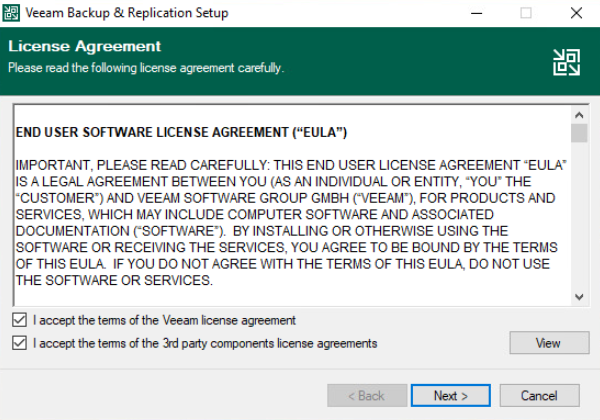
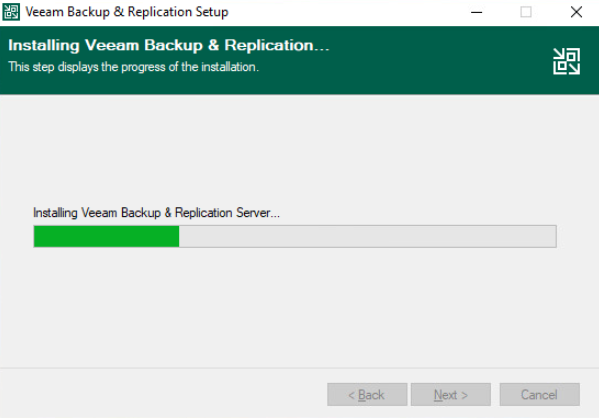
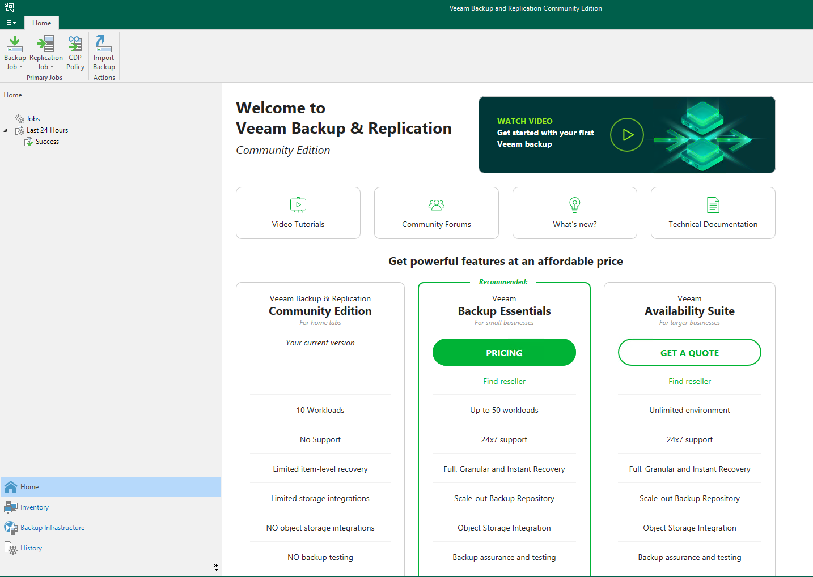
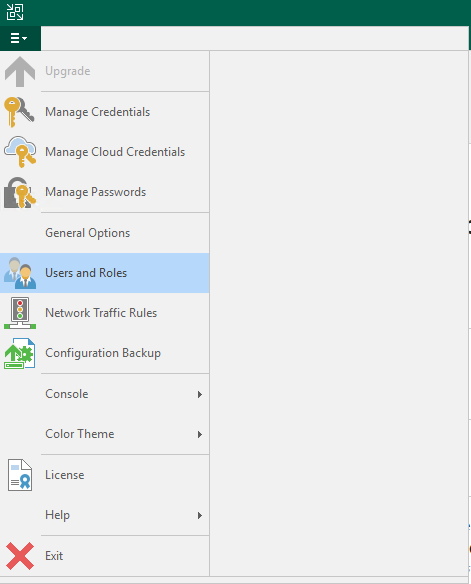
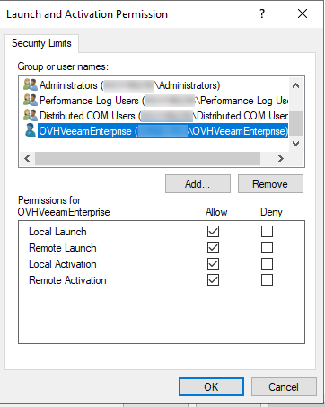
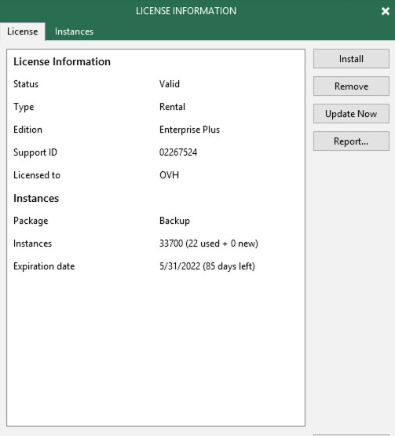

> [!primary]
> Tłumaczenie zostało wygenerowane automatycznie przez system naszego partnera SYSTRAN. W niektórych przypadkach mogą wystąpić nieprecyzyjne sformułowania, na przykład w tłumaczeniu nazw przycisków lub szczegółów technicznych. W przypadku jakichkolwiek wątpliwości zalecamy zapoznanie się z angielską/francuską wersją przewodnika. Jeśli chcesz przyczynić się do ulepszenia tłumaczenia, kliknij przycisk “Zgłóś propozycję modyfikacji” na tej stronie.
>

## Wprowadzenie

Veeam Backup & Replication jest oprogramowaniem do ochrony danych. Oferuje wiele możliwości tworzenia kopii zapasowych, replikacji i przywracania danych.

**Dowiedz się, jak zainstalować serwer Veeam Backup & Replication, a następnie jak zarejestrować go na serwerze licencji Veeam Enterprise OVHcloud.**


## Wymagania początkowe

* Posiadanie usługi [Veeam Enterprise](https://www.ovhcloud.com/pl/storage-solutions/veeam-enterprise/){.external}.
* Posiadanie wirtualnej maszyny z Windows Server 2012 lub nowszej wersji.


## W praktyce

### Instalacja Veeam Backup & Replication

> [!primary]
> Najnowsza wersja Veeam Backup & Replication (wersja 12) jest obsługiwana przez OVHcloud tylko z **bazami danych Microsoft SQL Server**.
>
> Będziemy obsługiwać Veeam Backup & Replication v12 z PostgreSQL [wkrótce](https://github.com/ovh/private-cloud-provider/issues/125).
>

Pobierz rozwiązanie **Veeam Backup & Replication** ze [strony Veeam](https://www.veeam.com/downloads.html?ad=top-sub-menu){.external}. Jeśli nie masz konta, utwórz je (bezpłatnie).

Plik ma postać obrazu dysku w formacie ISO. Po przesłaniu pliku na Twój serwer wybierz czytnik CD maszyny, po czym wybierz obraz.

Możesz teraz uruchomić na maszynie kreator instalacji. Następnie wybierz `Veeam Backup & Replication Install`{.action}.

{.thumbnail}

Przeczytaj umowę licencyjną i zaakceptuj ją, klikając `Next`{.action}.

{.thumbnail}

Aby pominąć etap wprowadzania pliku licencji, kliknij `Next`{.action}.

{.thumbnail}

Na etapie wyboru usług, które zostaną zainstalowane nie wprowadzaj żadnych zmian. W zależności od Twoich potrzeb możesz zmienić docelową ścieżkę instalacji. Zatwierdź, klikając `Next`{.action}.

{.thumbnail}

Kreator instalacji przeprowadzi teraz kontrolę dotyczącą wymagań oprogramowania. Jeśli rozpoczynasz od czystej instalacji systemu Windows, niektóre komponenty będą niedostępne, ale kreator instalacji pobierze i zainstaluje je automatycznie. Zatwierdź, klikając `Next`{.action}.

{.thumbnail}

Następnie zaczekaj, aż zakończy się instalacja wymaganych komponentów.

{.thumbnail}

Po realizacji tego etapu zatwierdź instalację **Veeam Backup & Replication**, klikając `Next`{.action}.

{.thumbnail}

Na etapie wyboru ustawień instalacji zatwierdź tę operację, klikając `Install`{.action}.

{.thumbnail}

Zaczekaj, aż instalacja się zakończy.

{.thumbnail}

Po jej zakończeniu zamknij kreator instalacji, klikając `Finish`{.action}.

{.thumbnail}

Zostaniesz przekierowany do asystenta instalacji. Wystarczy zamknąć okno.

### Tworzenie konta usługi Veeam Enterprise

#### Krok 1 - Utwórz konto usługi

Najpierw wygeneruj **silne** hasło.

Aby rozpocząć, uruchom Windows Powershell jako administrator.

Następnie utwórz konto usługi, wprowadzając poniższe wiersze poleceń po zalogowaniu się jako administrator:

```powershell
New-LocalUser "OVHVeeamEnterprise" -Password (ConvertTo-SecureString -AsPlainText "P@ssword01" -Force) -Description "OVH Service Account for Veeam Enterprise" -PasswordNeverExpires:$true -UserMayNotChangePassword:$true -AccountNeverExpires:$true
```

Pamiętaj, że nazwa konta i hasło są przykładowe i należy je zmienić:

- Nazwa konta: OVHVeeamEnterprise
- Hasło: P@ssword01

####  Krok 2 - Określ dostępy dla usługi

Uruchom konsolę Veeam.

{.thumbnail}

Sprawdź, czy pracujesz w trybie **Community Edition** w prawym dolnym rogu.

{.thumbnail}

Przejdź do menu, następnie kliknij `Users and Roles`{.action}.

{.thumbnail}

W oknie `Security`{.action} wybierz `Add...`{.action}.

{.thumbnail}

Następnie w oknie `Add User`{.action} wybierz utworzone konto usługi. Wybierz rolę **Veeam Backup Administrator** i zatwierdź przyciskiem `OK`{.action}.

{.thumbnail}

W oknie **Security** możesz sprawdzić, czy konto zostało utworzone.

{.thumbnail}

#### Krok 3 - Zezwolenia na wykonywanie i aktywację

Użytkownik OVHVeeamEnterprise jest dostępny tylko lokalnie, dlatego aby włączyć zdalne połączenie, należy dodać uprawnienia do graficznego interfejsu użytkownika Windows.

Za pomocą interfejsu graficznego użytkownika:

1. W pasku wyszukiwania Windows wpisz `Component Services`{.action} i uruchom usługę.
2. W menu po lewej stronie i po drzewie kliknij `Component Services`{.action}, następnie `Computers`{.action}, a następnie `My Computer`{.action}.
3. Po prawej stronie w zakładce `Actions`{.action} kliknij `More Actions`{.action}, a następnie `Properties`{.action}.
4. Przejdź do `COM Security`{.action} i do drugiej opcji `Launch and Activation Permissions`{.action}, kliknij `Edit Limits`{.action}. Następnie kliknij polecenie `Add...`{.action}.

{.thumbnail}

<ol start="5">
<li>Kliknij na <code class="action">Advanced...</code> aby zlokalizować konto usługi wcześniej dodane. Następnie kliknij polecenie <code class="action">Find Now</code> i wybierz użytkownika <code class="action">OVHVeeamEnterprise</code> z listy użytkowników.</li>
</ol>

{.thumbnail}

<ol start="6">
<li>Kliknij na <code class="action">OK</code>, aby potwierdzić wybór i na <code class="action">OK</code>, aby zatwierdzić. Następnie aktywuj wszystkie uprawnienia dla użytkownika <code class="action">OVHVeeamEnterprise</code>.</li>
</ol>

{.thumbnail}

<ol start="7">
<li>Kliknij <code class="action">OK</code>, aby potwierdzić i <code class="action">Apply</code>, aby zatwierdzić zmiany.</li>
</ol>

Twój użytkownik OVHVeeamEnterprise jest teraz dostępny lokalnie i zdalnie.

#### Krok 4 - Zarejestruj licencję dla serwera Veeam Backup & Replication

##### W panelu klienta OVHcloud

Zaloguj się do [Panelu klienta OVHcloud](https://www.ovh.com/auth/?action=gotomanager&from=https://www.ovh.pl/&ovhSubsidiary=pl){.external}, przejdź do sekcji `Hosted Private Cloud`{.action} i wybierz `Platformy i usługi`{.action}. Następnie wybierz Twoją usługę **backup serverenterprise**, a następnie kliknij przycisk `Aktywuj licencję`{.action} w sekcji `Skróty`.

Upewnij się, że otworzyłeś porty OVHcloud do Twoich serwerów Veeam Backup i Replication:

- `Port 9392/TCP`
- `Port 9405/TCP`

{.thumbnail}

{.thumbnail}

W nowym oknie wpisz następujące informacje:

- Publiczny adres IP, przez który jest osiągalny serwer **Veeam Backup & Replication**.
- Utworzone wcześniej poświadczenia logowania (nazwa użytkownika i hasło).

Zatwierdź, klikając przycisk `OK`{.action}.

{.thumbnail}

Po aktywacji informacje będą dostępne na stronie usługi.

{.thumbnail}


##### Za pomocą interfejsu API OVHcloud

Najpierw pobierz serviceName:

> [!api]
>
> @api {GET} /veeam/veeamEnterprise
>

Następnie przeprowadź rejestrację:

> [!api]
>
> @api {POST} /veeam/veeamEnterprise/{serviceName}/register
>

Przygotuj następujące informacje:

 * publiczny adres IP, za pomocą którego możesz połączyć się z serwerem **Veeam Backup & Replication**;
 * port serwera **Veeam Backup & Replication** (domyślnie **9392/TCP**);
 * login do utworzonego konta;
 * hasło do konta.

Pobierz publiczny adres IP używany przez Veeam Enterprise do łączenia się z serwerem Veeam Backup & Replication:

> [!api]
>
> @api {GET} /veeam/veeamEnterprise/{serviceName}
>

> [!primary]
> Aktywacja serwera Veeam Backup & Replication może trwać kilka godzin.

#### Krok 5 - Sprawdź poprawność rejestracji

Uruchom konsolę Veeam.

{.thumbnail}

Przejdź do menu, następnie kliknij `License`{.action}.

{.thumbnail}

Upewnij się, czy wyświetlane informacje dotyczą Twojej licencji OVHcloud.

Jeśli wszystko pójdzie dobrze, powinieneś zobaczyć "Edition: Enterprise Plus".

> [!primary]
> Możesz wyłączyć użytkownika, którego utworzyłeś do tworzenia rejestracji.

{.thumbnail}

## Sprawdź również

Przyłącz się do społeczności naszych użytkowników na Discord: <https://discord.gg/ovhcloud>

Przyłącz się do społeczności naszych użytkowników na stronie <https://community.ovh.com/en/>.
