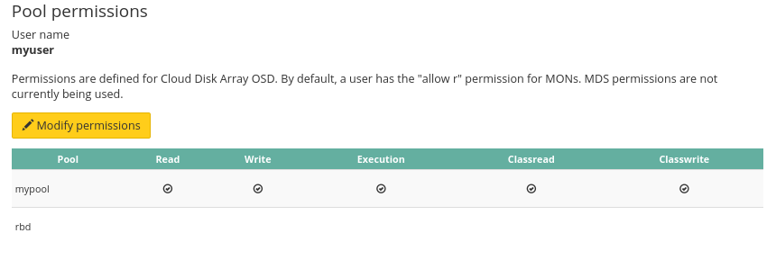

## Utilisation de l'interface web
L'utilisation d'une interface web est le moyen le plus simple de modifier les droits des utilisateurs.

Vous devez d'abord sélectionner votre utilisateur.

{.thumbnail}

Il énumérera les droits actuels, par défaut il n'y a pas de droits.

{.thumbnail}

Choisissons quelques droits pour notre utilisateur.

{.thumbnail}

Comme d'habitude, le statut du cluster et la liste des tâches changent.

## Utiliser l'API

> [!api]
>
> @api {PUT} /dedicated/ceph/{serviceName}/pool
>

> [!api]
>
> @api {GET} /dedicated/ceph/{serviceName}/user
>
Exemple de résultat:

```bash
GET /dedicated/ceph/98d166d8-7c88-47b7-9cb6-63acd5a59c15/user
[
  {
    mdsCaps: "",
    monCaps: "allow r",
    serviceName: "98d166d8-7c88-47b7-9cb6-63acd5a59c15",
    name: "myuser"
    osdCaps: "allow class-read object_prefix rbd_children, allow rwx pool=mypool",
    key: "AQA9KpdXoBrDNhAAFCM7m/XOtmWh3LMSNlHVqw==",
  }
]
```

## Aller plus loin

Rendez-vous sur notre chaîne Discord dédiée : <https://discord.gg/ovhcloud>. Posez des questions, fournissez des commentaires et interagissez directement avec l'équipe qui construit nos services de stockage et de sauvegarde.

Si vous avez besoin d'une formation ou d'une assistance technique pour la mise en oeuvre de nos solutions, contactez votre commercial ou cliquez sur [ce lien](https://www.ovhcloud.com/fr/professional-services/) pour obtenir un devis et demander une analyse personnalisée de votre projet à nos experts de l’équipe Professional Services.

Rejoignez notre communauté d'utilisateurs sur <https://community.ovh.com/>.
