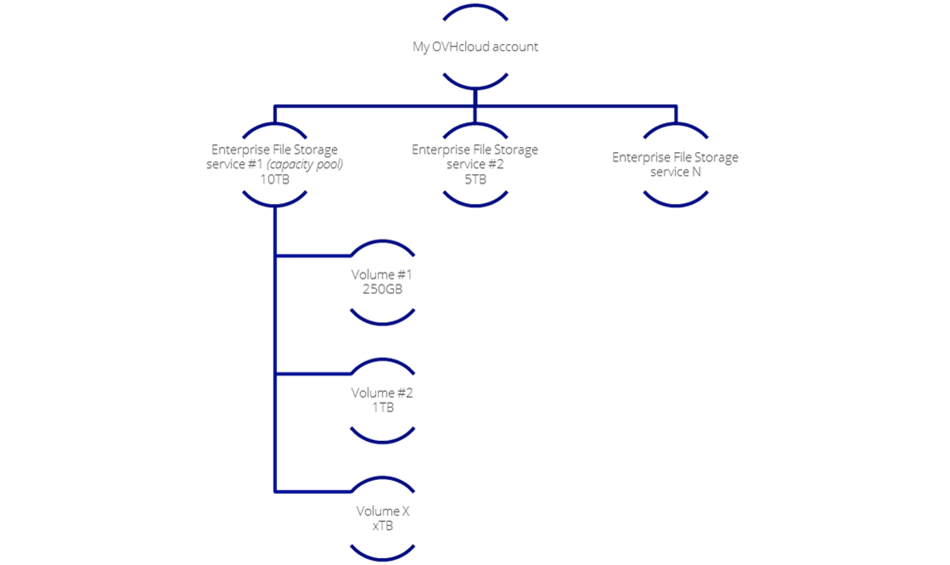

> [!primary]
> Tłumaczenie zostało wygenerowane automatycznie przez system naszego partnera SYSTRAN. W niektórych przypadkach mogą wystąpić nieprecyzyjne sformułowania, na przykład w tłumaczeniu nazw przycisków lub szczegółów technicznych. W przypadku jakichkolwiek wątpliwości zalecamy zapoznanie się z angielską/francuską wersją przewodnika. Jeśli chcesz przyczynić się do ulepszenia tłumaczenia, kliknij przycisk "Zgłóś propozycję modyfikacji" na tej stronie.
>

## Wprowadzenie

Poznaj pojęcia związane z tworzeniem rezerw, monitorowaniem oraz testowaniem wydajności rozwiązania [Enterprise File Storage](https://www.ovhcloud.com/pl/storage-solutions/enterprise-file-storage/).

## W praktyce

### Monitorowanie wydajności

Pojęcie "poziom usługi" jest ważnym elementem oferty Enterprise File Storage. Określa ona osiągalny poziom wydajności dla każdej usługi świadczonej w ramach rezerwy. Wydajność systemu plików jest zazwyczaj zdefiniowana przez kilka elementów: 

- Natężenie przepływu.
- IOPS (lub liczba operacji wejścia-wyjścia na sekundę).
- Rozmiar bloku.
- Model dostępu sekwencyjnego lub losowego.

Do tej pory Enterprise File Storage zapewnia i gwarantuje wydajność wynoszącą **64 MB/s na TB i 4000 IOPS na TB**. Zapasowe zasoby usług mają więc bezpośredni wpływ na wydajność Twojej usługi.

Informacja ta jest ważna w przypadku architektury przestrzeni dyskowej. Przytoczmy trzy przykłady:

- **Przykład nr 1**: Twoja aplikacja wymaga teoretycznego pobrania około **430 MB/s**. W tym celu należy zapewnić co najmniej **7 TB** przestrzeń dyskową. Szybkie obliczenie (**430/64 = 6,72**) pozwala bowiem na oszacowanie minimalnej zdolności przepustowej niezbędnej do osiągnięcia takiego przepływu.

- **Przykład nr 2**: Twoja infrastruktura wymaga **4500 IOPS** i ilości danych **1 TB**. W tym celu należy zapewnić zapasy **2 TB**, aby otrzymać **niezbędne 4500 IOPS**. W tym przypadku skorzystasz z **8000 IOPS** w przypadku wykorzystania dodatkowej pojemności. Chodzi zatem o nadmierne dostarczanie usługi, aby zapewnić pożądany poziom wydajności.

- **Przykład nr 3**: Twoja aplikacja nie wymaga szczególnie dużej wydajności, ale przestrzeni dyskowej większej niż **60 TB**. W takim przypadku lepiej jest wybrać usługę przestrzeni dyskowej [NAS-HA](https://www.ovhcloud.com/pl/storage-solutions/nas-ha/), która jest bardziej ekonomiczna i pozwala na osiągnięcie wydajności przekraczającej 58 TB na usługę.

### Liczba woluminów i jakości usług (QoS)

Przypominamy, że wolumen to partycja usługi (zwana również "pulą" lub "pulą pojemności"). Podczas składania zamówienia dostarczasz uprawnienia do świadczenia usługi. Po dostarczeniu usługi konieczne będzie utworzenie wolumenów z limitem transferu od 100 GB do 29 TB wolumenu. 

Poniżej znajdziesz hierarchię usługi przestrzeni dyskowej Enterprise File Storage:

{.thumbnail}

Enterprise File Storage nie pozwala na ręczne modyfikowanie QoS. QoS definiuje się bowiem na poziomie usługi (puli).

### Jak zmaksymalizować wydajność systemu plików

Aby zwiększyć wydajność Enterprise File Storage, należy wziąć pod uwagę następujące elementy:

- Pamiętaj, aby zarezerwować Enterprise File Storage w tym samym centrum danych co Twoje obciążenia. Opóźnienia między centrami danych mogą być wysokie i mieć wpływ na wydajność całej aplikacji.
- Dla większej niezawodności i przepustowości, możesz korzystać z serwerów najnowszej generacji, ponieważ dysponują one nowymi interfejsami sieciowymi.
- Wyszukaj dostępną przepustowość do sieci publicznej na serwerach klientów, aby zapewnić kompatybilność z dostarczaną wydajnością i tym samym zmaksymalizować przepustowość.

### Test wydajności

Aby przeprowadzić własne testy wydajności i zapoznać się z poziomami usług Enterprise File Storage, zalecamy użycie narzędzi takich jak [FIO](https://github.com/axboe/fio), popularnego narzędzia do ewaluacji. Dostarcza on wielu regulowanych opcji symulacji pożądanego obciążenia roboczego i dostarcza szczegółowe statystyki dotyczące zachowania przestrzeni dyskowej pod obciążeniem. Jest on również dostępny bezpłatnie w wielu systemach operacyjnych.

Ważne jest, aby przetestować wydajność Enterprise File Storage w tym samym centrum danych, co obciążenia robocze. Opóźnienia między centrami danych są zbyt duże, aby taka ocena była przydatna.

Przed rozpoczęciem testu upewnij się, że klient używany w tym benchmarku ma dostęp do Twojej usługi Enterprise File Storage oraz do wolumenu testów. Jeśli jeszcze tego nie zrobiłeś, zapoznaj się z przewodnikiem [zarządzanie w Panelu klienta OVHcloud](/pages/storage_and_backup/file_storage/enterprise_file_storage/netapp_control_panel).

#### Błąd testowy

Narzędzie [FIO](https://github.com/axboe/fio) pozwala na przetestowanie kilku scenariuszy i na zmianę wielu parametrów testowych: 

- Liczbę obrazów.
- Rozmiar obrazów.
- Rozmiar bloku.
- Czas trwania testu.
- Liczbę FIO workers.
- Model dostępu (odczyt/zapis/sekwencyjny/losowy) itp.

Więcej informacji znajduje się na stronie [dokumentacja FIO](https://fio.readthedocs.io/en/latest/index.html){.external}.

## Sprawdź również

Jeśli potrzebujesz szkolenia lub pomocy technicznej w celu wdrożenia naszych rozwiązań, skontaktuj się z przedstawicielem handlowym lub kliknij [ten link](https://www.ovhcloud.com/pl/professional-services/), aby uzyskać wycenę i poprosić o spersonalizowaną analizę projektu od naszych ekspertów z zespołu Professional Services.

Przyłącz się do społeczności naszych użytkowników na Discord: <https://discord.gg/jW2FgBJ72h>
