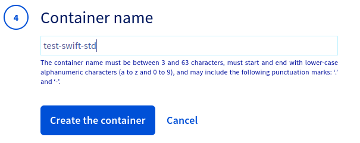

> [!primary]
> Esta traducción ha sido generada de forma automática por nuestro partner SYSTRAN. En algunos casos puede contener términos imprecisos, como en las etiquetas de los botones o los detalles técnicos. En caso de duda, le recomendamos que consulte la versión inglesa o francesa de la guía. Si quiere ayudarnos a mejorar esta traducción, por favor, utilice el botón «Contribuir» de esta página.
>

**Última actualización: 27/10/2021**

## Objetivo

La solución Object Storage para Public Cloud ofrece almacenamiento ilimitado con una facturación sencilla y adaptada a sus necesidades. Hay muchos tipos de contenedores de objetos:

- para alojamiento estático (sitio web estático);
- para el alojamiento privado (p. ej.: almacenamiento de datos personales);
- para alojamiento público (para almacenar todo lo que sea accesible al público);
- para almacenamiento en frío (archivado).

El primer paso es crear un contenedor que agrupe sus archivos.

**Esta guía explica cómo crearlo desde el área de cliente de OVHcloud y desde el panel Horizon de OpenStack.**

## Requisitos

- Haber iniciado sesión en el [área de cliente de OVHcloud](https://ca.ovh.com/auth/?action=gotomanager&from=https://www.ovh.com/world/&ovhSubsidiary=ws){.external}.

Si utiliza Horizon:

- Haber creado un [usuario de OpenStack](/pages/public_cloud/compute/create_and_delete_a_user).

## Procedimiento

### Creación de un contenedor Object Storage desde el área de cliente de OVHcloud 

Conéctese al [área de cliente](https://ca.ovh.com/auth/?action=gotomanager&from=https://www.ovh.com/world/&ovhSubsidiary=ws){.external}, acceda a la sección `Public Cloud`{.action} y seleccione el proyecto de Public Cloud correspondiente. A continuación, haga clic en `Object Storage`{.action} en la columna izquierda, en `Storage`.

Haga clic en `Crear un contenedor de objetos`{.action}.

Si se trata de su primer contenedor:

Si ya ha creado uno o más contenedores:

Seleccione la solución y haga clic en `Siguiente`{.action}.

Seleccione la región del contenedor y haga clic en `Siguiente`{.action}.

Seleccione el tipo de contenedor y haga clic en `Siguiente`{.action}.

Asigne un nombre al contenedor y haga clic en `Añadir el contenedor`{.action}.

> [!warning]
>
> Si quiere asociar su contenedor a un dominio, el nombre del contenedor no debe contener los siguientes caracteres:
>
> - [ . ]  
> - [ _ ]  
> - Y no debes usar mayúsculas.  
>
> Para más información, consulte nuestra guía "[Asociar un contenedor a un dominio](/pages/storage_and_backup/object_storage/pcs_link_domain)".
>

Su contenedor está creado:

### Creación de un contenedor Object Storage desde Horizon 

> [!primary]
>
> No es posible crear un contenedor de Public Cloud Archive desde Horizon
>

Conéctese al [espacio Horizon](https://horizon.cloud.ovh.net){.external}:

Desarrolle el menú `Object Store`{.action}, haga clic en `Containers`{.action} y seleccione `+ Container.`{.action}

Asigne un nombre al contenedor.

> [!warning]
>
> Si quiere asociar su contenedor a un dominio, el nombre del contenedor no debe contener los siguientes caracteres:
>
> - [ . ]  
> - [ _ ]  
> - Y no debes usar mayúsculas.  
>
> Para más información, consulte nuestra guía "[Asociar un contenedor a un dominio](/pages/storage_and_backup/object_storage/pcs_link_domain)".
>

Seleccione la política de acceso de su contenedor y haga clic en `Next`{.action}

El contenedor está creado.

También puede verlo en el área de cliente de OVHcloud:

## Más información

Si necesita formación o asistencia técnica para implantar nuestras soluciones, póngase en contacto con su representante de ventas o haga clic en [este enlace](https://www.ovhcloud.com/es/professional-services/) para obtener un presupuesto y solicitar un análisis personalizado de su proyecto a nuestros expertos del equipo de Servicios Profesionales.

Interactúe con nuestra comunidad de usuarios en <https://community.ovh.com/en/>.
