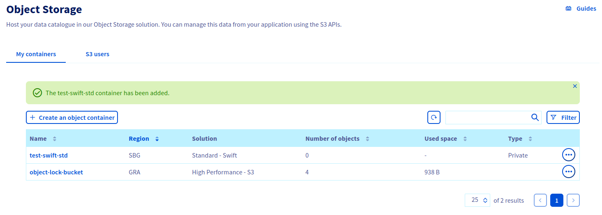

> [!primary]
> Esta tradução foi automaticamente gerada pelo nosso parceiro SYSTRAN. Em certos casos, poderão ocorrer formulações imprecisas, como por exemplo nomes de botões ou detalhes técnicos. Recomendamos que consulte a versão inglesa ou francesa do manual, caso tenha alguma dúvida. Se nos quiser ajudar a melhorar esta tradução, clique em "Contribuir" nesta página.
>

## Objetivo

A oferta Object Storage para o Public Cloud oferece uma solução de armazenamento ilimitada com uma faturação simples e adaptada às suas necessidades. Existem vários tipos de containers de objetos:

- alojamento estático (website estático);
- para alojamento privado (exemplo: armazenamento de dados pessoais);
- alojamento público (para armazenar tudo o que é acessível ao público);
- para armazenamento a frio (arquivo).

O primeiro passo é a criação de um container que irá agrupar os seus ficheiros.

**Este guia explica como criar o serviço a partir da Área de Cliente OVHcloud e da interface Horizon Openstack.**

## Requisitos

- Estar ligado à [Área de Cliente OVHcloud](https://www.ovh.com/auth/?action=gotomanager&from=https://www.ovh.pt/&ovhSubsidiary=pt){.external}.

Se utilizar o Horizon:

- Ter criado um [utilizador OpenStack](/pages/public_cloud/compute/create_and_delete_a_user).

## Instruções

### Criação de um container Object Storage a partir da Área de Cliente OVHcloud 

Ligue-se à sua [Área de Cliente](https://www.ovh.com/auth/?action=gotomanager&from=https://www.ovh.pt/&ovhSubsidiary=pt){.external}, aceda à secção `Public Cloud`{.action} e selecione o projeto Public Cloud em causa. A seguir, clique em `Object Storage`{.action} na barra de navegação à esquerda, na secção `Storage`.

A seguir, clique em `Criar um container de objetos`{.action}.

Se se tratar do seu primeiro container:

Se já criou um(s) container(s):

Selecione a sua solução e clique em `Seguinte`{.action}:

Selecione a região do seu container e clique em `Seguinte`{.action}:

Selecione o tipo de container e clique em `Seguinte`{.action}:

Dê um nome ao seu container e clique em `Adicionar o container`{.action}:

> [!warning]
>
> Se deseja associar o seu container a um nome de domínio, o nome do seu container de dados não deve conter os seguintes caracteres:
>
> - [ . ]  
> - [ _ ]  
> - e não deve utilizar maiúsculas.  
>
> Para mais informações, consulte o nosso guia "[Associar um container a um nome de domínio](/pages/storage_and_backup/object_storage/pcs_link_domain) (EN)".
>

O seu container é criado:

### Criação de um container Object Storage a partir do Horizon 

> [!primary]
>
> Não é possível criar um container Public Cloud Archive a partir do Horizon
>

Ligue-se ao seu [espaço Horizon](https://horizon.cloud.ovh.net){.external}:

Desenvolva o menu `Object Store`{.action}, clique em `Containers`{.action} e depois em `+ Container`{.action}

Dê um nome ao seu container.

> [!warning]
>
> Se deseja associar o seu container a um nome de domínio, o nome do seu container de dados não deve conter os seguintes caracteres:
>
> - [ . ]  
> - [ _ ]  
> - E não devem usar maiúsculas.  
>
> Para mais informações, consulte o nosso guia "[Associar um container a um nome de domínio](/pages/storage_and_backup/object_storage/pcs_link_domain) (EN)".
>

Selecione a política de acesso do seu container e clique em `Next`{.action}

O seu container foi criado.

Também pode vê-lo na Área de Cliente OVHcloud:

## Saiba mais

Se precisar de formação ou de assistência técnica para implementar as nossas soluções, contacte o seu representante comercial ou clique em [esta ligação](https://www.ovhcloud.com/pt/professional-services/) para obter um orçamento e solicitar uma análise personalizada do seu projecto aos nossos especialistas da equipa de Serviços Profissionais.

Fale com a nossa comunidade de utilizadores: [https://community.ovh.com](https://community.ovh.com/en/).
