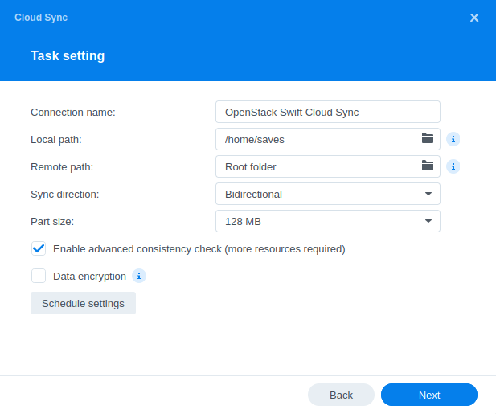

> [!primary]
> Diese Übersetzung wurde durch unseren Partner SYSTRAN automatisch erstellt. In manchen Fällen können ungenaue Formulierungen verwendet worden sein, z.B. bei der Beschriftung von Schaltflächen oder technischen Details. Bitte ziehen Sie im Zweifelsfall die englische oder französische Fassung der Anleitung zu Rate. Möchten Sie mithelfen, diese Übersetzung zu verbessern? Dann nutzen Sie dazu bitte den Button "Beitragen" auf dieser Seite.
>

## Ziel

Mit DiskStation Manager 7.0 bietet Synology ein Synchronisierungstool für verschiedene Cloud Lösungen an.

Es ist mit dem Object Storage der OVHcloud Public Cloud kompatibel und kann somit ein Backup Ihrer Daten durchführen und diese von überall aus verfügbar machen.

> [!primary]
>
> DiskStation Manager 6 ist nicht mit OVHcloud Public Cloud Object Storage kompatibel.
>

**Diese Anleitung erklärt, wie Sie DiskStation Manager 7.0 konfigurieren, um die Dateien auf Ihrem NAS mit Ihrem Object Storage zu synchronisieren.**

## Voraussetzungen

- [Erstellung von Object Storage Containern](/pages/storage_and_backup/object_storage/pcs_create_container)
- [Einen Zugang zu Horizon einrichten](/pages/public_cloud/compute/create_and_delete_a_user#erstellung-eines-openstack-benutzers)

## In der praktischen Anwendung

### Konfiguration von DiskStation Manager 7.0

> [!warning]
>
> Synology-Lösungen wie DiskStation oder Hyperbackup sind mit Public Cloud Archive nicht kompatibel.
>

#### Zugangsdaten für OpenStack abrufen

Um die Synchronisierung Ihres Synology NAS zu konfigurieren müssen Sie über die Zugangsdaten Ihres OpenStack Benutzers verfügen.

Diese können Sie anhand der folgenden Anleitung im Kundencenter herunterladen:

- [OpenStack Umgebungsvariablen einrichten](/pages/public_cloud/compute/loading_openstack_environment_variables)

#### Konfiguration des Synchronisationspunkts mit Cloud Sync

Sobald Sie Ihre Zugangsdaten haben, können Sie sich mit Ihrem NAS verbinden und die folgenden Aktionen ausführen:

- Cloud Sync Anwendung starten.

- OpenStack Swift als Cloud Provider auswählen:

{.thumbnail}

- Die Informationen Ihres OpenStack-Benutzers eingeben:

{.thumbnail}

Alle diese Informationen finden Sie in der OpenRC-Datei, die Sie im vorherigen Schritt abgerufen haben.

- Wählen Sie den Standort und Namen des Containers aus:

{.thumbnail}

- Den zu synchronisierenden Ordner konfigurieren:

{.thumbnail}

## Weiterführende Informationen

Wenn Sie Schulungen oder technische Unterstützung bei der Implementierung unserer Lösungen benötigen, wenden Sie sich an Ihren Vertriebsmitarbeiter oder klicken Sie auf [diesen Link](https://www.ovhcloud.com/de/professional-services/), um einen Kostenvoranschlag zu erhalten und eine persönliche Analyse Ihres Projekts durch unsere Experten des Professional Services Teams anzufordern.

Für den Austausch mit unserer User Community gehen Sie auf <https://community.ovh.com/en/>.
