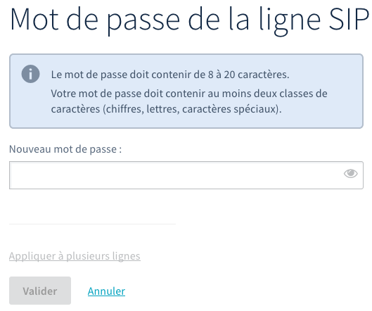

**Dernière mise à jour le 27/09/2018**

## Objectif

Votre ligne SIP OVH vous permet de recevoir et d’émettre des appels depuis l'appareil de votre choix. Cet accès est possible grâce au mot de passe qui lui est associé. Si vous disposez d'un téléphone Plug & Phone OVH avec votre ligne SIP, ce mot de passe est automatiquement configuré sur ce dernier. 

**Apprenez à changer le mot de passe d’une ligne SIP OVH ne disposant pas d'un téléphone Plug & Phone OVH.**

## Prérequis

- Disposer d'une [ligne SIP OVH](https://www.ovhtelecom.fr/telephonie/voip/){.external}.
- Être connecté à l'[espace client OVH](https://www.ovhtelecom.fr/manager/auth/?action=gotomanager){.external}, partie `Télécom`{.action}.

## En pratique

### Étape 1 : accéder à la gestion du mot de passe de la ligne SIP

Pour débuter la manipulation, connectez-vous à votre [espace client OVH](https://www.ovhtelecom.fr/manager/auth/?action=gotomanager){.external} et assurez-vous de vous situer dans la section `Télécom`. Cliquez sur `Téléphonie`{.action} dans la barre de services à gauche, puis sélectionnez la ligne SIP concernée parmi celles qui s'affichent. 

Positionnez-vous ensuite sur l'onglet `Gestion`{.action}, puis cliquez sur le bouton `Mot de passe SIP`{.action}.

> [!primary]
>
> Si le bouton « Mot de passe SIP » est grisé, cela vous indique que la modification est impossible pour la ligne SIP que vous avez sélectionnée. Celle-ci dispose en effet d'un téléphone Plug & Phone OVH. Dans ce type de configuration, le mot de passe est automatiquement configuré sur le téléphone Plug & Phone que vous utilisez. 
>

{.thumbnail}

### Étape 2 : modifier le mot de passe de la ligne SIP

Dans la fenêtre qui s’affiche, renseignez le nouveau mot de passe souhaité dans la zone de texte en dessous de « Nouveau mot de passe », puis cliquez sur le bouton `Valider`{.action}.

> [!primary]
>
> Pour des raisons de sécurité, nous vous invitons à respecter les conditions indiquées lors du choix du nouveau mot de passe. Nous vous recommandons également :
>
> - de ne pas utiliser deux fois le même mot de passe ;
>
> - de choisir un mot de passe qui n'a aucun rapport avec vos informations personnelles (évitez les mentions à votre nom, prénom ou date de naissance, par exemple) ;
>
> - de renouveler régulièrement vos mots de passe ;
>
> - de ne pas noter sur un papier ou de vous envoyer vos mots de passe sur votre adresse e-mail.
>

{.thumbnail}

### Étape 3 : configurer le nouveau mot de passe

Une fois le mot de passe modifié depuis votre espace client, vous devez le mettre à jour dans les paramètres du logiciel ou de l'appareil utilisant votre ligne SIP OVH. Pour cela, il se peut qu’un message ou une fenêtre apparaisse automatiquement sur votre logiciel ou votre appareil, vous demandant de renseigner le nouveau mot de passe de la ligne SIP. Si tel est le cas, suivez les étapes jusqu'à le modifier.

Dans le cas contraire, nous vous invitons à vous rapprocher de l’éditeur du logiciel ou du constructeur de l'appareil que vous utilisez pour réaliser cette manipulation, celle-ci étant inhérente à ce dernier.

## Aller plus loin

[En apprendre plus sur la sécurité des mots de passe grâce à l'ANSSI](http://www.ssi.gouv.fr/guide/mot-de-passe/){.external}.

Échangez avec notre communauté d'utilisateurs sur <https://community.ovh.com>.