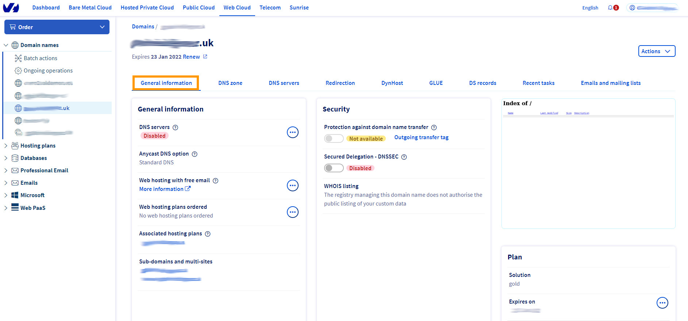

**Last updated 12th July 2021**

## Objective

The process of changing the registrar for Top Level Domains (TLD) of the **UK** country code (**.uk**) differs from the one explained in our [guide regarding generic TLDs](../outgoing-transfer-of-generic-or-geographical-domain-name/). The instructions below concern the following extensions:

- .uk
- .co.uk
- .ac.uk
- .gov.uk
- .me.uk
- .net.uk
- .org.uk
- .plc.uk
- .sch.uk

**This guide explains how to initiate an outgoing transfer for these TLDs in the OVHcloud Control Panel.**

## Requirements

- a [.uk domain name](https://www.ovh.com/sg/domains/) registered with OVHcloud
- access to the [OVHcloud Control Panel](https://ca.ovh.com/auth/?action=gotomanager&from=https://www.ovh.com/sg/&ovhSubsidiary=sg) with the necessary permissions to manage the domain name (domain administrator)
- the domain name is still active i.e. not expired or otherwise locked on the part of OVHcloud
- the domain name is not the subject of an ongoing dispute with the responsible registry [Nominet](https://www.nominet.uk/)

> [!primary]
>
> If the domain has been expired for **less than 90 days**, it can still be transferred. Please contact our support teams by creating a support request in your OVHcloud Control Panel to unlock the domain name for transfer.
>

## Instructions

The TLDs in question have a registrar **TAG** which corresponds to a domain name registrar such as OVHcloud. The transfer process is initiated by changing the TAG to the one identifying your new registrar.

In case you do not know the required TAG yet, you can request it at your new provider or look it up on this [Nominet registrar list](https://registrars.nominet.uk/uk-namespace/registrar-agreement/list-of-registrars/).

### Step 1: Verify the necessary information

Log in to your [OVHcloud Control Panel](https://ca.ovh.com/auth/?action=gotomanager&from=https://www.ovh.com/sg/&ovhSubsidiary=sg) and select `Web Cloud`{.action} in the top navigation bar. Click `Domain names`{.action} in the services bar on the left-hand side, then choose the domain name concerned.

In the `General information`{.action} tab, you can verify that the requirements for the transfer process are met.

{.thumbnail}

### Step 2: Edit your domain name's TAG

Click on the `Outgoing transfer tag`{.action} link in the section labelled **Security**.

{.thumbnail}

In the popup window, enter the TAG of your future registrar, then click on `Confirm`{.action}.

{.thumbnail}

If you are unable to modify your domain name's TAG in the OVHcloud Control Panel, you can request at the registry to modify it on your behalf. You can find more information on the official [Nominet website](https://www.nominet.uk/domain-support/).  

### Step 3: Follow up the transfer process with your new registrar

Successfully changing the TAG initiates the transfer process. Contact your new provider for details as well as any follow-up questions.

## Go further

[Transferring a domain name to another registrar](../outgoing-transfer-of-generic-or-geographical-domain-name/)

Join our community of users on <https://community.ovh.com/en/>. 