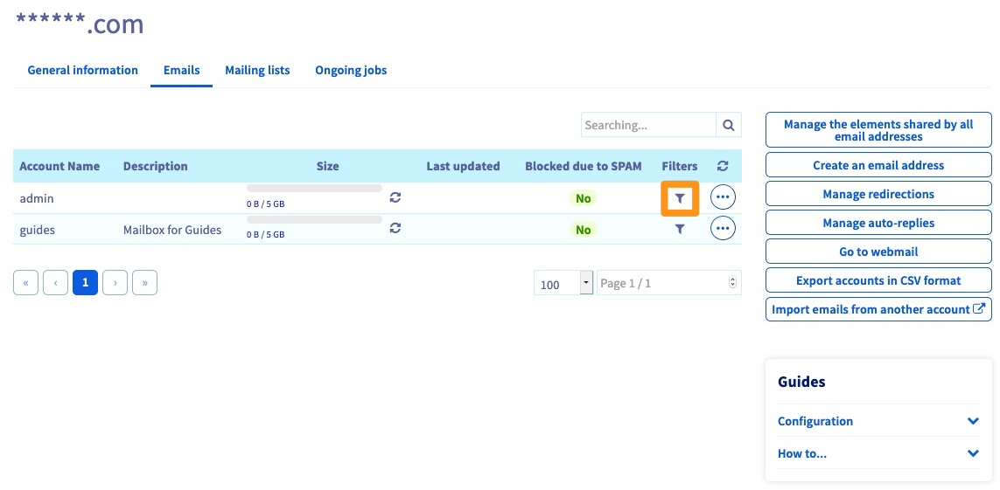

> [!primary]
> Diese Übersetzung wurde durch unseren Partner SYSTRAN automatisch erstellt. In manchen Fällen können ungenaue Formulierungen verwendet worden sein, z.B. bei der Beschriftung von Schaltflächen oder technischen Details. Bitte ziehen Sie im Zweifelsfall die englische oder französische Fassung der Anleitung zu Rate. Möchten Sie mithelfen, diese Übersetzung zu verbessern? Dann nutzen Sie dazu bitte den Button "Beitragen" auf dieser Seite.
>

**Letzte Aktualisierung am 27.09.2021**

## Ziel

Mit einem Filter können Bedingungen für die von Ihnen erhaltenen E-Mails sowie die sich daraus ergebenden Aktionen konfiguriert werden.

Zum Beispiel: Sie können jede E-Mail, die von unserem Spamschutz als Spam markiert wurde, automatisch löschen lassen.

- Bedingung: der Betreff der E-Mail enthält *[SPAM]*
- Aktion: E-Mail löschen

**Diese Anleitung erklärt, wie Sie Filter für Ihre E-Mail-Adressen erstellen und konfigurieren.**

## Voraussetzungen

- Sie verfügen über ein MX Plan E-Mail-Angebot oder ein [Webhosting](https://www.ovhcloud.com/de/web-hosting/){.external}.
- Sie haben Zugriff auf Ihr [OVHcloud Kundencenter](https://www.ovh.com/auth/?action=gotomanager&from=https://www.ovh.de/&ovhSubsidiary=de).

> [!warning]
>
> Die folgende Anleitung ist nur anwendbar auf den Dienst MX Plan *Legacy*. Für unsere aktuelle Version dieses Angebots erfolgt die Filterverwaltung direkt über das OWA Webmail (**O**utlook **W**eb **A**pplication). Sie können anhand der nachstehenden Tabelle identifizieren, welche Version des MX Plan Sie verwenden.
>

MX Plan Legacy|MX Plan neuere Version|
|---|---|
|{.thumbnail}  Die Angebotsbezeichnung steht in der Box "Abo".|{.thumbnail} Die `Server-Referenz` befindet sich in der Box "Zusammenfassung".|
|Lesen Sie weiter in dieser `[Anleitung](#oldmxplan)`.|Fahren Sie fort mit unserer Anleitung zu [Posteingangsregeln in OWA](https://docs.ovh.com/de/microsoft-collaborative-solutions/posteingangsregeln-in-owa-erstellen/).|

## In der praktischen Anwendung 

Loggen Sie sich in Ihr [OVHcloud Kundencenter](https://www.ovh.com/auth/?action=gotomanager&from=https://www.ovh.de/&ovhSubsidiary=de) ein und wechseln Sie zum Bereich `Web Cloud`{.action}.

Wählen Sie die Domain im Bereich `E-Mails`{.action} aus und gehen Sie auf den Tab `E-Mails`{.action}, um die Liste der E-Mail-Accounts Ihres MX Plan Angebots anzuzeigen.

Klicken Sie in der Tabelle, in der Ihre E-Mail-Adressen aufgelistet sind, auf das `Filter`{.action}-Symbol in der Zeile der zu bearbeitenden Adresse.

{.thumbnail}

Ein neues Fenster öffnet sich, das Ihre derzeit für diese E-Mail-Adresse konfigurierten Filter anzeigt. Um einen hinzuzufügen, klicken Sie rechts auf den Button `Filter hinzufügen`{.action}.

{.thumbnail}

### Die Filter-Einstellungen verstehen

{.thumbnail}

#### Information

- **Filtername**: Hiermit können Sie Ihre Filter im Kundencenter unterscheiden.
- **Priorität**: Dies legt die Reihenfolge der Ausführung Ihrer Filter für alle eingehenden Nachrichten auf dieser Adresse fest. Ein Filter der Priorität 1 wird vor einem der Priorität 5 ausgeführt.
- **Den Filter aktivieren**: Legt fest, ob der Filter auf den Posteingang angewendet wird (Sie können z.B. einen Filter vorübergehend deaktivieren, ohne ihn zu löschen, indem Sie den Haken bei dieser Option entfernen.)

#### <u>Regeln:</u>

In diesem Bereich können Sie die Filterbedingungen, auch Posteingangsregeln genannt, konfigurieren.

Erste Auswahl (Header):

- **Von**: Entspricht dem Absender, zum Beispiel: "Wenn der Absender ...".
- **An**: Entspricht dem Empfänger, zum Beispiel: "Wenn der Empfänger ...".
- **Betreff der Nachricht**: Entspricht dem Inhalt des Betreffs, zum Beispiel: "Wenn der Betreff der Nachricht ...".
- **Sonstige**: Anderer Parameter.

Zweite Auswahl (Regel):

- **spf**: Vom SPF einer Domain abhängiger Parameter, zum Beispiel: "... hat keinen SPF Eintrag".
- **enthält**: Positive Bedingung, zum Beispiel "Der Betreff enthält ...".
- **enthält nicht**: Negative Bedingung, zum Beispiel "... enthält nicht ...".

Dritte Auswahl (Wert):

- Ein konkreter Wert zur Definition dieser Regel, zum Beispiel: `[SPAM]`.

Vierte Auswahl (+):

- Damit können Sie weitere Regeln für die Aktion hinzufügen, die weiter unten definiert wird.

**Ergebnis dieser Regeln**

Beispiel: `Wenn der Betreff der Nachricht [SPAM] enthält`

#### Aktionen

Hier entscheiden Sie, wie der Filter eine E-Mail behandelt, wenn die oben genannten Bedingungen erfüllt sind.

Sie können zwischen diesen Arten von Aktionen wählen:

- **Akzeptieren**: Die E-Mail verbleibt in Ihrem Posteingang.
- **An eine lokale Adresse weiterleiten**: Leitet die Nachricht an eine Ihrer anderen E-Mail-Adressen auf derselben Domain weiter.
- **Löschen**: Löscht die E-Mail ohne weitere Benachrichtigung aus Ihrem Posteingang.
- **Auf eine andere Remote-Adresse weiterleiten**: Leitet die Nachricht an die von Ihnen angegebene E-Mail-Adresse weiter.

### Beispiele

#### Spam löschen

||Header|Regel|Wert|Aktion|
|---|---|---|---|---|
|Filtereinstellungen|Betreff der Nachricht|enthält|[SPAM]|löschen|
|Was der Filter bewirkt|Wenn der Betreff|enthält|das Wort `[SPAM]`|dann die Nachricht löschen.|

#### E-Mails eines bestimmten Senders weiterleiten

||Header|Regel|Wert|Aktion|
|---|---|---|---|---|
|Filtereinstellungen|Von|enthält|contact@domaintest.ovh|an eine Remote-Adresse weiterleiten: jean@otherdomain.ovh|
|Was der Filter bewirkt|Wenn der Absender|ist|contact@domaintest.ovh|dann die Nachricht an jean@otherdomain.ovh weiterleiten|

#### An eine Mailingliste adressierte E-Mail weiterleiten

||Header|Regel|Wert|Aktion|
|---|---|---|---|---|
|Filtereinstellungen|An|enthält|ML@mailing.com|an eine lokale Adresse weiterleiten: recipient@mypersonaldomain.ovh|
|Was der Filter bewirkt|Wenn die Nachricht an die Mailingliste versandt wurde|namens|ML@mailing.com|dann die Nachricht an meine andere Adresse weiterleiten: recipient@mypersonaldomain.ovh|

#### E-Mails mit unerwünschten Phrasen löschen, unter Ausnahme einer Absenderadresse

Dieses Filterbeispiel besteht aus zwei Regeln:

||Header|Regel|Wert|Aktion|
|---|---|---|---|---|
|Filtereinstellungen 1|Betreff der Nachricht|enthält|money|löschen|
|Filtereinstellungen 2|Von|enthält nicht|john@mybank.ovh|löschen|

**Was der Filter bewirkt**: Wenn der Betreff der Nachricht das Wort `money` enthält **und** der Absender der Nachricht nicht `john@mybank.ovh` ist, wird die Nachricht gelöscht.

Im Kundencenter sieht diese Konfiguration so aus:

{.thumbnail}

## Weiterführende Informationen

Für den Austausch mit unserer User Community gehen Sie auf <https://community.ovh.com/en/>.
