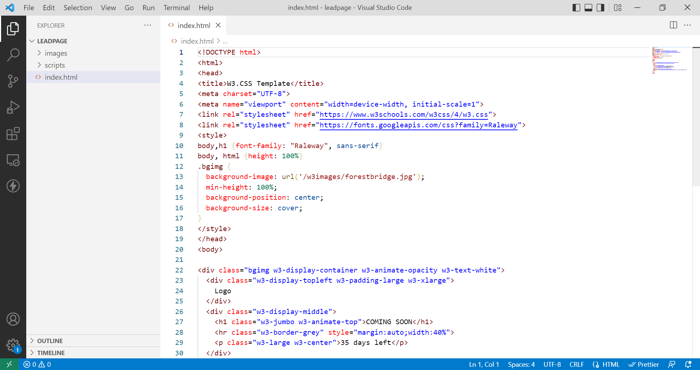
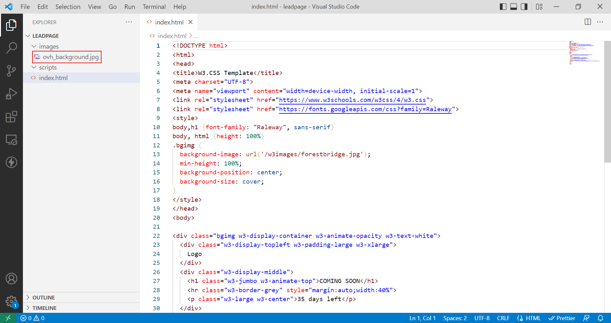

**Dernière mise à jour le 20/01/2023**

> [!warning]
>
> OVHcloud met à votre disposition des services dont la configuration, la gestion et la responsabilité vous incombent. Il vous revient de ce fait d'en assurer le bon fonctionnement.
> 
> Si vous éprouvez des difficultés à suivre les étapes de ce tutoriel, nous vous recommandons de faire appel à un [prestataire spécialisé](https://partner.ovhcloud.com/fr/) . En effet, nous ne serons pas en mesure de vous fournir une assistance. Plus d'informations dans la section [« Aller plus loin »](#go-further) de ce guide.
>

## Objectif

Ce tutoriel explique comment créer une page web professionnelle comprenant un formulaire, utilisable par les visiteurs de votre site web. Les données récupérées seront envoyées directement sur l'adresse e-mail de votre choix. Vous pourrez ainsi répondre à vos interlocuteurs.

## Prérequis

- Disposer d'un [nom de domaine](https://www.ovhcloud.com/fr/domains/)
- Avoir souscrit à une offre d'[hébergement web OVHcloud](https://www.ovh.com/fr/hebergement-web/)
- Être en capacité d'utiliser un éditeur de texte sur votre ordinateur ou un IDE
- Avoir installé un client FTP comme [FileZilla](https://filezilla-project.org/download.php).
- Avoir quelques notions de programmation web (HTML, CSS et PHP)

VConsultez le tutoriel [« Créer sa page web personnelle chez OVHcloud »](https://docs.ovh.com/fr/hosting/create-your-own-web-page/) pour vous familiariser avec les concepts de programmation utilisés.

## En pratique

Pour l'élaboration de la page web et lui assurer un rendu professionnel, nous allons utiliser un template disponible sur le site web [W3Schools](https://www.w3schools.com/w3css/w3css_templates.asp){.external}, [« Coming Soon Template »](https://www.w3schools.com/w3css/tryw3css_templates_coming_soon.htm){.external}.

Nous ajouterons le formulaire qui permettra la récupération des données saisies et l'envoi vers l'adresse mail de votre choix via un script en PHP.

### Mise en place des fichiers

Sur votre ordinateur, créez un dossier `Leadpage` dans lequel l'ensemble des fichiers se trouveront. Dans ce dossier, créez les éléments suivants:

- un répertoire `scripts` où se trouvera le fichier contenant le script PHP permettant d'envoyer le contenu du formulaire
- un répertoire `images` où se trouveront les fichiers d'illustration pour personnaliser le site web
- un fichier `index.html` qui contiendra les éléments de la page web.

{.thumbnail}

### Détails du code HTML et CSS

Le code **collé** dans le fichier `index.html` contient les éléments suivants:

- une structure `HTML` classique
- des balises `<link>` faisant appel à une feuille de style et une police externes
- une balise `<style>` permettant l'affichage de l'image de fond et l'étirement du contenu
- des balises `<div>` avec du contenu textuel utilisant des classes CSS spécifiques aux templates **W3schools** (similaire à ce que propose **Bootstrap**).

### Récupération du template

Pour chaque template proposé figure un lien de démonstration et un accès au code source de la page. Il offre la possibilité de le modifier et de visualiser le résultat en temps réel. Cliquez sur le bouton [« Try it Yourself »](https://www.w3schools.com/w3css/tryit.asp?filename=tryw3css_templates_coming_soon&stacked=h).

Copiez et collez le code dans votre fichier `index.html`:

{.thumbnail}

### Personnaliser l'image de fond

La balise `<style>` présente dans le template se présente de la façon suivante:

```html
<style>
body,h1 {font-family: "Raleway", sans-serif}
body, html {height: 100%}
.bgimg {
  background-image: url('/w3images/forestbridge.jpg');
  min-height: 100%;
  background-position: center;
  background-size: cover;
}
</style>
```

Utilisez votre propre illustration et placez le fichier dans le répetoire `images` de votre projet. À titre indicatif, les dimensions de l'image par défaut du template pris pour exemple sont de 1200×700 pixels.

Déposez votre image de fond dans le répertoire `images`:

{.thumbnail}

Modifiez l'URL dans la feuille de style pour charger la bonne image:

```html
<style>
body,h1 {font-family: "Raleway", sans-serif}
body, html {height: 100%}
.bgimg {
  background-image: url('/images/ovh_background.jpg');
  min-height: 100%;
  background-position: center;
  background-size: cover;
}
</style>
```

Visualisez le résultat en transférant vos fichiers sur votre hebergement web via un client FTP.

Pour transférer vos fichiers sur votre hébergement web, reportez-vous au tutoriel [« Utiliser FileZilla avec votre hébergement OVHcloud »](https://docs.ovh.com/fr/hosting/mutualise-guide-utilisation-filezilla/).

### Modifier le titre du site

Modifiez le contenu de la balise `<title>` située au début de votre fichier html:

```html
<title>My web site</title>
```

### Modifier le texte par défaut

Le contenu *textuel* se situe entre les balises `<body>`. Remplacez le code du template par celui-ci dessous:

```html
<body>
  <div class="bgimg w3-display-container w3-animate-opacity w3-text-white">
    <div class="w3-display-middle">
      <h1 class="w3-jumbo w3-animate-top">My web site</h1>
      <hr class="w3-border-grey" style="margin:auto;width:40%">
      <p class="w3-large w3-center">Contact us using the form below</p>
    </div>
  </div>
</body>
```

### Changer la couleur du texte

Dans la balise `<style>`, ajoutez une ligne pour modifier la couleur des titres et des paragraphes:

```css
h1, p {color: #333}
```

## Aller plus loin <a name="go-further"></a>

Pour des prestations spécialisées (référencement, développement, etc), contactez les [partenaires OVHcloud](https://partner.ovhcloud.com/fr/).

Si vous souhaitez bénéficier d'une assistance à l'usage et à la configuration de vos solutions OVHcloud, nous vous proposons de consulter nos différentes [offres de support](https://www.ovhcloud.com/fr/support-levels/).

Échangez avec notre communauté d'utilisateurs sur <https://community.ovh.com>.
