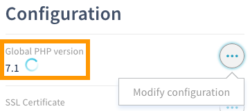

**Päivitetty 25.9.2018**

## Tavoite

Verkossa on olemassa valtava määrä verkkosivuja. Olipa kyse blogin tai verkkokaupan perustamisesta, kiinnostuksen kohteen jakamisesta tai liiketoiminnan edistämisestä, [OVH:n webhotellilla](https://www.ovh-hosting.fi/webhotelli/){.external} voit ylläpitää haluamiasi verkkosivuja kunhan se on yhteensopiva [infrastruktuuriemme konfiguraation](http://pro.ovh.net/infos/){.external} kanssa.

**Opi muokkaamaan OVH:n webhotellisi konfiguraatiota hallintapaneelissa.**

## Edellytykset

- Sinulla on yhteensopiva [webhotellituote](https://www.ovh-hosting.fi/webhotelli/){.external} (ei Cloud Web).
- Olet kirjautunut [hallintapaneeliin](https://www.ovh.com/auth/?action=gotomanager).

## Käytännössä

**Webhotellin konfiguraatiossa on noudatettava varovaisuutta.** Epäasianmukainen muutos saattaa estää pääsyn verkkosivullesi. Ymmärtämällä tällaisten muokkausten vaikutukset, voit saada paremmin käsityksen muutoksista, joita tulet tekemään.

Kun muutat webhotellisi konfiguraatiota, muokkaat verkkosivusi käyttämää webhotellia. Vaikka infrastruktuurimme tarjoavat useita mahdollisia vaihtoehtoja, huolehdi, että valittu konfiguraatio on teknisesti yhteensopiva verkkosivusi kanssa.

> [!warning] 
>
> Varmista ennen muutoksen aloittamista, ettei toimenpide estä verkkosivusi saavutettavuutta. Suosittelemme ottamaan kuitenkin yhteyttä erikoistuneeseen palveluntarjoajaan, mikäli kohtaat hankaluuksia. Me emme voi tarjota avustusta asiassa. Lisätietoa tämän ohjeen kohdasta “Lisää aiheesta”. 
> 

### Muokkaa webhotellin konfiguraatiota hallintapaneelissa

#### 1. vaihe: Mene webhotellin konfiguraation hallintaan

Menettelyn aloittamiseksi kirjaudu [hallintapaneeliisi](https://www.ovh.com/auth/?action=gotomanager){.external}, klikkaa kohtaa `Webhotellit`{.action} vasemman reunan valikossa ja valitse sitten kyseessä oleva webhotelli. Varmista, että olet välilehdellä `Yleiset tiedot`{.action}. Klikkaa siellä kolmea pistettä esittävää kuvaketta ja sitten painiketta `Muokkaa konfiguraatiota`{.action}.

{.thumbnail}

Jos painike `Muokkaa konfiguraatiota`{.action} on harmaana, saattaa **globaalin PHP-version** tarkistus olla käynnissä. Jos näin on, näkyy kyseisen version vieressä pyöreä sininen symboli. Odota muutamia minuutteja, jotta painike `Muokkaa konfiguraatiota`{.action} on jälleen käytettävissä.

{.thumbnail}

#### 2. vaihe: Muokkaa webhotellin konfiguraatiota

Seuraavaksi näkyviin tulevassa ikkunassa on kaksi vaihtoehtoa. Valitse haluamaasi toimintaa vastaava toimenpide ja klikkaa sitten `Jatka`{.action}.

|Valinta|Tiedot|
|---|---|
|“Paluu aikaisemmin käytettyyn konfiguraatioon”|Kun olet valinnut tämän vaihtoehdon, poimi palautettava konfiguraatio kohdan `Tavanomainen valinta` vieressä. Tämä mahdollisuus ei ole välttämättä saatavilla, jos et ole tehnyt muutoksia aiemmin.|
|“Muokkaa nykyistä konfiguraatiota”|Kun olet valinnut tämän vaihtoehdon, valikoi konfiguraatioon tehtävät muutokset ehdotettujen joukosta. Tarvittaessa löydät ne menemällä tämän dokumentin osioon [“Katso saatavilla olevat konfiguraatiot”](https://docs.ovh.com/fi/hosting/webhotellin_kayttoympariston_muokkaaminen/#katso-saatavilla-olevat-konfiguraatiot){.external}.|

> [!primary]
>
> Webhotellin Runtime engine -moottorin muuttaminen uudelleenkäynnistää automaattisesti PHP-istunnot.
> 

Kun olet valmis, klikkaa `Vahvista`{.action} muokkauksen käyttöönottamiseksi. Odota hetki, että muutos toteutuu.

{.thumbnail}

### Katso saatavilla olevat konfiguraatiot

Kun muokkaat webhotellin konfiguraatiota, on saatavilla useita konfigurointivaihtoehtoja. Jatka tämän dokumentaation lukemista tekemäsi valinnan mukaan.

- [Käyttöympäristö](https://docs.ovh.com/fi/hosting/webhotellin_kayttoympariston_muokkaaminen/#kayttoymparisto){.external}.
- [PHP-versio](https://docs.ovh.com/fi/hosting/webhotellin_kayttoympariston_muokkaaminen/#php-versio){.external}.
- [PHP-moottori](https://docs.ovh.com/fi/hosting/webhotellin_kayttoympariston_muokkaaminen/#php-moottori){.external}.
- [Tila](https://docs.ovh.com/fi/hosting/webhotellin_kayttoympariston_muokkaaminen/#tila){.external}.

#### Käyttöympäristö

Käyttöympäristöä vaihtamalla voidaan muokata webhotellisi tiettyjä teknisiä arvoja. **Varmista ennen muutosten tekemistä, että käyttöympäristö on yhteensopiva verkkosivusi kanssa.** 

|Käyttöympäristö|Legacy|stable|testing|jessie.i386|
|---|---|---|---|---|
|Liitetty image|Legacy|jessie.i386|jessie.i386|jessie.i386|
|minimi PHP-versio|4.4,|5.3,|5.3,|5.3,|
|Openssl|0.9.8o|1.0.1k (TLS1.2 yhteensopiva)|1.0.1k (TLS1.2 yhteensopiva)|1.0.1k (TLS1.2 yhteensopiva)|
|Laajennus php imagick| - | Kyllä | Kyllä | Kyllä |
|Laajennus php memcache (PHP 5.6)| Kyllä | Kyllä | Kyllä | Kyllä |
|Laajennus php memcache (PHP 5.6)| - | Kyllä | Kyllä | Kyllä |
|Laajennus php mongo (PHP 5.4, 5.5, 5.6)| - | Kyllä | Kyllä | Kyllä |
|Laajennus mysqlnd (vain utf-8)| - | Kyllä | Kyllä | Kyllä |
|Laajennus redis| - | Kyllä | Kyllä | Kyllä |
|Opcache| Kyllä | Kyllä | Kyllä | Kyllä |
|Python|2.6|2.7 ja 3.4.|2.7 ja 3.4.|2.7 ja 3.4.|
|Ruby|1.8.7|2.1.5|2.1.5|2.1.5|
|Rails|2.3.5|4.1.8|4.1.8|4.1.8|
|Perl|5.10|5.20|5.20|5.20|
|git|1.7.2.5|2.1.4|2.1.4|2.1.4|

> [!primary]
>
> “Legacy”-ympäristö voi olla hyödyllinen vanhoille verkkosivuille, jotka käyttävät vielä vanhoja PHP-versioita. Suosittelemme vahvasti kuitenkin käyttämään “vakaata” käyttöympäristöä, joka hyödyntää viimeisimpiä päivityksiä. **Varmista, että verkkosivusi on yhteensopiva ennen muutosten aloittamista.**
> 

Kun valintasi on tehty, on olemassa kaksi vaihtoehtoa muutoksen toteuttamiseen:

- **hallintapaneelissa**: seuraa ohjeita, jotka on kuvattu tämän dokumentaation osiossa [“Muokkaa webhotellin konfiguraatiota hallintapaneelissa”](https://docs.ovh.com/fi/hosting/webhotellin_kayttoympariston_muokkaaminen/#muokkaa-webhotellin-konfiguraatiota-hallintapaneelissa){.external}.
- **muokkaamalla käsin “.ovhconfig”-tiedostoa**: tämä vaihtoehto on teknisempi ja edellyttää tallennustilaan kirjautumista. Jos haluat muokata tiedostoa “**.ovhconfig**”, katso ohjeita dokumentaatiosta [“Konfiguroi webhotellin .ovhconfig-tiedosto”](https://docs.ovh.com/fi/hosting/ovhconfig-tiedoston-konfigurointi/){.external}.

#### PHP-versio

PHP-ohjelmointikielestä on olemassa nykyään useita eri versioita. Kuten on tapana uudet versiot tuovat mukanaan erilaisia korjauksia, kuten lisättyjä ominaisuuksia tai vanhojen pysäytyksiä. OVH tarjoaa viimeisimpiä suuria PHP-versioita, joiden listan voit löytää klikkaamalla tätä linkkiä: <https://www.ovh-hosting.fi/webhotelli/php.xml> 

Koska tiettyjä ominaisuuksia ei voida enää ylläpitää uusien versioiden myötä, **varmista ennen muutosten tekemistä, että uusi PHP-versio on yhteensopiva verkkosivusi kanssa.** 

Webhotellisi PHP-version muokkaamiseen on olemassa useita tapoja:

- **hallintapaneelissa**: seuraa ohjeita, jotka on kuvattu tämän dokumentaation osiossa [“Muokkaa webhotellin konfiguraatiota hallintapaneelissa”](https://docs.ovh.com/fi/hosting/webhotellin_kayttoympariston_muokkaaminen/#muokkaa-webhotellin-konfiguraatiota-hallintapaneelissa){.external}.
- **muokkaamalla käsin tallennustilassasi olevaa tiedostoa**: tämä vaihtoehto on teknisempi ja edellyttää tallennustilaan kirjautumista. 

Yleisesti ottaen, jos haluat saada lisätietoa PHP-version muuttamisesta, katso dokumentaatiossa [“Webhotellin PHP-version muuttaminen”](https://docs.ovh.com/fi/hosting/php-konfigurointi_ovhn_webhotellissa/){.external} kuvattuja ohjeita.

#### PHP-moottori

PHP-moottorin valinta mahdollistaa PHP-kiihdyttimen (“PHP-FPM”) käyttöönoton tai käytöstä poistamisen. Tämä on mukautettu infrastruktuuriimme tavoitteena parantaa PHP-skriptien suoritusnopeutta.  Vertailun vuoksi PHP-kiihdytin (“PHP-FPM”) tarjoaa jopa seitsemän kertaa nopeamman suorituskyvyn kuin “phpcgi”-moottori. 

Webhotellisi käyttämän PHP-moottorin muokkaukseen on olemassa kaksi mahdollista tapaa:

- **hallintapaneelissa**: seuraa tämän dokumentaation osiossa [“Muokkaa webhotellin konfiguraatiota hallintapaneelissa”](https://docs.ovh.com/fi/hosting/webhotellin_kayttoympariston_muokkaaminen/#muokkaa-webhotellin-konfiguraatiota-hallintapaneelissa){.external} olevia ohjeita. PHP-kiihdyttimen (“PHP-FPM”) aktivoimiseksi valitse moottoriksi “php”. Kun haluat poistaa sen käytöstä, valitse “phpcgi”
- **muokkaamalla käsin “.ovhconfig”-tiedostoa**: tämä vaihtoehto on teknisempi ja edellyttää tallennustilaan kirjautumista. Jos haluat muokata tiedostoa “**.ovhconfig**”, katso ohjeita dokumentaatiosta [“Konfiguroi webhotellin .ovhconfig-tiedosto”](https://docs.ovh.com/fi/hosting/ovhconfig-tiedoston-konfigurointi/){.external}.

#### Tila

Tilan valinta mahdollistaa verkkosivusi staattisten tiedostojen (esim. kuvat) välimuistin hallinnan sekä PHP-virheiden käsittelyn (hyödyllistä yleensä silloin, kun sivusi näyttää esimerkiksi valkoisen sivun). On olemassa kaksi tilaa, jotka voit aktivoida:

|Tila|Staattisten tiedostojen välimuisti|PHP-virheiden käsittely|
|---|---|---|
|*Production*|Maksimoi staattisten tiedostojen asettamisen välimuistiin verkkoselaimilla.|PHP-virheet eivät näy verkkosivullasi.|
|*Development*|Mitään välimuistia ei käytetä.|PHP-virheet näkyvät verkkosivullasi.|

Webhotellisi käyttämän tilan muokkaukseen on olemassa kaksi mahdollista tapaa:

- **hallintapaneelissa**: seuraa ohjeita, jotka on kuvattu tämän dokumentaation osiossa [“Muokkaa webhotellin konfiguraatiota hallintapaneelissa”](https://docs.ovh.com/fi/hosting/webhotellin_kayttoympariston_muokkaaminen/#muokkaa-webhotellin-konfiguraatiota-hallintapaneelissa){.external}.
- **muokkaamalla käsin “.ovhconfig”-tiedostoa**: tämä vaihtoehto on teknisempi ja edellyttää tallennustilaan kirjautumista. Jos haluat muokata tiedostoa “**.ovhconfig**”, katso ohjeita dokumentaatiosta [“Konfiguroi webhotellin .ovhconfig-tiedosto”](https://docs.ovh.com/fi/hosting/ovhconfig-tiedoston-konfigurointi/){.external}.

## Lue lisää aiheesta

Viesti käyttäjäyhteisömme kanssa osoitteessa: <https://community.ovh.com/en/>.