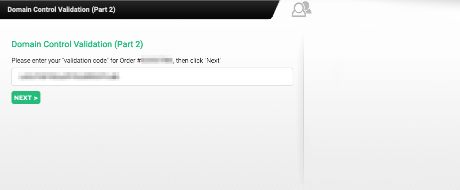

**Last updated 17th April 2020**

## Objective

This guide is for customers who have just ordered a Private Exchange platform. It details the steps you need to take in order to configure it for the first time.

**This guide explains the important first steps when configuring a Private Exchange platform.**

## Requirements

- access to the [OVHcloud Control Panel](https://www.ovh.com/auth/?action=gotomanager&from=https://www.ovh.ie/&ovhSubsidiary=ie)
- an [OVHcloud Private Exchange solution](https://www.ovhcloud.com/en-ie/emails/private-exchange/)

## Instructions

### Step 1: Receiving the configuration email for your platform

Once you have placed your order, you will be sent an email to your contact email address you have listed in the OVHcloud Control Panel. This email will contain the information you need to configure your Private Exchange platform. 

To read this email via the [OVHcloud Control Panel](https://www.ovh.com/auth/?action=gotomanager&from=https://www.ovh.ie/&ovhSubsidiary=ie), click on your account name in the top right-hand corner, then click on `Service emails`{.action}. Search for an email with the subject:

> **\[xx-11111-ovh] Your Private Exchange 20_xxx_ service is being delivered.**

{.thumbnail}

This email contains a link to complete two steps of your service configuration:

- customising the access link for your webmail (dedicated SSL certificate)
- entering the contact email address for validating your certificate (important - this email address must already exist, and you must have access to it)

Click on the link in this email, and move on to [step 2](./#step-2-starting-up-your-platform) below.

### Step 2: Starting up your platform

Once you have clicked on the email link in [step 1](./#step-1-receiving-the-configuration-email-for-your-platform), log in to the page that opens.

You will be redirected to the following confirmation page:
{.thumbnail}

Fill in this page with the information listed in the table below.

| Information          	| Description                                                                                                                                                                                                                             	|
|----------------------	|-----------------------------------------------------------------------------------------------------------------------------------------------------------------------------------------------------------------------------------------	|
| Server name 	| In the dropdown menu, select the sub-domain linked to your domain name.   In the free text field, type in the domain name you would like to link.                                                                   	|
| Email               	| Select an email address from the list. This email address will receive the SSL certificate validation email for your platform. For this reason, it is vital to ensure that this email address is valid, or that it redirects to an accessible email address you can receive it from.
| DNS Assist           	| By ticking this box, you authorise for your DNS zone to be automatically configured for your platform’s domain name. The domain must be managed by the same OVHcloud account as your platform. If you do not tick this box, you will be sent an email with the configuration details for your DNS zone. 	|

Once you have confirmed this step, you will receive a message that the configuration has been completed. You will also be reminded about the SSL certificate validation email address, and the address for accessing your platform’s webmail.

### Step 3: Configuring the DNS zone for your platform’s domain name manually

> [!primary]
>
> This step is optional if you ticked **DNS Assist** in [step 2](./#step-2-starting-up-your-platform).
> 

If your domain name is not managed on the same customer account, or is not hosted with OVHcloud, you will be sent a second email containing the information required to configure your DNS zone manually.

This email will contain the IPv4 and IPv6 addresses of your Private Exchange server. Enter these IP addresses into the DNS zone for the sub-domain created in [step 2](./#step-2-starting-up-your-platform), as an A record and an AAAA record respectively. For an OVHcloud domain name, please read our guide on [Editing a DNS zone](../../domains/web_hosting_how_to_edit_my_dns_zone/) to help you.

### Step 4: Validating your SSL certificate

After completing [step 2](./#step-2-starting-up-your-platform), you will have received an email via the email address you selected to validate your SSL certificate.

This email is sent to you by the organisation that delivers the SSL certificate, with the subject:

> **ORDER #1111111 - Domain Control Validation for exchange.yourdomain.com**

Copy the code included in the email, and click on the validation link for the SSL certificate.

The window below will then open. Paste the code into the box, then click `Next`{.action}.

{.thumbnail}

You will see a message confirming whether the code you have entered is valid. If it is valid, click `Close window`{.action}.

### Completion

Once your SSL certificate has been validated, you may need to wait around 4 hours for your service to be delivered. During this period, your Private Exchange platform will not appear in the OVHcloud Control Panel.

Once your server is ready and available, you will receive a confirmation email with the subject:

> **\[xx-11111-ovh] Your Private Exchange 20_xxx_ service is ready.**

To add the first domain name to your platform and configure the accounts, please refer to our guide on [Adding a domain name to an Exchange service](../adding-domain-exchange/). 

## Go further

[Editing a DNS zone](../../domains/web_hosting_how_to_edit_my_dns_zone/)

[Adding a domain name to your Exchange service](../adding-domain-exchange/) 

Join our community of users on <https://community.ovh.com/en/>.
