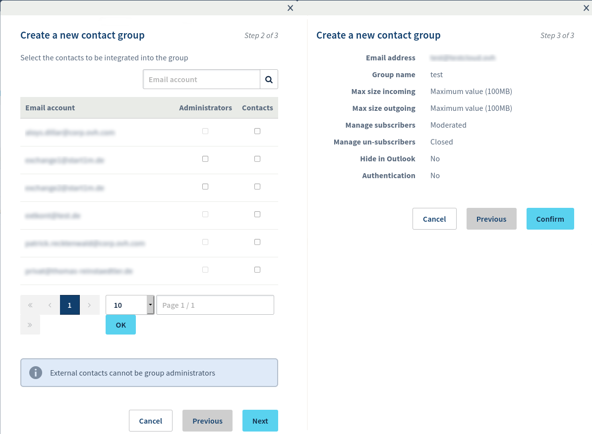
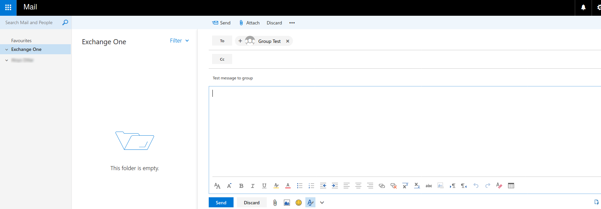

**Letzte Aktualisierung am 26.02.2020**

## Ziel

Mit Exchange Gruppen können mehrere Benutzer durch Senden von E-Mails an eine Gruppenadresse untereinander kommunizieren. Mit dieser kollaborativen Funktion können Sie Mailinglisten erstellen und verwalten, die sowohl Exchange Benutzer als auch externe Kontakte enthalten können.

**In dieser Anleitung wird erläutert, wie Sie Exchange Gruppen über das OVHcloud Kundencenter und die Outlook Web App (OWA) verwenden.**

## Voraussetzungen

- Sie haben Zugriff auf das [OVHcloud-Kundencenter](https://www.ovh.com/auth/?action=gotomanager&from=https://www.ovh.de/&ovhSubsidiary=de).
- Sie haben eine [OVHcloud Exchange Lösung](https://www.ovhcloud.com/de/emails/hosted-exchange/), die bereits eingerichtet ist.

## In der praktischen Anwendung

### Schritt 1: Eine neue Gruppe erstellen

Loggen Sie sich in Ihrem [OVHcloud Kundencenter](https://www.ovh.com/auth/?action=gotomanager&from=https://www.ovh.de/&ovhSubsidiary=de) ein und wählen Sie unter `Microsoft`{.action} und `Exchange`{.action} Ihren Exchange Dienst aus. Gehen Sie dann auf den Tab `Gruppen`{.action}.

{.thumbnail}

Wenn Sie auf `Kontaktgruppe erstellen`{.action} klicken, öffnet sich ein neues Fenster, in dem Sie die Gruppeneinstellungen definieren können:

{.thumbnail}

|Name|Beschreibung|
|---|---|
|E-Mail-Adresse|Die neue Adresse, von der aus Nachrichten an die Mailingliste gesendet werden. Bitte beachten Sie, dass Sie keine existierende E-Mail-Adresse eingeben können.|
|Name der Gruppe|Der Anzeigename, der in Ihrem [OVHcloud Kundencenter](https://www.ovh.com/auth/?action=gotomanager&from=https://www.ovh.de/&ovhSubsidiary=de) und in [OVHcloud Webmail](https://www.ovh.de/mail) (OWA) erscheint.|
|Maximale Größe eingehend/ausgehend|Sie können die maximale Größe eingehender und ausgehender E-Mails angeben.|
|Adresse in Outlook verbergen|Wenn dieses Kontrollkästchen aktiviert ist, wird die Gruppenadresse nicht in der Adressliste des Exchange Dienstes angezeigt.|
|Authentifizierung erforderlich|Wenn dieses Kontrollkästchen aktiviert ist, können nur Benutzer auf derselben Plattform eine Nachricht mit der Gruppenadresse senden.|

> [!primary]
>
Bitte beachten Sie, dass die Optionen „Verwaltung der Anmeldungen“ und „Verwaltung der Abmeldungen“ von unseren Administratoren aus Sicherheitsgründen deaktiviert wurden. Wir entschuldigen uns für jedwede Unannehmlichkeiten.
>

Klicken Sie auf `Weiter`{.action}, um fortzufahren.

Definieren Sie auf der zweiten Seite die Mitglieder der Gruppe und wählen Sie die „Administratoren“. Die Auswahl umfasst nur E-Mail-Adressen und externe Kontakte, die bereits für den Exchange Dienst angelegt wurden.

{.thumbnail}

Bitte beachten Sie, dass Administratoren auch als „Kontakte“ festgelegt werden müssen, um Gruppen-E-Mails zu erhalten.
Klicken Sie auf `Weiter`{.action}, um fortzufahren und schließen Sie den Vorgang dann ab, indem Sie auf `Bestätigen`{.action} klicken.

### Schritt 2: Gruppen verwalten

Ihre neu erstellte Gruppe ist innerhalb weniger Minuten bereit. In der Gruppenliste können Sie die oben beschriebenen Einstellungen anpassen, indem Sie auf `...`{.action} klicken und aus dem Kontextmenü auswählen.

{.thumbnail}

Darüber hinaus wird der Menüpunkt `Berechtigungen konfigurieren`{.action} angezeigt. Mit dieser Option können Sie den Zugriff auf dieselbe Weise wie für einen Exchange Account übertragen. Weitere Details finden Sie in [dieser Anleitung](/pages/web/microsoft-collaborative-solutions/feature_delegation).

{.thumbnail}

> [!primary]
>
Bitte beachten Sie, dass es einige Minuten dauern kann, bis Änderungen am Dienst abgeschlossen sind. Sie können den Status der meisten Vorgänge überprüfen, indem Sie im horizontalen Menü `Mehr+`{.action} und `Aktuelle Tasks`{.action} auswählen.
>

### Schritt 3: Nachricht an eine Gruppe mit OWA senden

Sie können jetzt Ihre Mailingliste über [OVHcloud Webmail](https://www.ovh.de/mail) (OWA) testen: Senden Sie einfach eine E-Mail an die Gruppenadresse.

{.thumbnail}

## Weiterführende Informationen

[Berechtigungen eines Exchange Accounts übertragen](/pages/web/microsoft-collaborative-solutions/feature_delegation)

[OWA mit einem Exchange Account verwenden](/pages/web/emails/email_owa)

[Kalender in OWA freigeben](/pages/web/microsoft-collaborative-solutions/owa_calendar_sharing)

Für den Austausch mit unserer User Community gehen Sie auf <https://community.ovh.com/en/>.
